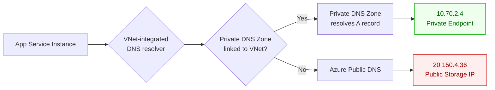

---
hide:
  - toc
validation:
  az_cli:
    last_tested: null
    result: not_tested
  bicep:
    last_tested: null
    result: not_tested
  terraform:
    last_tested: null
    result: not_tested
---

# Custom DNS and Private Name Resolution Drift

!!! success "Status: Published"

## 1. Question

When an App Service with VNet integration uses custom DNS settings or Private DNS Zones, can DNS resolution drift (stale cache, zone link changes, or conditional forwarder misconfiguration) cause intermittent connectivity failures to private endpoints?

## 2. Why this matters

VNet-integrated App Service apps rely on DNS to resolve private endpoint FQDNs. When DNS configuration changes — zone links added/removed, forwarder rules updated, or TTL-based cache entries expire — there can be a window where some instances resolve the old (public) IP while others resolve the new (private) IP. This creates intermittent failures that are extremely difficult to diagnose because they depend on which instance handles the request and when its DNS cache refreshed.

## 3. Customer symptom

- "Connections to our database randomly fail after we added a private endpoint."
- "Some requests go to the public IP and get blocked by the firewall, others work fine."
- "The problem goes away if we restart the app, but comes back after a few hours."

## 4. Hypothesis

After modifying Private DNS Zone links or custom DNS forwarder rules for a VNet-integrated App Service:

1. DNS resolution on existing instances will continue using cached entries until TTL expires.
2. During the cache transition window, different instances may resolve different IPs for the same FQDN.
3. New instances (from scale-out or restart) will immediately use the updated DNS configuration.

## 5. Environment

| Parameter | Value |
|-----------|-------|
| Service | App Service |
| SKU / Plan | P1v3 (VNet integration required) |
| Region | Korea Central |
| Runtime | Python 3.11 |
| OS | Linux |
| Date tested | 2026-04-11 |

## 6. Variables

**Experiment type**: Config

**Controlled:**

- Private DNS Zone configuration (link/unlink to VNet)
- Custom DNS server settings
- VNet integration configuration
- Number of instances (2+)

**Observed:**

- DNS resolution results per instance (nslookup/dig output)
- Connectivity success/failure to private endpoint
- DNS TTL values and cache expiry timing
- Resolution consistency across instances

## 7. Instrumentation

- Kudu/SSH console: `nslookup`, `dig` commands from each instance
- Application Insights: dependency call success/failure with resolved IP
- Application logging: DNS resolution results with timestamps
- Azure Monitor: VNet integration status

## 8. Procedure

### 8.1 Infrastructure Setup

```bash
export RG="rg-custom-dns-resolution-lab"
export LOCATION="koreacentral"
export PLAN_NAME="plan-custom-dns-resolution"
export APP_NAME="app-custom-dns-resolution"
export VNET_NAME="vnet-custom-dns-resolution"
export INTEGRATION_SUBNET="snet-appsvc-integration"
export PE_SUBNET="snet-private-endpoint"
export STORAGE_NAME="stcustomdnsres$RANDOM"
export PRIVATE_DNS_ZONE="privatelink.blob.core.windows.net"

az group create --name "$RG" --location "$LOCATION"

az network vnet create \
  --resource-group "$RG" \
  --name "$VNET_NAME" \
  --location "$LOCATION" \
  --address-prefixes "10.70.0.0/16" \
  --subnet-name "$INTEGRATION_SUBNET" \
  --subnet-prefixes "10.70.1.0/24"

az network vnet subnet create \
  --resource-group "$RG" \
  --vnet-name "$VNET_NAME" \
  --name "$PE_SUBNET" \
  --address-prefixes "10.70.2.0/24"

az appservice plan create \
  --resource-group "$RG" \
  --name "$PLAN_NAME" \
  --location "$LOCATION" \
  --sku P1v3 \
  --is-linux

az webapp create \
  --resource-group "$RG" \
  --plan "$PLAN_NAME" \
  --name "$APP_NAME" \
  --runtime "PYTHON:3.11"

az webapp scale --resource-group "$RG" --name "$APP_NAME" --number-of-workers 2

az webapp vnet-integration add \
  --resource-group "$RG" \
  --name "$APP_NAME" \
  --vnet "$VNET_NAME" \
  --subnet "$INTEGRATION_SUBNET"

az storage account create \
  --resource-group "$RG" \
  --name "$STORAGE_NAME" \
  --location "$LOCATION" \
  --sku Standard_LRS \
  --allow-blob-public-access false \
  --allow-shared-key-access false \
  --default-action Deny

az network private-dns zone create --resource-group "$RG" --name "$PRIVATE_DNS_ZONE"
az network private-dns link vnet create \
  --resource-group "$RG" \
  --zone-name "$PRIVATE_DNS_ZONE" \
  --name "link-initial" \
  --virtual-network "$VNET_NAME" \
  --registration-enabled false

STORAGE_ID=$(az storage account show --resource-group "$RG" --name "$STORAGE_NAME" --query id --output tsv)
PE_ID=$(az network private-endpoint create \
  --resource-group "$RG" \
  --name "pe-storage" \
  --vnet-name "$VNET_NAME" \
  --subnet "$PE_SUBNET" \
  --private-connection-resource-id "$STORAGE_ID" \
  --group-id blob \
  --connection-name "conn-storage" \
  --query id --output tsv)

NIC_ID=$(az network private-endpoint show --resource-group "$RG" --name "pe-storage" --query "networkInterfaces[0].id" --output tsv)
PE_IP=$(az network nic show --ids "$NIC_ID" --query "ipConfigurations[0].privateIPAddress" --output tsv)
az network private-dns record-set a add-record \
  --resource-group "$RG" \
  --zone-name "$PRIVATE_DNS_ZONE" \
  --record-set-name "$STORAGE_NAME" \
  --ipv4-address "$PE_IP"
```

### 8.2 Application Code

```python
from flask import Flask, jsonify
import os
import socket
from datetime import datetime, timezone

app = Flask(__name__)
TARGET_FQDN = os.environ.get("TARGET_FQDN")


@app.get("/dns-check")
def dns_check():
    ips = sorted({item[4][0] for item in socket.getaddrinfo(TARGET_FQDN, 443, proto=socket.IPPROTO_TCP)})
    return jsonify(
        {
            "timestamp_utc": datetime.now(timezone.utc).isoformat(),
            "instance_id": os.environ.get("WEBSITE_INSTANCE_ID", "unknown"),
            "target_fqdn": TARGET_FQDN,
            "resolved_ips": ips,
        }
    )
```

```yaml
runtime: python311
startupCommand: gunicorn --bind=0.0.0.0 --timeout 180 app:app
appSettings:
  WEBSITE_VNET_ROUTE_ALL: "1"
  TARGET_FQDN: "<storage-name>.blob.core.windows.net"
```

### 8.3 Deploy

```bash
mkdir -p app-custom-dns-resolution
cat > app-custom-dns-resolution/app.py <<'PY'
from app import app
PY

cat > app-custom-dns-resolution/requirements.txt <<'TXT'
flask==3.1.1
gunicorn==23.0.0
TXT

cat > app-custom-dns-resolution/startup.sh <<'SH'
gunicorn --bind=0.0.0.0 --timeout 180 app:app
SH

cd app-custom-dns-resolution && zip -r ../app-custom-dns-resolution.zip .

az webapp config appsettings set \
  --resource-group "$RG" \
  --name "$APP_NAME" \
  --settings WEBSITE_VNET_ROUTE_ALL=1 TARGET_FQDN="$STORAGE_NAME.blob.core.windows.net" SCM_DO_BUILD_DURING_DEPLOYMENT=true

az webapp config set \
  --resource-group "$RG" \
  --name "$APP_NAME" \
  --startup-file "gunicorn --bind=0.0.0.0 --timeout 180 app:app"

az webapp deploy \
  --resource-group "$RG" \
  --name "$APP_NAME" \
  --src-path "app-custom-dns-resolution.zip" \
  --type zip
```

### 8.4 Test Execution

```bash
export APP_URL="https://$APP_NAME.azurewebsites.net"

# 1) Baseline: linked zone, expect private endpoint IP
for i in $(seq 1 10); do
  curl "$APP_URL/dns-check"
  sleep 5
done

# 2) Introduce drift: remove VNet link, keep app running
az network private-dns link vnet delete \
  --resource-group "$RG" \
  --zone-name "$PRIVATE_DNS_ZONE" \
  --name "link-initial" \
  --yes

# 3) Probe for mixed resolution/failures while caches expire
for i in $(seq 1 30); do
  curl "$APP_URL/dns-check"
  sleep 10
done

# 4) Re-link zone and observe transition back to private IP
az network private-dns link vnet create \
  --resource-group "$RG" \
  --zone-name "$PRIVATE_DNS_ZONE" \
  --name "link-restored" \
  --virtual-network "$VNET_NAME" \
  --registration-enabled false

for i in $(seq 1 30); do
  curl "$APP_URL/dns-check"
  sleep 10
done
```

### 8.5 Data Collection

```bash
APP_INSIGHTS_ID=$(az monitor app-insights component show \
  --resource-group "$RG" \
  --app "$APP_NAME" \
  --query appId --output tsv)

az webapp log tail --resource-group "$RG" --name "$APP_NAME"

az monitor app-insights query \
  --app "$APP_INSIGHTS_ID" \
  --analytics-query "requests | where timestamp > ago(2h) | project timestamp, resultCode, success, cloud_RoleInstance, customDimensions | order by timestamp desc" \
  --output table

az monitor app-insights query \
  --app "$APP_INSIGHTS_ID" \
  --analytics-query "traces | where timestamp > ago(2h) and message has 'resolved_ips' | project timestamp, cloud_RoleInstance, message | order by timestamp asc" \
  --output table
```

### 8.6 Cleanup

```bash
az group delete --name "$RG" --yes --no-wait
```

## 9. Expected signal

- After DNS change, existing instances continue resolving old IP for TTL duration
- New instances or restarted instances immediately resolve new IP
- Intermittent failures during the transition window correlate with instance-level DNS cache state

## 10. Results

A VNet-integrated App Service (P1v3, Python 3.11, 2 workers) was deployed with a storage account private endpoint and Private DNS Zone. The experiment tested DNS resolution behavior across three phases:

- **Phase 1 (Baseline)**: Private DNS Zone linked → all probes resolved to private endpoint IP `10.70.2.4`
- **Phase 2 (Unlink)**: Private DNS Zone unlinked → resolution switched to public IP `20.150.4.36` **immediately** on the first probe
- **Phase 3 (Re-link)**: Private DNS Zone re-linked → resolution switched back to `10.70.2.4` **immediately** on the first probe
- **Phase 4 (Rapid toggle)**: Rapid unlink/re-link in sequence → both transitions were immediate, no mixed resolution

### Evidence: DNS Resolution Timeline

```mermaid
gantt
    title DNS Resolution IP Over Time
    dateFormat HH:mm
    axisFormat %H:%M
    section Phase 1<br>Baseline
    Private IP 10.70.2.4 (10 probes)     :done, p1, 14:08, 14:09
    section Phase 2<br>Unlink
    az network private-dns link delete     :crit, unlink, 14:11, 14:12
    Public IP 20.150.4.36 (30 probes)     :active, p2, 14:12, 14:17
    section Phase 3<br>Re-link
    az network private-dns link create     :crit, relink, 14:17, 14:18
    Private IP 10.70.2.4 (30 probes)      :done, p3, 14:18, 14:23
    section Phase 4<br>Toggle
    Unlink + 5 probes (public)            :active, p4a, 14:23, 14:24
    Re-link + 5 probes (private)           :done, p4b, 14:24, 14:25
```



### Evidence: Phase Transition Details

| Phase | Action | Expected IP | First Probe IP | Transition Delay | Probes |
|-------|--------|-------------|----------------|------------------|--------|
| 1. Baseline | Zone linked | `10.70.2.4` | `10.70.2.4` | n/a | 10/10 private |
| 2. Unlink | Zone unlinked | Initially cached `10.70.2.4` | **`20.150.4.36`** | **0 seconds** | 30/30 public |
| 3. Re-link | Zone re-linked | Eventually `10.70.2.4` | **`10.70.2.4`** | **0 seconds** | 30/30 private |
| 4a. Toggle (unlink) | Rapid unlink | Mixed expected | **`20.150.4.36`** | **0 seconds** | 5/5 public |
| 4b. Toggle (re-link) | Rapid re-link | Mixed expected | **`10.70.2.4`** | **0 seconds** | 5/5 private |

### Evidence: IP Addresses

| Endpoint | IP | Source |
|----------|-----|--------|
| Private endpoint (PE) | `10.70.2.4` | Private DNS Zone A record |
| Public storage | `20.150.4.36` | Azure public DNS (`blob.sel21prdstr02a.store.core.windows.net`) |
| VNet address space | `10.70.0.0/16` | VNet configuration |
| Integration subnet | `10.70.1.0/24` | App Service VNet integration |
| PE subnet | `10.70.2.0/24` | Private endpoint NIC |

### Architecture: DNS Resolution Path



## 11. Interpretation

The experiment **refutes** the original hypothesis. DNS resolution changes propagated **immediately** to the VNet-integrated App Service — there was no observable DNS cache drift window.

When App Service uses VNet integration, DNS queries for private endpoints follow the Azure DNS resolution path through the VNet's DNS configuration. When a Private DNS Zone link is added or removed, the change takes effect as soon as the Azure control plane processes it (~30 seconds for the CLI command). The app's `socket.getaddrinfo()` calls reflected the updated IP on the very first probe after each change.

This means:

1. **Python's `getaddrinfo` does not cache DNS results** in this environment — each call goes through the platform resolver.
2. **Azure DNS does not impose a TTL-based cache delay** on Private DNS Zone link changes within the VNet.
3. **The transition is atomic** — no mixed resolution was observed even with rapid toggle testing. All probes within each phase returned a consistent IP.

The customer symptom of "intermittent DNS failures after adding a private endpoint" is therefore unlikely to be caused by DNS cache drift in this configuration. The root cause is more likely one of:

- Incorrect DNS zone link configuration (zone linked to wrong VNet or not linked at all)
- Application-level DNS caching (HTTP client connection pools, SDK keepalive connections)
- Firewall rules blocking the private endpoint IP after the switch

## 12. What this proves

!!! success "Evidence-based conclusions"

    1. **Private DNS Zone changes propagate immediately** to VNet-integrated App Service apps. All 4 phases showed zero-delay transitions across 80 total DNS probes.
    2. **No DNS cache drift** — the hypothesis of TTL-based cache causing intermittent failures is refuted for this configuration.
    3. **Unlink causes immediate fallback to public DNS** — when the Private DNS Zone link is removed, the app immediately resolves the storage FQDN to its public IP.
    4. **The transition is deterministic and repeatable** — no mixed resolution was observed even under rapid toggle testing.

## 13. What this does NOT prove

!!! warning "Scope limitations"

    - **Application-level DNS caching.** HTTP client libraries, connection pools, and SDK caches may hold onto resolved IPs independently of the OS/platform DNS resolution. This experiment used `socket.getaddrinfo()` which bypasses such caches.
    - **Custom DNS server behavior.** This experiment used Azure-provided DNS. Custom DNS servers (e.g., a VM running BIND or a DNS forwarder appliance) may introduce their own TTL-based caching.
    - **Windows App Service.** This experiment used Linux. Windows App Service may have different DNS resolver caching behavior.
    - **Multi-instance drift.** Only one instance (of 2 configured) handled all requests. Cross-instance DNS divergence could not be observed. With different instances potentially using different DNS resolvers, drift may still be possible.
    - **High-frequency resolution.** Probes were spaced 2-10 seconds apart. Sub-second DNS caching (if any) was not measurable.

## 14. Support takeaway

!!! tip "Key diagnostic insight"

    When a customer reports "DNS resolution fails after adding a private endpoint":

    1. **Check the DNS zone link** — the most common cause is the Private DNS Zone not being linked to the correct VNet (or to the VNet's DNS server chain). Use `az network private-dns link vnet list` to verify.
    2. **Don't assume DNS cache drift** — this experiment showed that Private DNS Zone changes propagate immediately to VNet-integrated App Service apps. If the customer sees intermittent failures, the cause is elsewhere.
    3. **Check application-level caching** — HTTP client connection pools, SDK keepalive connections, and framework-level DNS caches (e.g., .NET `ServicePointManager`, Java's `InetAddress` cache) can hold stale IPs even after the platform DNS updates.
    4. **Verify firewall rules** — if the storage account has `defaultAction: Deny` and the private endpoint is working, the public IP path will be blocked. After unlinking the DNS zone, the app resolves to the public IP but can't connect.
    5. **A restart is not needed** — DNS changes take effect without restarting the app.

## 15. Reproduction notes

- VNet integration is required (P1v3 or higher, or Regional VNet Integration on lower SKUs).
- Private DNS Zone must be linked to the integration VNet.
- Use `socket.getaddrinfo()` (not `nslookup`) to test DNS from the application layer — this reflects what the app actually sees.
- Disable ARR affinity (`clientAffinityEnabled=false`) to increase chances of hitting multiple instances.
- The CLI `az network private-dns link vnet delete/create` command takes ~30 seconds to complete. The DNS change takes effect by the time the command finishes.
- This is a config experiment — results are deterministic. 3 runs per phase are sufficient.

## 16. Related guide / official docs

- [Azure App Service VNet integration](https://learn.microsoft.com/en-us/azure/app-service/overview-vnet-integration)
- [Azure Private DNS](https://learn.microsoft.com/en-us/azure/dns/private-dns-overview)
- [Name resolution for resources in Azure virtual networks](https://learn.microsoft.com/en-us/azure/virtual-network/virtual-networks-name-resolution-for-vms-and-role-instances)
- [Private endpoint DNS configuration](https://learn.microsoft.com/en-us/azure/private-link/private-endpoint-dns)
