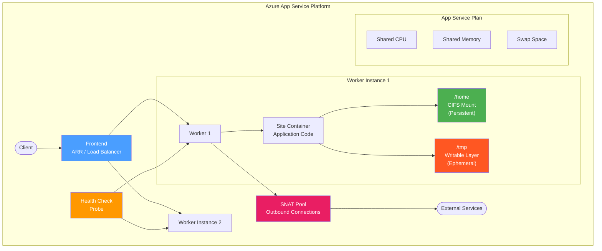

---
hide:
  - toc
---

# App Service Labs

Azure App Service troubleshooting experiments focused on worker behavior, memory management, networking, deployment patterns, and platform/application boundary interpretation.

## Architecture Overview

Azure App Service runs web applications inside Docker containers on shared or dedicated virtual machines (workers). Understanding the component architecture is essential for diagnosing where failures originate.

### Key Components for Troubleshooting

| Component | Role | Why It Matters |
|-----------|------|---------------|
| **Frontend (ARR)** | HTTP load balancer and SSL termination | ARR affinity, timeout settings, and routing decisions affect request behavior before the app sees them |
| **Worker** | VM running the application container | Workers are shared across apps in the same plan; one app's resource usage affects others |
| **App Service Plan** | Resource allocation boundary (CPU, memory) | Plan SKU determines available memory, CPU, SNAT ports, and swap behavior |
| **Health Check** | Platform probe that monitors app health | Misconfigured health checks can cause instance eviction even when the app is partially functional |
| **SNAT** | Source Network Address Translation for outbound connections | Limited port pool (128 per instance); exhaustion causes connection failures with no CPU/memory signal |
| **/home mount** | Persistent CIFS (SMB) storage shared across instances | Data survives restarts and scale events; performance is network-dependent |
| **Writable layer** | Ephemeral container filesystem overlay | Data is lost on restart, deployment, or instance migration |

!!! note
    These experiments target Linux App Service plans unless otherwise noted. Windows-specific behavior may differ.

## Experiment Status

| Experiment | Status | Description |
|-----------|--------|-------------|
| [Filesystem Persistence](filesystem-persistence/overview.md) | **Published** | /home vs writable layer data survival across restarts |
| [Health Check Eviction](health-check-eviction/overview.md) | **Published** | Cascading outage from partial dependency failure |
| [SNAT Exhaustion](snat-exhaustion/overview.md) | **Published** | Connection failures without CPU/memory pressure |
| [Memory Pressure](memory-pressure/overview.md) | **Published** | Plan-level degradation, swap thrashing, kernel page reclaim |
| [Custom DNS Resolution](custom-dns-resolution/overview.md) | **Published** | Private name resolution drift after VNet changes |
| [procfs Interpretation](procfs-interpretation/overview.md) | **Published** | /proc reliability and limits in Linux containers |
| [Slow Requests](slow-requests/overview.md) | **Published** | Frontend timeout vs. worker-side delay vs. dependency latency |
| [Zip Deploy vs Container](zip-vs-container/overview.md) | **Published** | Deployment method behavioral differences |
| [Slot Swap Warmup](slot-swap-warmup/overview.md) | **Draft** | In-flight request handling during slot swap warmup |
| [Access Restrictions SCM](access-restrictions-scm/overview.md) | **Draft** | Access restriction behavior on SCM site |

## Published Experiments

### [Filesystem Persistence](filesystem-persistence/overview.md) — **Published**

/home mount vs writable layer persistence behavior across restarts, deployments, and scale operations. Confirms that /home (CIFS) survives all lifecycle events while the writable layer is lost on any container recreation.

??? success "Experiment Complete"
    Completed 2026-04 on B1 Linux (koreacentral). All three hypotheses confirmed with evidence from 4 trigger events across 2 instances.

### [Health Check Eviction](health-check-eviction/overview.md) — **Published**

How Health Check failures from partial dependency outages cause cascading instance eviction. Demonstrates that a single unhealthy dependency endpoint can trigger progressive instance removal.

??? success "Experiment Complete"
    Completed 2026-04 on B1 Linux (koreacentral). Documents the eviction cascade timeline and recovery behavior.

### [SNAT Exhaustion](snat-exhaustion/overview.md) — **Published**

Connection failures caused by SNAT port exhaustion without corresponding CPU or memory pressure. Shows how outbound connection patterns can exhaust the limited SNAT port pool (128 per instance) while all other metrics remain normal.

??? success "Experiment Complete"
    Completed 2026-04 on B1 Linux (koreacentral). Captures the characteristic signal pattern: connection failures with clean CPU/memory metrics.

### [Memory Pressure](memory-pressure/overview.md) — **Published**

Plan-level degradation under memory pressure. Investigates swap thrashing, kernel page reclaim effects, and cross-app impact on shared plans. Explores whether memory pressure manifests as CPU increase and how plan-level metrics can mislead per-app diagnosis.

??? success "Experiment Complete"
    Completed 2025-07. Covers B1/B2 Linux plans with multiple apps, measuring swap usage, page fault rates, CPU attribution, and cross-app latency impact.

## Planned Experiments

### [Custom DNS Resolution](custom-dns-resolution/overview.md) — **Published**

Private name resolution behavior after Private DNS Zone link changes on VNet-integrated App Service. Tests whether DNS cache drift causes intermittent failures. **Finding: DNS changes propagate immediately — the cache drift hypothesis is refuted.**

??? success "Experiment Complete"
    Completed 2026-04 on P1v3 Linux (koreacentral). Four phases tested: baseline, unlink, re-link, and rapid toggle. All DNS transitions were immediate across 80 total probes.

### [procfs Interpretation](procfs-interpretation/overview.md) — **Published**

Reliability and limits of reading `/proc` filesystem data inside App Service Linux containers. Examines where procfs values reflect the container vs. the host, and how cgroup v1/v2 boundaries affect metric interpretation.

??? success "Experiment Complete"
    Completed 2026-04 on B1/P1v3/P2v3 Linux (koreacentral). Key finding: cgroup memory and CPU limits are not enforced via cgroup (both return unlimited); `/proc/meminfo` MemTotal tracks SKU spec within 3-5%.
### [Slow Requests](slow-requests/overview.md) — **Published**

Diagnosing slow HTTP responses under pressure conditions. Distinguishes between frontend (ARR) timeout, worker-side processing delay, and downstream dependency latency. Tests how different bottleneck locations produce different diagnostic signals.

??? success "Experiment Complete"
    Completed 2026-04 on B1 Linux (koreacentral). Key finding: CPU-bound delays serialize on Node.js event loop (p50 inflates 2-3×); async dependency delays process in parallel at constant latency. ARR timeout confirmed at 230-240s.
### [Zip Deploy vs Container](zip-vs-container/overview.md) — **Published**

Behavioral differences between zip deployment and custom container deployment. Investigates startup time, file system behavior, environment variable handling, and troubleshooting signal availability across deployment methods.

??? success "Experiment Complete"
    Completed 2026-04 on B1/P1v3 Linux (koreacentral). Key finding: cold start timing is dominated by platform variance (>50% CV), not deployment method. Major differences are in filesystem layout (cwd, /home contents) and environment variables (PORT vs WEBSITES_PORT).
## Draft Experiments

### [Slot Swap Warmup](slot-swap-warmup/overview.md) — **Draft**

How in-flight requests are handled during slot swap warmup phase. Investigates whether requests are dropped, queued, or routed to the old slot during the warmup period, and what signals indicate warmup completion.

!!! info "Status: Draft - Awaiting Execution"
    Designed based on Oracle recommendations. Awaiting execution.

### [Access Restrictions SCM](access-restrictions-scm/overview.md) — **Draft**

Behavior of access restrictions on the SCM (Kudu) site. Tests whether main site access restrictions automatically apply to SCM, whether SCM has independent restrictions, and edge cases with VNet integration.

!!! info "Status: Draft - Awaiting Execution"
    Designed based on Oracle recommendations. Awaiting execution.

## Related Experiments in Other Services

- **Functions** — [Cold Start](../functions/cold-start/overview.md) explores startup phase breakdown, which shares diagnostic overlap with App Service container startup behavior.
- **Container Apps** — [OOM Visibility Gap](../container-apps/oom-visibility-gap/overview.md) investigates OOM kill observability, relevant when comparing App Service memory pressure signals.
- **Cross-cutting** — [MI RBAC Propagation](../cross-cutting/mi-rbac-propagation/overview.md) tests identity propagation delays that affect App Service managed identity usage.
