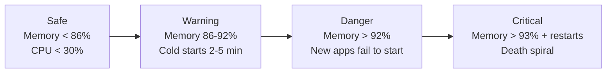

# Memory Pressure on App Service

!!! success "Status: Published (실험 완료)"

## 1. Question

How does plan-level memory pressure on a shared Azure App Service Linux plan affect startup success, cold-start duration, and stability, and does the behavior differ between Flask apps deployed with ZIP deploy and Node.js apps deployed as custom containers?

## 2. Why this matters

Memory pressure is one of the fastest ways to turn a seemingly healthy App Service plan into a multi-app incident. Support cases often begin as “some apps are slow” and then escalate into “new apps do not start” or “apps keep restarting for no clear reason.”

This experiment matters because it isolates a common support question: whether plan-level memory saturation causes predictable degradation patterns, and whether the same patterns appear equally for built-in runtime/ZIP deploy apps and custom container apps.

## 3. Customer symptom

Typical customer reports matched the following patterns:

- “The app was fine earlier, but after scaling app count on the same B1 plan, new apps return 503.”
- “Cold start suddenly takes several minutes even though code did not change.”
- “Apps keep restarting and never recover once memory gets tight.”
- “Containerized apps on the same SKU do not show the same failure pattern.”

## 4. Hypothesis

If shared-plan memory usage rises high enough on App Service Linux, Flask apps deployed through ZIP deploy will move through distinct degradation zones:

1. Stable operation below a plan-memory threshold.
2. Startup delay as memory approaches saturation.
3. Startup failure for newly added apps once memory crosses a higher threshold.
4. A restart-driven death spiral once the plan remains above the critical threshold.

The parallel hypothesis is that Node.js custom containers on the same B1 Linux SKU will not expose the same external memory pattern because container memory accounting differs from ZIP deploy apps.

## 5. Environment

| Service | SKU | Region | Runtime | OS | Date |
|---|---|---|---|---|---|
| Azure App Service | B1 | koreacentral | Flask (ZIP deploy) | Linux | 2026-04-02 |
| Azure App Service | B1 | koreacentral | Node.js (Custom Container) | Linux | 2026-04-02 |

## 6. Variables

### Controlled

| Variable | Value / Range |
|---|---|
| Plan SKU | B1 |
| Region | koreacentral |
| Operating system | Linux |
| Test date | 2026-04-02 |
| Deployment styles compared | Flask with ZIP deploy, Node.js with custom container |
| App count and per-app memory targets | 2×100 MB, 8×50 MB, 4×175 MB, 6×75 MB |

### Observed

| Variable | Meaning |
|---|---|
| Plan memory percentage | Shared memory utilization on the B1 worker |
| Startup outcome | Successful start vs. failed start with 503 |
| Cold-start duration | Time to become responsive after deployment/start |
| Restart behavior | Stable, repeated restart, or crash loop |
| HTTP failures | Presence of 5xx responses |

## 7. Instrumentation

The experiment relied on App Service platform and workload signals that are available during real incidents:

- Azure Monitor plan metrics for memory and CPU trend correlation.
- HTTP outcome tracking to identify 503 failures during startup and scale-out attempts.
- App Service restart/startup observations to detect crash-loop behavior.
- Side-by-side comparison between Flask/ZIP deploy and Node.js/container deployments on the same B1 Linux context.

### KQL: detect plan memory pressure over time

```kusto
AzureMetrics
| where ResourceProvider == "MICROSOFT.WEB"
| where MetricName in ("MemoryPercentage", "CpuPercentage")
| summarize AvgValue = avg(Total) by MetricName, bin(TimeGenerated, 5m), Resource
| order by TimeGenerated asc
```

### KQL: correlate startup-time 503 failures

```kusto
AppServiceHTTPLogs
| where ScStatus == 503
| summarize Failures = count() by SiteName, bin(TimeGenerated, 5m)
| order by TimeGenerated asc
```

### KQL: identify restart or crash-loop periods

```kusto
AppServiceConsoleLogs
| where Message has_any ("restart", "stopping site", "starting site", "container", "failed")
| project TimeGenerated, SiteName, Message
| order by TimeGenerated asc
```

## 8. Procedure

1. Provision a shared B1 Linux App Service plan in koreacentral.
2. Deploy the Flask application using ZIP deploy and establish a baseline with 2 apps allocating 100 MB each.
3. Increase app count and memory patterns across these configurations for Flask/ZIP deploy:
    - 8 apps × 50 MB
    - 4 apps × 175 MB
    - 6 apps × 75 MB
4. Record plan memory percentage, startup outcome, average response time, and 5xx behavior for each Flask scenario.
5. Repeat comparable high-density scenarios using Node.js custom containers:
    - 8 apps × 50 MB
    - 4 apps × 175 MB
6. Compare stability, visible memory percentage, and error behavior between the two deployment models.

## 9. Expected signal

If the hypothesis is correct, the signal should look like this:

- Flask/ZIP deploy stays healthy in a lower memory zone.
- Cold-start time increases sharply before outright startup failure.
- At a higher threshold, newly started apps fail with 503 rather than degrading gracefully.
- Once the plan is both highly saturated and restarting, the system does not self-recover quickly and enters a crash loop.
- Node.js/custom container results do not mirror the same visible memory curve even when per-app allocations are configured similarly.

## 10. Results

### Flask / ZIP deploy results

| Scenario | Outcome | Memory | Avg response | 5xx |
|---|---|---:|---:|---:|
| 2 apps × 100 MB | Baseline stable | 76% | 934 ms | 0 |
| 8 apps × 50 MB | Apps 1-6 started; apps 7-8 failed | Not separately stated | Not separately stated | 503 on apps 7-8 |
| 4 apps × 175 MB | Stable but severely delayed startup | 95% | Cold start 6 min | Not stated |
| 6 apps × 75 MB | Crash loop / death spiral | 93%+ | Not stable enough for comparable average | Restart-driven failure |

### Node.js / custom container results

| Scenario | Outcome | Memory | Errors |
|---|---|---:|---:|
| 8 apps × 50 MB | Stable | 73-77% | 0 |
| 4 apps × 175 MB | Stable | 73-77% | 0 |

### Degradation zones observed for Flask / ZIP deploy

| Zone | Threshold | Observed behavior |
|---|---|---|
| Safe | Memory < 86%, CPU < 30% | Stable performance |
| Warning | Memory 86-92% | Cold starts increased to roughly 2-5 minutes |
| Danger | Memory > 92% | New apps failed to start |
| Critical | Memory > 93% with restarts | Death spiral / crash loop |

### Degradation progression



## 11. Interpretation

- **[Measured]** The Flask baseline at 2 apps × 100 MB remained stable at 76% memory, 934 ms average response time, and 0 5xx, establishing that the B1 Linux plan could handle moderate shared memory pressure without visible failure.
- **[Observed]** In the Flask 8 apps × 50 MB scenario, apps 7 and 8 failed with 503 instead of all apps degrading evenly. This is a capacity cliff pattern, not a smooth performance decline.
- **[Measured]** In the Flask 4 apps × 175 MB scenario, memory reached 95% and cold start increased to 6 minutes compared with a roughly 60-second baseline. This shows startup delay appears before total startup failure.
- **[Observed]** In the Flask 6 apps × 75 MB scenario, the plan entered a crash loop once memory stayed above 93% and restarts began.
- **[Correlated]** The Flask degradation zones align with progressive operational impact: first latency, then startup failure, then restart-driven instability.
- **[Measured]** Node.js custom containers stayed within 73-77% observed memory across both 8×50 MB and 4×175 MB scenarios, with 0 errors in both cases.
- **[Correlated]** The absence of visible saturation and errors in the Node.js container runs, despite comparable scenario structure, indicates materially different memory accounting or isolation behavior versus Flask/ZIP deploy on the same SKU family.
- **[Inferred]** For ZIP deploy apps on B1 Linux, plan memory percentage is a useful leading indicator for incident progression because the warning, danger, and critical zones aligned with distinct operational outcomes.
- **[Strongly Suggested]** Support engineers should not assume that memory behavior observed in custom containers will predict memory behavior for built-in runtime or ZIP deploy workloads on the same plan type.

## 12. What this proves

This experiment proves the following within the tested environment:

- Shared-plan memory pressure on B1 Linux can produce clear degradation zones for Flask apps deployed through ZIP deploy.
- For Flask/ZIP deploy, the degradation sequence was observable as: stable baseline → slow cold start → startup failure → death spiral.
- Startup failure can occur before every existing app shows an obvious steady-state performance collapse.
- In the tested scenarios, Node.js custom containers did not reproduce the same visible memory saturation or failure pattern.

## 13. What this does NOT prove

This experiment does **not** prove the following:

- That the same thresholds apply to all SKUs, especially Premium or memory-optimized SKUs.
- That every Linux runtime behaves exactly like Flask/ZIP deploy.
- That container workloads are immune to memory pressure; only that the tested container scenarios remained stable and exposed different observed accounting.
- That CPU was irrelevant in every case; only that memory thresholds were the dominant differentiator in this experiment.
- That the exact 86%, 92%, and 93% thresholds are universal outside the tested B1 koreacentral environment on 2026-04-02.

## 14. Support takeaway

For support triage on App Service Linux B1 plans:

- If Flask or similar ZIP deploy apps begin showing long cold starts once plan memory enters the high-80% range, treat that as an early warning rather than waiting for outright failure.
- If memory exceeds roughly 92%, investigate shared-plan saturation immediately because new app starts may fail with 503.
- If memory exceeds 93% and restarts begin, prioritize mitigation over deep investigation because the system may already be in a death spiral.
- Do not transfer conclusions from custom container tests directly onto ZIP deploy incidents without checking how memory is actually being reported and enforced.

## 15. Reproduction notes

- Keep the environment consistent: B1 Linux, koreacentral, same-day comparative runs where possible.
- Reproduce Flask and Node.js scenarios separately but on equivalent plan settings.
- Preserve the tested scenario sets exactly when comparing outcomes:
    - Flask baseline: 2×100 MB
    - Flask density test: 8×50 MB
    - Flask high-allocation test: 4×175 MB
    - Flask instability test: 6×75 MB
    - Node.js container tests: 8×50 MB and 4×175 MB
- Compare memory percentage, startup time, 503 count, and restart frequency rather than relying on only one signal.
- Treat the Flask degradation zones as environment-specific reproduction guidance, not as universal platform guarantees.

## 16. Related guide / official docs

- [lab-memory-pressure](https://github.com/yeongseon/lab-memory-pressure)
- [azure-app-service-practical-guide](https://github.com/yeongseon/azure-app-service-practical-guide)
- [Microsoft Learn: Monitor App Service instances by using metrics](https://learn.microsoft.com/en-us/azure/app-service/web-sites-monitor)
- [Microsoft Learn: Diagnose memory leaks on Azure App Service](https://learn.microsoft.com/en-us/troubleshoot/azure/app-service/capture-memory-dumps-app-service)
- [Microsoft Learn: Configure a custom Linux container for Azure App Service](https://learn.microsoft.com/en-us/azure/app-service/configure-custom-container)
