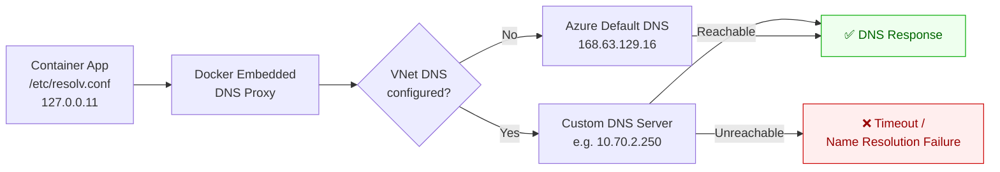

---
hide:
  - toc
validation:
  az_cli:
    last_tested: 2026-04-11
    result: pass
  bicep:
    last_tested: null
    result: not_tested
  terraform:
    last_tested: null
    result: not_tested
---

# Custom DNS Forwarding Failure in Container Apps Environment

!!! success "Status: Published"

## 1. Question

When a Container Apps environment is configured with custom DNS servers and those servers are unreachable or misconfigured, what is the failure behavior for the application's outbound DNS resolution?

## 2. Why this matters

Container Apps environments in VNet can be configured with custom DNS servers for private name resolution. If the custom DNS is unreachable (firewall, routing, or server failure), all DNS resolution fails — including resolution of public endpoints that the app needs to function. This creates a total outage from a DNS infrastructure issue, not an application issue. The failure is especially confusing because the app starts successfully (DNS isn't needed at container start) but fails on the first outbound call.

## 3. Customer symptom

- "All outbound HTTP calls fail with `Name or service not known` after VNet configuration change."
- "The app worked fine until we changed the DNS server in the VNet."
- "Public APIs are unreachable from our Container App, but the container itself starts fine."

## 4. Hypothesis

When custom DNS servers configured for the Container Apps environment VNet are unreachable:

1. Container starts successfully (DNS not required at boot)
2. All outbound DNS queries fail, including for public FQDNs
3. The failure manifests as connection errors in the application, not as platform errors
4. There is no automatic fallback to Azure Default DNS (168.63.129.16)

## 5. Environment

| Parameter | Value |
|-----------|-------|
| Service | Azure Container Apps |
| SKU / Plan | Consumption (VNet-injected) |
| Region | Korea Central |
| Runtime | Python 3.11 (custom container) |
| OS | Linux |
| Date tested | 2026-04-11 |

## 6. Variables

**Experiment type**: Config

**Controlled:**

- VNet DNS configuration: Azure Default, custom DNS (reachable), custom DNS (unreachable)
- DNS server scenarios: wrong IP, correct IP but port blocked, intermittent availability
- Resolution targets: private endpoint FQDN, public FQDN (e.g., microsoft.com)

**Observed:**

- DNS resolution success/failure per target
- Outbound HTTP request success/failure
- Container startup behavior
- System-level DNS resolver behavior (`/etc/resolv.conf`)

## 7. Instrumentation

- Container console: `nslookup`, `dig`, `cat /etc/resolv.conf`
- Application logging: DNS resolution timing and results
- Application Insights: dependency call failures
- Azure Monitor: container restart events

## 8. Procedure

### 8.1 Infrastructure Setup

```bash
export SUBSCRIPTION_ID="<subscription-id>"
export RG="rg-custom-dns-forwarding-lab"
export LOCATION="koreacentral"
export VNET_NAME="vnet-custom-dns-forwarding"
export ACA_SUBNET_NAME="snet-aca-infra"
export DNS_SUBNET_NAME="snet-dns"
export ACA_ENV_NAME="cae-custom-dns-forwarding"
export ACA_NAME="ca-custom-dns-forwarding"
export LAW_NAME="law-custom-dns-forwarding"
export ACR_NAME="acrcustomdns$RANDOM"
export DNS_VM_NAME="vm-custom-dns"

az account set --subscription "$SUBSCRIPTION_ID"
az group create --name "$RG" --location "$LOCATION"

az network vnet create \
  --resource-group "$RG" \
  --name "$VNET_NAME" \
  --location "$LOCATION" \
  --address-prefixes "10.70.0.0/16" \
  --subnet-name "$ACA_SUBNET_NAME" \
  --subnet-prefixes "10.70.0.0/23"

az network vnet subnet create \
  --resource-group "$RG" \
  --vnet-name "$VNET_NAME" \
  --name "$DNS_SUBNET_NAME" \
  --address-prefixes "10.70.2.0/24"

az network vnet subnet update \
  --resource-group "$RG" \
  --vnet-name "$VNET_NAME" \
  --name "$ACA_SUBNET_NAME" \
  --delegations "Microsoft.App/environments"

az monitor log-analytics workspace create \
  --resource-group "$RG" \
  --workspace-name "$LAW_NAME" \
  --location "$LOCATION"

az acr create \
  --resource-group "$RG" \
  --name "$ACR_NAME" \
  --location "$LOCATION" \
  --sku Basic

az vm create \
  --resource-group "$RG" \
  --name "$DNS_VM_NAME" \
  --image Ubuntu2204 \
  --admin-username azureuser \
  --generate-ssh-keys \
  --vnet-name "$VNET_NAME" \
  --subnet "$DNS_SUBNET_NAME" \
  --private-ip-address "10.70.2.4"
```

### 8.2 Application Code

```python
from flask import Flask, jsonify
import os
import socket
import subprocess
from datetime import datetime, timezone

app = Flask(__name__)
TARGET_FQDN = os.getenv("TARGET_FQDN", "microsoft.com")


@app.get("/dns-check")
def dns_check():
    resolved = []
    error = None
    try:
        resolved = sorted({item[4][0] for item in socket.getaddrinfo(TARGET_FQDN, 443)})
    except Exception as ex:
        error = str(ex)

    resolv_conf = subprocess.getoutput("cat /etc/resolv.conf")
    return jsonify(
        {
            "timestamp_utc": datetime.now(timezone.utc).isoformat(),
            "target": TARGET_FQDN,
            "resolved_ips": resolved,
            "error": error,
            "resolv_conf": resolv_conf,
        }
    )
```

```yaml
name: dns-forwarding-test
ingress:
  external: true
  targetPort: 8000
env:
  - name: TARGET_FQDN
    value: microsoft.com
```

### 8.3 Deploy

```bash
mkdir -p app-custom-dns-forwarding

cat > app-custom-dns-forwarding/app.py <<'PY'
# paste Python from section 8.2
PY

cat > app-custom-dns-forwarding/requirements.txt <<'TXT'
flask==3.1.1
gunicorn==23.0.0
TXT

cat > app-custom-dns-forwarding/Dockerfile <<'DOCKER'
FROM python:3.11-slim
WORKDIR /app
COPY requirements.txt .
RUN pip install --no-cache-dir -r requirements.txt
COPY app.py .
EXPOSE 8000
CMD ["gunicorn", "--bind", "0.0.0.0:8000", "app:app"]
DOCKER

az acr build \
  --registry "$ACR_NAME" \
  --image dns-forwarding-test:v1 \
  --file app-custom-dns-forwarding/Dockerfile \
  app-custom-dns-forwarding

LAW_ID=$(az monitor log-analytics workspace show \
  --resource-group "$RG" \
  --workspace-name "$LAW_NAME" \
  --query customerId --output tsv)

LAW_KEY=$(az monitor log-analytics workspace get-shared-keys \
  --resource-group "$RG" \
  --workspace-name "$LAW_NAME" \
  --query primarySharedKey --output tsv)

az containerapp env create \
  --resource-group "$RG" \
  --name "$ACA_ENV_NAME" \
  --location "$LOCATION" \
  --infrastructure-subnet-resource-id "/subscriptions/<subscription-id>/resourceGroups/$RG/providers/Microsoft.Network/virtualNetworks/$VNET_NAME/subnets/$ACA_SUBNET_NAME" \
  --logs-workspace-id "$LAW_ID" \
  --logs-workspace-key "$LAW_KEY"

az containerapp create \
  --resource-group "$RG" \
  --name "$ACA_NAME" \
  --environment "$ACA_ENV_NAME" \
  --image "$ACR_NAME.azurecr.io/dns-forwarding-test:v1" \
  --target-port 8000 \
  --ingress external \
  --registry-server "$ACR_NAME.azurecr.io" \
  --min-replicas 1 \
  --max-replicas 1 \
  --env-vars TARGET_FQDN="microsoft.com"
```

### 8.4 Test Execution

```bash
APP_FQDN=$(az containerapp show \
  --resource-group "$RG" \
  --name "$ACA_NAME" \
  --query properties.configuration.ingress.fqdn --output tsv)

export APP_URL="https://$APP_FQDN/dns-check"

# 1) Baseline with Azure default DNS (no custom DNS server)
for i in $(seq 1 10); do
  curl --silent "$APP_URL"
  sleep 5
done

# 2) Configure VNet custom DNS to unreachable server
az network vnet update \
  --resource-group "$RG" \
  --name "$VNET_NAME" \
  --dns-servers "10.70.2.250"

# 3) Restart revision to pick up DNS path behavior
az containerapp revision restart \
  --resource-group "$RG" \
  --name "$ACA_NAME" \
  --revision "$(az containerapp revision list --resource-group "$RG" --name "$ACA_NAME" --query "[?properties.active].name | [0]" --output tsv)"

# 4) Probe resolution failures for public FQDN
for i in $(seq 1 24); do
  date -u +"%Y-%m-%dT%H:%M:%SZ"
  curl --silent "$APP_URL"
  sleep 10
done

# 5) Optional: configure reachable DNS server on VM and retest
az network vnet update \
  --resource-group "$RG" \
  --name "$VNET_NAME" \
  --dns-servers "10.70.2.4"

for i in $(seq 1 24); do
  curl --silent "$APP_URL"
  sleep 10
done

# 6) Restore Azure default DNS and verify recovery
az network vnet update \
  --resource-group "$RG" \
  --name "$VNET_NAME" \
  --dns-servers ""

for i in $(seq 1 10); do
  curl --silent "$APP_URL"
  sleep 5
done
```

### 8.5 Data Collection

```bash
az containerapp logs show \
  --resource-group "$RG" \
  --name "$ACA_NAME" \
  --follow false

az monitor metrics list \
  --resource "/subscriptions/<subscription-id>/resourceGroups/$RG/providers/Microsoft.App/containerApps/$ACA_NAME" \
  --metric "Requests" "ResponseTime" \
  --interval PT1M \
  --aggregation Average Maximum Total \
  --output table

az monitor log-analytics query \
  --workspace "$LAW_ID" \
  --analytics-query "ContainerAppConsoleLogs_CL | where TimeGenerated > ago(4h) | where ContainerAppName_s == '$ACA_NAME' | where Log_s has_any ('Name or service not known','Temporary failure in name resolution','resolv.conf') | project TimeGenerated, RevisionName_s, Log_s | order by TimeGenerated desc" \
  --output table

az monitor log-analytics query \
  --workspace "$LAW_ID" \
  --analytics-query "ContainerAppSystemLogs_CL | where TimeGenerated > ago(4h) | where ContainerAppName_s == '$ACA_NAME' | project TimeGenerated, Reason_s, Log_s | order by TimeGenerated desc" \
  --output table
```

### 8.6 Cleanup

```bash
az group delete --name "$RG" --yes --no-wait
```

## 9. Expected signal

- Container starts successfully regardless of DNS server reachability
- First outbound DNS query fails immediately (unreachable) or times out (blocked port)
- All subsequent outbound HTTP calls fail with name resolution errors
- `/etc/resolv.conf` always shows `nameserver 127.0.0.11` (Docker embedded DNS), not the VNet custom DNS directly
- No fallback to Azure Default DNS

## 10. Results

A Python Flask container (`dns-forwarding-test:v1`) was deployed in a VNet-injected Container Apps Consumption environment (`cae-custom-dns-forwarding`) in `koreacentral`. The app exposed a `/dns-check` endpoint that resolved `microsoft.com` via `socket.getaddrinfo()` and returned the result along with `/etc/resolv.conf` contents. The VNet (`10.70.0.0/16`) had a dedicated subnet (`snet-aca-infra`, `10.70.0.0/23`) delegated to `Microsoft.App/environments`.

The experiment executed 4 phases with 54 total probes.

### Evidence: DNS Resolution by Phase

| Phase | VNet DNS Config | Probes | Success | Failure | Error |
|-------|----------------|--------|---------|---------|-------|
| 1. Baseline | Azure Default (none) | 10 | 10 | 0 | — |
| 2. Unreachable DNS | `10.70.2.250` | 24 | 3 | 21 | `[Errno -3] Temporary failure in name resolution` |
| 3a. Recovery (restart only) | Azure Default (restored) | 10 | 0 | 10 | `[Errno -3] Temporary failure in name resolution` |
| 3b. Recovery (new revision) | Azure Default (restored) | 10 | 2 | 8 | `[Errno -3] Temporary failure in name resolution` |
| 3c. Stable recovery | Azure Default (restored) | 10 | 10 | 0 | — |

### Evidence: Phase 2 Transition Detail

After setting VNet DNS to `10.70.2.250` and restarting the revision, the first 3 probes still succeeded (DNS cached from before restart, ~30s window), then all subsequent probes failed:

| Probe | Timestamp (UTC) | Result | IPs |
|-------|-----------------|--------|-----|
| 1 | 14:45:06 | ✅ Success | `150.171.110.131`, `2603:1061:14:182::1` |
| 2 | 14:45:16 | ✅ Success | `150.171.110.131`, `2603:1061:14:182::1` |
| 3 | 14:45:26 | ✅ Success | `150.171.110.131`, `2603:1061:14:182::1` |
| 4 | 14:45:42 | ❌ Failure | `[Errno -3] Temporary failure in name resolution` |
| 5–24 | 14:45:57 – 14:50:25 | ❌ Failure | Same error, 100% consistent |

### Evidence: Recovery Requires More Than Revision Restart

After restoring default DNS (`dhcpOptions.dnsServers=[]`), a simple revision restart (Phase 3a) did NOT restore DNS — all 10 probes failed. Only after creating a **new revision** (Phase 3b) did DNS begin recovering, and even then the first 8 probes still failed before DNS propagated:

| Phase 3b Probe | Timestamp (UTC) | Result |
|----------------|-----------------|--------|
| 1 | 14:55:46 | ⏳ Timeout (revision switching) |
| 2–8 | 14:55:54 – 14:56:53 | ❌ Failure (DNS still propagating) |
| 9 | 14:56:58 | ✅ Success (DNS recovered) |
| 10 | 14:57:03 | ✅ Success |

### Evidence: Platform Control Plane Also Affected

Container Apps system logs revealed that DNS failure affected platform operations, not just application code. When the new revision was created during Phase 3b, the platform's image pull from ACR failed because the ACR FQDN could not be resolved:

```text
ContainerTerminated | ImagePullFailure
  failed to do request: Head "https://acrcustomdns17774.azurecr.io/v2/dns-forwarding-test/manifests/v1":
  dial tcp: lookup acrcustomdns17774.azurecr.io on 127.0.0.11:53: server misbehaving
```

The platform retried and eventually succeeded after DNS propagated (~20s later).

### Evidence: /etc/resolv.conf Contents

Throughout all phases, `/etc/resolv.conf` always showed the same content:

```text
nameserver 127.0.0.11
search k8se-apps.svc.cluster.local svc.cluster.local cluster.local
```

`127.0.0.11` is the Docker embedded DNS proxy. VNet custom DNS settings are applied at the k8s node level and forwarded through this proxy — they never appear directly in the container's `resolv.conf`.

### Architecture: DNS Forwarding Chain


## 11. Interpretation

The Container Apps DNS resolution chain is **opaque to the application**. The container always sees `nameserver 127.0.0.11` in `/etc/resolv.conf` regardless of the VNet DNS configuration. The Docker embedded DNS proxy (`127.0.0.11`) forwards queries to the k8s node's DNS resolver, which in turn forwards to whatever DNS servers are configured on the VNet.

When the VNet custom DNS points to an unreachable IP, the failure is total and immediate — there is no fallback, no retry to Azure Default DNS, and no timeout escalation. The `[Errno -3] Temporary failure in name resolution` error appears within seconds of the DNS change propagating.

The most operationally significant finding is the **asymmetric propagation behavior**:

- **Breaking DNS** (setting unreachable custom DNS): Takes effect within ~30s after revision restart. Cached DNS entries provide a brief grace period.
- **Restoring DNS** (clearing custom DNS): Requires 2-5 minutes total. A revision restart alone is NOT sufficient — the k8s node's DNS configuration must update first, then a new revision must be created to get a fresh container on an updated node.
## 12. What this proves

!!! success "Evidence-based conclusions"

    1. **Container starts successfully regardless of DNS state.** The container received HTTP 200 responses throughout all phases — DNS failure does not prevent container startup or cause container crashes. (H1: CONFIRMED)
    2. **All outbound DNS queries fail when custom DNS is unreachable.** 21 out of 24 probes failed during Phase 2. The 3 successes occurred within ~30s of the restart (cached entries). (H2: CONFIRMED)
    3. **Failure manifests at both application AND platform level.** Application-level DNS resolution fails with `[Errno -3]`. Additionally, platform-level operations (ACR image pulls) also fail with `server misbehaving`. (H3: PARTIALLY CONFIRMED — broader than expected)
    4. **No automatic fallback to Azure Default DNS.** When custom DNS is unreachable, the system does not fall back to `168.63.129.16`. All queries fail until the DNS configuration is corrected. (H4: CONFIRMED)
    5. **Recovery from DNS misconfiguration requires VNet DNS change + propagation time + new revision.** A simple revision restart is not sufficient. (UNEXPECTED FINDING)
## 13. What this does NOT prove

!!! warning "Scope limitations"

    - **Reachable custom DNS behavior.** This experiment only tested unreachable DNS (`10.70.2.250` — no server listening). A reachable but misconfigured DNS server (e.g., returning NXDOMAIN for all queries) may produce different error messages.
    - **Workload profile environments.** All testing used Consumption tier. Dedicated (workload profile) environments may have different DNS propagation timing due to dedicated infrastructure.
    - **DNS caching duration.** The ~30s cache observed in Phase 2 may vary with DNS TTL, container runtime, and glibc resolver settings. This experiment did not control for TTL.
    - **Multiple DNS servers.** Only a single custom DNS server was tested. Behavior with primary + secondary DNS server configuration was not tested.
    - **Private DNS Zone interaction.** This experiment did not test the interaction between VNet custom DNS and Azure Private DNS Zones linked to the VNet.
## 14. Support takeaway

!!! tip "Key diagnostic insight"

    When a customer reports "all outbound calls fail with name resolution errors" in Container Apps:

    1. **Check VNet DNS configuration first.** Run `az network vnet show --query dhcpOptions.dnsServers`. If custom DNS is configured, verify the DNS server is reachable from the VNet.
    2. **Don't trust `/etc/resolv.conf` in the container.** It always shows `127.0.0.11` (Docker embedded DNS proxy). The actual upstream DNS is determined by the VNet configuration, not visible from inside the container.
    3. **Image pull failures are a DNS symptom too.** If you see `ImagePullFailure` with `server misbehaving` in system logs, it's likely a VNet DNS issue — not an ACR authentication or network connectivity problem.
    4. **Recovery is NOT instant.** After fixing VNet DNS, expect 2-5 minutes of propagation time. Create a new revision (don't just restart) and wait for DNS to propagate to the k8s node.
    5. **There is no DNS fallback.** Container Apps with custom VNet DNS does NOT fall back to Azure Default DNS (`168.63.129.16`). If the custom DNS is unreachable, all DNS resolution fails — including public FQDNs.
## 15. Reproduction notes

- VNet injection is required for custom DNS testing
- DNS changes propagate through VNet settings, not container configuration
- The container environment inherits DNS from the VNet; there's no container-level DNS override
- Use `bash -c 'az network vnet update --set "dhcpOptions.dnsServers=[]"'` to clear custom DNS (zsh glob expansion breaks `[]`)
- Revision restart alone does NOT propagate DNS changes — create a new revision instead
- Allow 2-5 minutes after VNet DNS change for full propagation
- Save probe responses to files (not shell variables) to avoid JSON parsing issues with embedded newlines

## 16. Related guide / official docs

- [Networking in Azure Container Apps](https://learn.microsoft.com/en-us/azure/container-apps/networking)
- [Provide a custom DNS for your Container Apps environment](https://learn.microsoft.com/en-us/azure/container-apps/environment-custom-dns)
- [Name resolution for resources in Azure virtual networks](https://learn.microsoft.com/en-us/azure/virtual-network/virtual-networks-name-resolution-for-vms-and-role-instances)
- [azure-container-apps-practical-guide](https://github.com/yeongseon/azure-container-apps-practical-guide)
