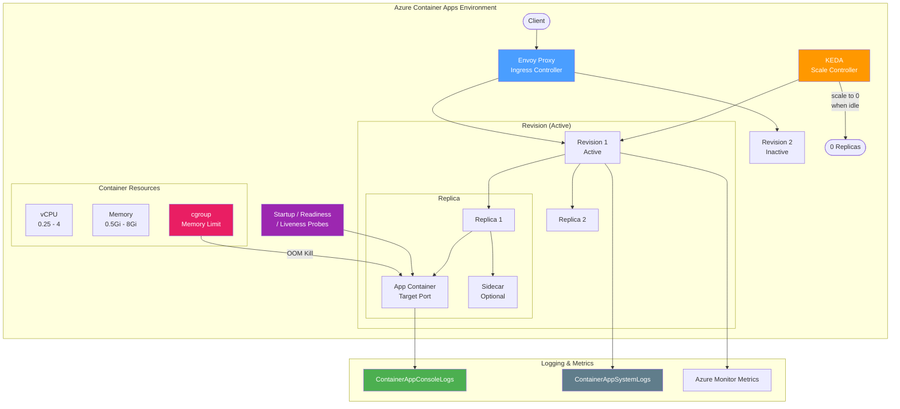

---
hide:
  - toc
---

# Container Apps Labs

Azure Container Apps troubleshooting experiments focused on ingress behavior, container lifecycle, OOM observability, networking edge cases, and scaling patterns.

## Architecture Overview

Azure Container Apps is a managed container platform built on Kubernetes. Understanding the ingress, scaling, and container lifecycle components is essential for diagnosing where failures originate.

### Key Components for Troubleshooting

| Component | Role | Why It Matters |
|-----------|------|---------------|
| **Envoy Proxy** | Ingress controller handling HTTP routing and TLS | Target port misconfiguration, SNI routing, and host header handling happen here |
| **Revision** | Immutable deployment unit containing replica configuration | Traffic splitting, blue-green deployment, and rollback operate at revision level |
| **Replica** | Running container instance within a revision | Each replica has its own cgroup memory limit; OOM kills target processes inside |
| **KEDA** | Event-driven autoscaler | Scale-to-zero creates cold start latency; scaling decisions affect availability |
| **cgroup Memory Limit** | Kernel-enforced memory boundary per container | OOM kills are invisible in system logs when multi-process servers absorb worker kills |
| **Probes** | Startup, readiness, and liveness health checks | Misconfigured probe timing causes restart loops or premature traffic routing |
| **ContainerAppConsoleLogs** | Application stdout/stderr captured as logs | Often the ONLY evidence source for worker-level OOM kills |
| **ContainerAppSystemLogs** | Platform lifecycle events (start, stop, crash) | Does NOT capture worker-level OOM kills when PID 1 survives |

!!! note
    These experiments focus on the managed Container Apps environment and its Envoy ingress layer. Underlying Kubernetes control plane behavior is out of scope.

## Experiment Status

| Experiment | Status | Description |
|-----------|--------|-------------|
| [Scale-to-Zero 503](scale-to-zero-502/overview.md) | **Published** | First-request failure modes after idle scale-down |
| [Target Port Detection](target-port-detection/overview.md) | **Published** | Auto-detection failures causing 502 on running containers |
| [OOM Visibility Gap](oom-visibility-gap/overview.md) | **Published** | Observability gaps across metrics and logs for OOM kills |
| [Custom DNS Forwarding](custom-dns-forwarding/overview.md) | **Published** | Outbound resolution failure with unreachable custom DNS |
| [Ingress SNI / Host Header](ingress-sni-host-header/overview.md) | **Published** | SNI and host header routing behavior |
| [Private Endpoint FQDN vs IP](private-endpoint-fqdn-vs-ip/overview.md) | **Published** | FQDN vs. direct IP access differences |
| [Startup Probes](startup-probes/overview.md) | **Published** | Probe interaction and failure patterns |
| [Revision Update Downtime](revision-update-downtime/overview.md) | **Published** | 502/503 errors during revision updates |
| [Internal Name Routing](internal-name-routing/overview.md) | **Published** | Internal name vs FQDN routing behavior |
| [Burst Scaling Queueing](burst-scaling-queueing/overview.md) | **Published** | Request queueing during burst scaling |
| [Scaling Rule Conflicts](scaling-rule-conflicts/overview.md) | **Published** | Conflicting KEDA scaling rules behavior |
| [Liveness Probe Failures](liveness-probe-failures/overview.md) | **Published** | Runtime liveness probe failure patterns and in-flight request impact |
| [Dependency-Coupled Health](dependency-coupled-health/overview.md) | **Published** | Readiness vs liveness probe coupling with external dependencies |
| [Default Probe Injection](default-probe-injection/overview.md) | **Published** | Whether Container Apps auto-injects probes with ingress enabled |
| [Multi-Revision Traffic Split](multi-revision-traffic-split/overview.md) | **Published** | Unhealthy revision behavior in percentage-based traffic splitting |
| [Probe Protocol Semantics](probe-protocol-semantics/overview.md) | **Published** | HTTP vs TCP probe failure detection differences |
| [Worker Saturation vs Liveness](worker-saturation-liveness/overview.md) | **Published** | Single-worker thread saturation causing liveness probe timeout |
| [HTTP/2 gRPC Timeout](http2-grpc-timeout/overview.md) | **Draft** | Envoy idle timeout on gRPC streams; heartbeat mitigation |
| [Secret Volume Mount](secret-volume-mount/overview.md) | **Draft** | Volume-mounted secrets do not auto-refresh; new revision required |
| [Replica Restart Loop](replica-restart-loop/overview.md) | **Draft** | Crash loop backoff; OOMKill vs probe failure restart patterns |
| [Bicep Revision Suffix Collision](bicep-revision-suffix-collision/overview.md) | **Draft** | Static revisionSuffix no-op re-deployments in CI/CD pipelines |
| [Dapr Component Scoping](dapr-component-scoping/overview.md) | **Draft** | Component scope enforcement and bypass vectors |

## Published Experiments

### [Scale-to-Zero 503](scale-to-zero-502/overview.md) — **Published**

First-request failure modes after idle scale-down to zero replicas. Documents the cold start window where incoming requests receive 503 errors or experience extended timeouts while the first replica initializes.

??? success "Experiment Complete"
    Completed 2026-04 on Consumption tier (koreacentral). Captures the activation delay, error codes, and the timeline from zero replicas to first successful response.

### [Target Port Detection](target-port-detection/overview.md) — **Published**

Auto-detection failures causing 502 errors on running containers. Demonstrates how Container Apps' ingress port auto-detection can select the wrong port, causing all traffic to fail even though the container is healthy and listening.

??? success "Experiment Complete"
    Completed 2026-04 on Consumption tier (koreacentral). Documents the auto-detection algorithm behavior and the specific conditions that cause detection failure.

### [OOM Visibility Gap](oom-visibility-gap/overview.md) — **Published**

Observability gaps across Azure Monitor metrics, system logs, and console logs when containers are OOM-killed. Reveals that multi-process servers (gunicorn) absorb worker OOM kills without triggering any platform-level telemetry — console logs are the only evidence source.

??? success "Experiment Complete"
    Completed 2026-04 on Consumption tier (koreacentral). Five OOM kills across two variants (gradual and spike). WorkingSetBytes underreports peaks by 2.4×; RestartCount stays 0; SystemLogs contain zero events.

### [Startup Probes](startup-probes/overview.md) — **Published**

Interaction between startup, readiness, and liveness probes. Investigates failure patterns that emerge from misconfigured probe timing, threshold settings, and the order of probe evaluation during container initialization.

??? success "Experiment Complete"
    Completed 2026-04 on Consumption tier (koreacentral). Four probe scenarios tested: startup-only failure, no-startup with liveness, readiness-only failure, and combined aggressive probes. Documents restart cascades, traffic routing gaps, and probe handoff timing.
### [Ingress SNI / Host Header](ingress-sni-host-header/overview.md) — **Published**

How Container Apps ingress handles Server Name Indication (SNI) and host header routing. Demonstrates that Envoy routes by Host header (not SNI), SNI is required for TLS admission, and any app in a shared environment can be reached by manipulating the Host header.

??? success "Experiment Complete"
    Completed 2026-04 on Consumption tier (koreacentral). Eight SNI/Host permutations tested across 3 runs with 100% reproducibility. Key finding: Host header is the routing key; SNI is only a TLS admission gate.

### [Custom DNS Forwarding](custom-dns-forwarding/overview.md) — **Published**

Outbound resolution failure when custom DNS servers configured in the Container Apps environment become unreachable. Demonstrates that there is no DNS fallback to Azure Default DNS, that recovery requires VNet DNS change + propagation time + new revision, and that DNS failure also breaks platform-level operations (ACR image pulls).

??? success "Experiment Complete"
    Completed 2026-04-11 on Consumption tier (VNet-injected, koreacentral). 54 probes across 4 phases. All 4 hypothesis points confirmed; unexpected finding that recovery is asymmetric — breaking DNS takes ~30s but restoring takes 2-5 minutes.

### [Private Endpoint FQDN vs IP](private-endpoint-fqdn-vs-ip/overview.md) — **Published**

Behavioral differences when accessing a Container App via private endpoint FQDN versus direct IP address. Demonstrates that direct IP access fails at the TLS level due to missing SNI — not certificate validation — and that `curl --resolve` is the correct workaround.

??? success "Experiment Complete"
    Completed 2026-04-12 on Consumption tier (internal-only, VNet-injected, koreacentral). 10 access patterns tested across 5 runs with 100% reproducibility. Key finding: SNI is mandatory for TLS admission; `-k` and `-H Host:` do not help because the failure occurs before certificate presentation and before HTTP layer processing.

### [Revision Update Downtime](revision-update-downtime/overview.md) — **Published**

502/503 errors during revision updates. Documents the downtime window when deploying new revisions, conditions that cause failed requests, and mitigation strategies (traffic splitting, minReplicas).

??? success "Experiment Complete"
    Completed 2026-04 on Consumption tier (koreacentral). Captures revision update lifecycle, error codes during single-revision vs multi-revision modes, and the impact of minReplicas settings.

### [Internal Name Routing](internal-name-routing/overview.md) — **Published**

Internal name vs FQDN routing behavior in Container Apps. Investigates when internal names (without environment domain) work vs fail, the "Connection refused" errors, and DNS resolution differences.

??? success "Experiment Complete"
    Completed 2026-04 on Consumption tier (koreacentral). Documents internal vs FQDN routing resolution and connection behavior differences.

### [Burst Scaling Queueing](burst-scaling-queueing/overview.md) — **Published**

Request queueing behavior during rapid scale-out events. Tests how incoming requests are handled when KEDA triggers scaling faster than replicas can start, and whether Envoy queues or rejects excess traffic.

??? success "Experiment Complete"
    Completed 2026-04 on Consumption tier (koreacentral). Documents Envoy queueing behavior, replica startup timing, and request fate during rapid scale-out.

### [Scaling Rule Conflicts](scaling-rule-conflicts/overview.md) — **Published**

Behavior when multiple KEDA scaling rules conflict. Tests what happens when HTTP and custom (queue-based) scaling rules give contradictory signals, and which rule takes precedence.

??? success "Experiment Complete"
    Completed 2026-04 on Consumption tier (koreacentral). Documents KEDA rule precedence, max-wins behavior, and the interaction between HTTP and queue-based scaling rules.

### [Liveness Probe Failures](liveness-probe-failures/overview.md) — **Published**

Runtime liveness probe failure patterns covering dependency-checking probes (cascading restart), blocking I/O (timeout restart), missing probes (zombie undetected), and in-flight request drop during restart.

??? success "Experiment Complete"
    Completed 2026-04-13 on Consumption tier (koreacentral). Five scenarios tested: healthy baseline, dependency-checking liveness, blocking I/O liveness, missing liveness (zombie), and in-flight request drop. All four hypotheses confirmed with real system log evidence.

### [Dependency-Coupled Health](dependency-coupled-health/overview.md) — **Published**

Readiness vs liveness probe coupling with external dependencies. Demonstrates that liveness probes checking dependencies cause cascading restart loops, while readiness-only dependency checks allow self-healing after recovery.

??? success "Experiment Complete"
    Completed 2026-04-13 on Consumption tier (koreacentral). Six variants tested including readiness-only, liveness+readiness, slow dependency, and intermittent failure. Key finding: liveness+dependency caused 8 restarts and permanent Failed state; readiness-only self-healed.

### [Default Probe Injection](default-probe-injection/overview.md) — **Published**

Whether Container Apps automatically injects health probes when ingress is enabled. Tests four scenarios: no ingress, with ingress, slow startup (60s), and 404-returning apps.

??? success "Experiment Complete"
    Completed 2026-04-13 on Consumption tier (koreacentral). Confirmed Container Apps does NOT auto-inject probes regardless of ingress configuration. A 60s-delay app ran without restarts because no probes existed to detect the slow startup.

### [Multi-Revision Traffic Split](multi-revision-traffic-split/overview.md) — **Published**

Unhealthy revision behavior in percentage-based traffic splitting. Tests what happens when an unhealthy/Failed revision receives traffic through multi-revision traffic split configuration.

??? success "Experiment Complete"
    Completed 2026-04-13 on Consumption tier (koreacentral). With 90/10 split, requests routed to the Failed v2 revision timed out while v1 served normally. Rolling back to 100% v1 immediately resolved all errors. Key finding: Container Apps routes traffic to Failed revisions — no automatic skip.

### [Probe Protocol Semantics](probe-protocol-semantics/overview.md) — **Published**

HTTP vs TCP probe failure detection differences. Demonstrates that TCP probes only check port connectivity and cannot detect application-level failures (HTTP 503), while HTTP probes detect response codes.

??? success "Experiment Complete"
    Completed 2026-04-13 on Consumption tier (koreacentral). Two identical apps with same failure trigger: HTTP-probed app entered restart loop (5 restarts), TCP-probed app remained Healthy with 0 restarts despite /live returning 503.

### [Worker Saturation vs Liveness](worker-saturation-liveness/overview.md) — **Published**

Single-worker thread saturation causing liveness probe timeout and container restart. Tests the failure mode when a single long-running request blocks all probe responses.

??? success "Experiment Complete"
    Completed 2026-04-13 on Consumption tier (koreacentral). A 60s blocking request on a 1-worker/1-thread gunicorn app caused readiness failure at T+24s, liveness failure at T+40s, and container termination. App auto-recovered after restart.

## Draft Experiments

### [HTTP/2 gRPC Timeout](http2-grpc-timeout/overview.md) — **Draft**

How Envoy ingress handles long-lived HTTP/2 streams for gRPC. Tests idle timeout behavior on server-streaming and bidirectional gRPC RPCs, heartbeat prevention of timeout, and gRPC health probe HTTP/2 requirements.

!!! info "Status: Draft - Awaiting Execution"
    Addresses a common Container Apps gRPC streaming failure mode: streams terminated at exactly the ingress timeout.

### [Secret Volume Mount](secret-volume-mount/overview.md) — **Draft**

Whether volume-mounted Container Apps secrets auto-refresh when the secret value is updated. Tests plain text secrets, Key Vault references, and compares volume mount vs. environment variable refresh behavior.

!!! info "Status: Draft - Awaiting Execution"
    Important for customers expecting zero-downtime secret rotation via volume mounts.

### [Replica Restart Loop](replica-restart-loop/overview.md) — **Draft**

Crash loop backoff timing and detection. Tests exponential backoff patterns for immediate crashes vs. delayed crashes, OOMKill vs. probe failure restart patterns, and whether a new revision clears the backoff delay.

!!! info "Status: Draft - Awaiting Execution"
    Critical for diagnosing why a "fixed" crash loop doesn't recover immediately.

### [Bicep Revision Suffix Collision](bicep-revision-suffix-collision/overview.md) — **Draft**

Idempotency behavior when Bicep deployments use static `revisionSuffix` values. Tests no-op re-deployments, concurrent pipeline collisions, and the `utcNow()` workaround for forcing revision creation.

!!! info "Status: Draft - Awaiting Execution"
    Documents the most common CI/CD deployment anti-pattern for Container Apps.

### [Dapr Component Scoping](dapr-component-scoping/overview.md) — **Draft**

Dapr component scope enforcement in shared environments. Tests whether out-of-scope apps are blocked at the Dapr sidecar level, whether direct Azure SDK access bypasses scoping, and how dynamic scope updates propagate.

!!! info "Status: Draft - Awaiting Execution"
    Important for multi-team environments sharing a Container Apps environment.

### [Job Retry Semantics](job-retry-semantics/overview.md) — **Draft**

Container Apps Job retry behavior when executions fail. Tests retry count enforcement, backoff behavior, exit code interpretation (retry-eligible vs. permanent failure), and whether retries create new replicas or reuse existing ones.

!!! info "Status: Draft - Awaiting Execution"
    Addresses common misconceptions about job retry behavior and exit code semantics.

### [Env Variable Injection Order](env-injection-order/overview.md) — **Draft**

Precedence and override behavior when environment variables are set at multiple levels in Container Apps. Tests ARM app-settings vs. Dapr component env, secret reference vs. plain value for same key, and revision-level vs. environment-level variable scoping.

!!! info "Status: Draft - Awaiting Execution"
    Documents the variable injection order which differs from App Service behavior.

### [Ingress CORS Preflight](ingress-cors-preflight/overview.md) — **Draft**

How Container Apps ingress handles CORS preflight (OPTIONS) requests. Tests whether ingress terminates OPTIONS requests before they reach the container, whether ingress injects CORS headers, and how custom CORS headers interact with ingress-level behavior.

!!! info "Status: Draft - Awaiting Execution"
    A common source of confusion: CORS errors that disappear when ingress is removed from the path.

## Related Experiments in Other Services

- **App Service** — [Memory Pressure](../app-service/memory-pressure/overview.md) (**Published**) covers plan-level resource contention, relevant when comparing Container Apps scaling and resource isolation.
- **App Service** — [Health Check Eviction](../app-service/health-check-eviction/overview.md) (**Published**) investigates health check cascading failures, conceptually similar to probe misconfiguration in Container Apps.
- **Cross-cutting** — [PE DNS Negative Cache](../cross-cutting/pe-dns-negative-cache/overview.md) tests DNS negative caching during private endpoint cutover, affecting Container Apps with VNet integration.
