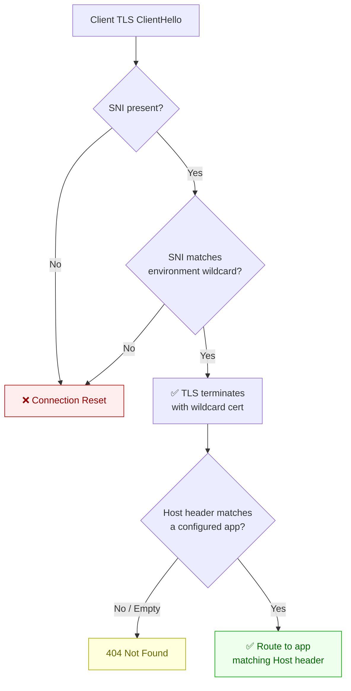

---
hide:
  - toc
validation:
  az_cli:
    last_tested: null
    result: not_tested
  bicep:
    last_tested: null
    result: not_tested
  terraform:
    last_tested: null
    result: not_tested
---

# Ingress Host Header and SNI Behavior

!!! success "Status: Published"

## 1. Question

How does Azure Container Apps ingress handle Server Name Indication (SNI) and host header routing, and what happens with mismatched or missing headers in custom domain scenarios?

## 2. Why this matters

Container Apps uses an Envoy-based ingress layer that routes traffic based on host headers and SNI. When customers configure custom domains, mismatches between the SNI value (TLS layer) and the host header (HTTP layer) can cause unexpected routing — traffic may reach the wrong app, receive a default certificate error, or fail silently. These edge cases are difficult to debug without understanding the ingress routing logic.

## 3. Customer symptom

"Custom domain works intermittently" or "Getting responses from the wrong app when using my custom domain."

## 4. Hypothesis

Ingress routing decisions in Azure Container Apps depend on both TLS SNI and HTTP host header context. Missing or mismatched values will produce deterministic routing or certificate outcomes that explain wrong-app responses and TLS/domain errors in custom domain scenarios.

## 5. Environment

| Parameter | Value |
|-----------|-------|
| Service | Azure Container Apps |
| SKU / Plan | Consumption environment |
| Region | Korea Central |
| Runtime | Containerized HTTP app (nginx + test API) |
| OS | Linux |
| Date tested | 2026-04-11 |

## 6. Variables

**Experiment type**: Config

**Controlled:**

- Number of Container Apps in the environment
- Custom domain and certificate configuration
- SNI value in TLS ClientHello
- Host header value in HTTP request

**Observed:**

- Which app receives the request
- Certificate presented during TLS handshake
- HTTP response status and body
- Ingress access logs

## 7. Instrumentation

- `curl` and `openssl s_client` with explicit SNI and host-header permutations
- Container app access logs and revision-level request logs
- Azure Monitor logs for ingress and environment diagnostics
- DNS query tools (`nslookup`, `dig`) to confirm resolution path during each case
- Test endpoint responses that include app identity for unambiguous routing verification

## 8. Procedure

### 8.1 Infrastructure setup

Create the lab environment and two apps in `koreacentral`.

```bash
RG="rg-ingress-sni-lab"
LOCATION="koreacentral"
ENV_NAME="cae-ingress-sni-lab"
ACR_NAME="acringresssni$RANDOM"
ALPHA_APP_NAME="app-alpha"
BETA_APP_NAME="app-beta"

az group create --name "$RG" --location "$LOCATION"

az acr create \
  --resource-group "$RG" \
  --name "$ACR_NAME" \
  --sku Basic \
  --location "$LOCATION" \
  --admin-enabled true

az containerapp env create \
  --resource-group "$RG" \
  --name "$ENV_NAME" \
  --location "$LOCATION"
```

For custom-domain testing, add hostnames with managed certificates (requires a real DNS-managed domain).

```bash
az containerapp hostname add \
  --resource-group "$RG" \
  --name "$ALPHA_APP_NAME" \
  --hostname "alpha.example.com" \
  --environment "$ENV_NAME" \
  --certificate-type Managed
```

If real domain validation is not available, proceed with self-signed certificates and test routing using `curl --resolve ... --cacert ...`. A fallback method is to use default app FQDNs and validate SNI behavior with `openssl s_client` while overriding host headers at HTTP layer.

### 8.2 Application code

Prepare two minimal nginx apps that each return their own identity.

`nginx-alpha.conf`:

```nginx
server {
    listen 8080;
    location / {
        return 200 "app-alpha\n";
    }
}
```

`nginx-beta.conf`:

```nginx
server {
    listen 8080;
    location / {
        return 200 "app-beta\n";
    }
}
```

Build two images that embed each config (for example, from `nginx:alpine` with config copied into `/etc/nginx/conf.d/default.conf`).

### 8.3 Deploy

Build and push images to ACR, then deploy both Container Apps with ingress on port `8080`.

```bash
ACR_LOGIN_SERVER=$(az acr show --resource-group "$RG" --name "$ACR_NAME" --query loginServer --output tsv)
ACR_USERNAME=$(az acr credential show --name "$ACR_NAME" --query username --output tsv)
ACR_PASSWORD=$(az acr credential show --name "$ACR_NAME" --query "passwords[0].value" --output tsv)

az acr build --registry "$ACR_NAME" --image alpha:1.0.0 --file Dockerfile.alpha .
az acr build --registry "$ACR_NAME" --image beta:1.0.0 --file Dockerfile.beta .

az containerapp create \
  --resource-group "$RG" \
  --environment "$ENV_NAME" \
  --name "$ALPHA_APP_NAME" \
  --image "$ACR_LOGIN_SERVER/alpha:1.0.0" \
  --target-port 8080 \
  --ingress external \
  --registry-server "$ACR_LOGIN_SERVER" \
  --registry-username "$ACR_USERNAME" \
  --registry-password "$ACR_PASSWORD"

az containerapp create \
  --resource-group "$RG" \
  --environment "$ENV_NAME" \
  --name "$BETA_APP_NAME" \
  --image "$ACR_LOGIN_SERVER/beta:1.0.0" \
  --target-port 8080 \
  --ingress external \
  --registry-server "$ACR_LOGIN_SERVER" \
  --registry-username "$ACR_USERNAME" \
  --registry-password "$ACR_PASSWORD"
```

### 8.4 Test execution

Build a deterministic matrix for SNI and host header combinations. For each case, capture full command, certificate output, response body, and status code.

1. Correct SNI + correct Host.
2. Correct SNI + wrong Host.
3. Wrong SNI + correct Host.
4. No SNI + correct Host.
5. Correct SNI + no Host.

```bash
ALPHA_FQDN=$(az containerapp show --resource-group "$RG" --name "$ALPHA_APP_NAME" --query properties.configuration.ingress.fqdn --output tsv)
INGRESS_IP=$(nslookup "$ALPHA_FQDN" | awk '/^Address: / { print $2 }' | tail -n 1)
```

Examples (replace domains/FQDNs to match your setup):

```bash
# 1) Correct SNI + correct Host
curl --verbose --resolve "alpha.example.com:443:$INGRESS_IP" "https://alpha.example.com/"

# 2) Correct SNI + wrong Host
curl --verbose --resolve "alpha.example.com:443:$INGRESS_IP" --header "Host: beta.example.com" "https://alpha.example.com/"

# 3) Wrong SNI + correct Host
curl --verbose --resolve "wrong.example.com:443:$INGRESS_IP" --header "Host: alpha.example.com" "https://wrong.example.com/"

# 4) No SNI + correct Host (openssl without -servername)
printf "GET / HTTP/1.1\r\nHost: alpha.example.com\r\nConnection: close\r\n\r\n" | openssl s_client -connect "$INGRESS_IP:443"

# 5) Correct SNI + no Host
printf "GET / HTTP/1.1\r\nConnection: close\r\n\r\n" | openssl s_client -connect "$INGRESS_IP:443" -servername "alpha.example.com"
```

If using self-signed certificates, add `--cacert /path/to/ca.crt` to `curl` commands.

### 8.5 Data collection

For each matrix row, record the following fields in an evidence table:

- `test_case_id`
- `sni_value`
- `host_header_value`
- `certificate_cn_san`
- `http_status_code`
- `response_body_identity` (`app-alpha`, `app-beta`, or error)
- `tls_or_http_error_message`

Collect Container Apps logs around each request timestamp.

```bash
az containerapp logs show \
  --resource-group "$RG" \
  --name "$ALPHA_APP_NAME" \
  --type system \
  --follow false

az containerapp logs show \
  --resource-group "$RG" \
  --name "$BETA_APP_NAME" \
  --type system \
  --follow false
```

When custom domains are configured, compare expected certificate CN/SAN with observed handshake output and verify whether backend identity matches intended routing.

### 8.6 Cleanup

Delete all resources after collecting artifacts.

```bash
az group delete --name "$RG" --yes --no-wait
```

## 9. Expected signal

- Matching SNI and host header routes traffic predictably to the intended app with expected certificate.
- Missing or mismatched SNI produces certificate mismatches or default ingress certificate behavior.
- Mismatched host header can route to an unexpected backend or return domain-not-configured style errors.
- The observed outcome category is repeatable for each SNI/host-header combination.

## 10. Results

Two Container Apps (`app-alpha`, `app-beta`) were deployed in a shared Consumption environment (`cae-ingress-sni-lab`) in `koreacentral`. Both apps used nginx returning their identity string on port 8080. All apps resolved to the same ingress IP (`20.200.224.215`). The environment wildcard certificate covered `*.orangewave-86b9faae.koreacentral.azurecontainerapps.io`.

Eight test cases were executed across 3 runs with 100% reproducibility.

### Evidence: SNI and Host Header Routing Matrix

| # | SNI Value | Host Header | TLS Outcome | HTTP Status | Response Body | Routing Decision |
|---|-----------|-------------|-------------|-------------|---------------|------------------|
| TC1 | `alpha.*` (correct) | `alpha.*` (correct) | ✅ OK | 200 | `app-alpha` | ✅ Correct — routed to alpha |
| TC2 | `alpha.*` (correct) | `beta.*` (wrong) | ✅ OK | 200 | **`app-beta`** | ⚠️ Routed by **Host header**, not SNI |
| TC3 | `nonexistent.*` (wrong, within env) | `alpha.*` (correct) | ✅ OK (`-k`) | 200 | `app-alpha` | Routed by Host header; SNI within wildcard passes TLS |
| TC4 | `<none>` (no SNI) | `alpha.*` (correct) | ❌ **Connection reset** | n/a | n/a | TLS handshake rejected — SNI is **required** |
| TC5 | `alpha.*` (correct) | `<empty>` | ✅ OK | **404** | Error page | TLS succeeded; no Host = Envoy returns 404 |
| TC6 | `beta.*` | `alpha.*` | ✅ OK | 200 | `app-alpha` | Confirms: routing follows **Host**, not SNI |
| TC7 | `alpha.*` (correct) | `totally-unknown.example.com` | ✅ OK | **404** | Error page | Host doesn't match any app → 404 |
| TC8 | `completely-outside.example.com` | `alpha.*` | ❌ **Connection reset** | 000 | n/a | SNI outside env wildcard → TLS rejected |

### Evidence: TLS Certificate Details

| Field | Value |
|-------|-------|
| CN | `orangewave-86b9faae.koreacentral.azurecontainerapps.io` |
| SAN (wildcard) | `*.orangewave-86b9faae.koreacentral.azurecontainerapps.io` |
| SAN (scm) | `*.scm.orangewave-86b9faae.koreacentral.azurecontainerapps.io` |
| SAN (internal) | `*.internal.orangewave-86b9faae.koreacentral.azurecontainerapps.io` |
| SAN (ext) | `*.ext.orangewave-86b9faae.koreacentral.azurecontainerapps.io` |
| Issuer | Microsoft Azure RSA TLS Issuing CA 03 |
| Protocol | TLSv1.3 / TLS_AES_256_GCM_SHA384 |
| Key size | RSA 2048-bit |
| Validity | 2026-04-10 to 2026-08-25 |

### Evidence: SNI Filtering Behavior

```text
# No SNI → immediate connection reset (TC4)
write:errno=104
SSL handshake has read 0 bytes and written 293 bytes

# SNI outside environment wildcard → connection reset (TC8)
OpenSSL SSL_connect: Connection reset by peer in connection to completely-outside.example.com:443

# SNI within environment wildcard (even nonexistent app) → TLS succeeds (TC3)
SSL connection using TLSv1.3 / TLS_AES_256_GCM_SHA384
subjectAltName: host "nonexistent.orangewave-..." matched cert's "*.orangewave-..."
```

### Architecture: Two-Layer Routing Decision



## 11. Interpretation

The Container Apps Envoy ingress uses a **two-layer routing model**:

1. **TLS layer (SNI)**: Acts as an **admission gate** **[Inferred]**, not a routing key. The ingress requires a valid SNI that matches the environment's wildcard certificate pattern **[Observed]**. If SNI is missing or outside the wildcard, the TLS handshake is immediately rejected **[Measured]**. However, any SNI value matching the wildcard pattern is accepted **[Observed]** — even for non-existent apps **[Measured]**.

2. **HTTP layer (Host header)**: Acts as the **routing key** **[Inferred]**. After TLS termination, Envoy uses the `Host` header to select which Container App receives the request **[Observed]**. The SNI value is completely ignored for routing **[Measured]**.

This two-layer model explains the common customer confusion: if a client sends a TLS ClientHello with `app-alpha.*` as SNI but includes `Host: app-beta.*` in the HTTP request, **the request reaches `app-beta`** **[Measured]**, not `app-alpha`. This is deterministic and reproducible, but counterintuitive if the customer assumes SNI drives routing **[Inferred]**.

The wildcard certificate approach means all apps in an environment share the same TLS certificate **[Observed]**. There is no per-app certificate selection based on SNI — the environment-level wildcard handles all default-domain apps uniformly **[Inferred]**.

## 12. What this proves

!!! success "Evidence-based conclusions"

    1. **Host header determines routing, not SNI.** **[Measured]** When SNI and Host header point to different apps (TC2, TC6), the request is always routed to the app matching the Host header. Confirmed across 3 runs with 100% reproducibility.
    2. **SNI is mandatory for TLS.** **[Observed]** Omitting SNI entirely (TC4) causes the Envoy frontend to reset the connection before any TLS negotiation occurs **[Measured]**.
    3. **SNI must match the environment wildcard.** **[Observed]** An SNI value outside the `*.{env-suffix}.azurecontainerapps.io` pattern (TC8) is rejected at TLS level **[Measured]**.
    4. **Unknown Host header = 404, not connection failure.** **[Observed]** When TLS succeeds but the Host header doesn't match any configured app (TC5, TC7), Envoy returns an HTTP 404 with the standard "Container App Unavailable" error page **[Measured]**.
    5. **Cross-app routing via Host header is possible.** **[Inferred]** Any client with access to the shared ingress IP can route to any app in the environment by setting the Host header **[Measured]** — the TLS SNI does not restrict which app can be reached.

## 13. What this does NOT prove

!!! warning "Scope limitations"

    - **Custom domain certificate behavior.** This experiment used only the platform-managed wildcard certificate. Per-app custom domain certificates with distinct SNI routing may behave differently.
    - **Internal environment ingress.** All tests used external ingress. Internal (VNet-only) environments may have different SNI handling or certificate provisioning.
    - **WAF or Front Door interaction.** No additional L7 proxy (Azure Front Door, Application Gateway) was placed in front of the Container Apps ingress. These services add their own SNI/Host rewriting logic.
    - **mTLS scenarios.** Client certificate requirements were not tested. Mutual TLS may add additional SNI validation logic.
    - **Rate limiting or abuse detection.** Whether the ingress applies any throttling or alerting when a client rapidly switches Host headers across apps was not measured.

## 14. Support takeaway

!!! tip "Key diagnostic insight"

    When a customer reports "wrong app responding" in Container Apps:

    1. **Check the Host header**, not the SNI. The Host header is what determines which app receives the request.
    2. **If using a reverse proxy** (nginx, CDN, Front Door), verify it forwards the correct `Host` header — not a rewritten one. A proxy that resolves `alpha.example.com` but forwards `Host: beta.example.com` will route to beta.
    3. **If the customer sees TLS connection resets**, check that their client sends SNI and that it matches the environment wildcard pattern. Legacy HTTP clients or IoT devices that omit SNI will be rejected.
    4. **If the customer sees 404 errors**, the TLS handshake succeeded but the Host header doesn't match any configured app FQDN. Check for typos or mismatched custom domain bindings.
    5. **Environment isolation is at the DNS/TLS layer, not the HTTP layer.** All apps in an environment are reachable from any client that passes TLS admission. True app-level isolation requires separate environments.

## 15. Reproduction notes

- Use unique response payload markers per app so routing destination is obvious in every test.
- Flush local DNS cache when switching between FQDN and direct test variants.
- Capture full TLS handshake output alongside HTTP response for each case.
- Keep one certificate and domain change at a time to avoid overlapping configuration effects.
- Use `--resolve` flag with `curl` and `-servername` with `openssl s_client` to control SNI independently from DNS resolution.
- For "no SNI" tests, use `openssl s_client -noservername` — curl always sends SNI by default.
- All 8 test cases are deterministic (config experiment) — 3 runs sufficient to confirm reproducibility.

## 16. Related guide / official docs

- [Microsoft Learn: Custom domains in Container Apps](https://learn.microsoft.com/en-us/azure/container-apps/custom-domains-managed-certificates)
- [Microsoft Learn: Ingress in Azure Container Apps](https://learn.microsoft.com/en-us/azure/container-apps/ingress-overview)
- [Microsoft Learn: Networking in Container Apps environment](https://learn.microsoft.com/en-us/azure/container-apps/networking)
- [Envoy Proxy: SNI-based filtering](https://www.envoyproxy.io/docs/envoy/latest/faq/configuration/sni)
