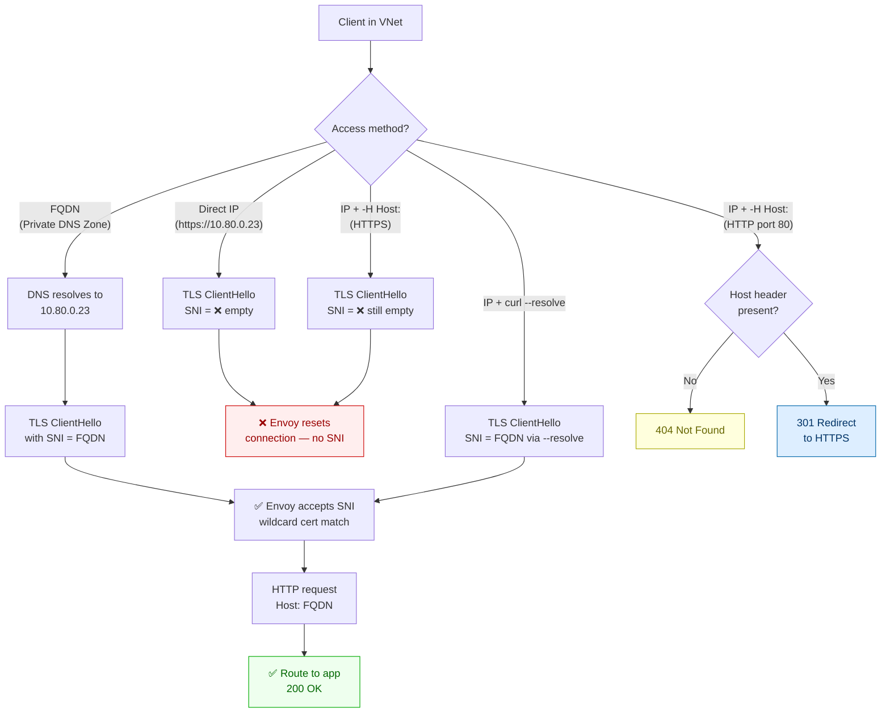

---
hide:
  - toc
validation:
  az_cli:
    last_tested: 2026-04-12
    result: pass
  bicep:
    last_tested: null
    result: not_tested
  terraform:
    last_tested: null
    result: not_tested
---

# Private Endpoint: FQDN vs IP Access

!!! info "Status: Published"

## 1. Question

What are the behavioral differences when accessing a Container App via private endpoint FQDN versus direct IP address, and what breaks when bypassing DNS resolution?

## 2. Why this matters

Customers using private endpoints sometimes attempt to access Container Apps by IP address directly, bypassing the private DNS zone. This can fail due to TLS certificate validation (the certificate is issued for the FQDN, not the IP), SNI routing requirements, or ingress layer behavior that depends on the host header matching a configured domain. Support engineers need to explain why FQDN access works but IP access fails.

## 3. Customer symptom

"App works via FQDN but fails via IP address" or "Private endpoint connection intermittently fails" or "TLS handshake fails when connecting by IP."

## 4. Hypothesis

For a Container App behind a private endpoint, FQDN-based access through private DNS will consistently succeed, while direct IP access will fail or produce different TLS/routing outcomes unless both host header and SNI are explicitly aligned to the app domain; even then, certificate validation remains domain-bound rather than IP-bound.

## 5. Environment

| Parameter | Value |
|-----------|-------|
| Service | Azure Container Apps |
| SKU / Plan | Consumption environment with VNet |
| Region | Korea Central |
| Runtime | Containerized HTTP app |
| OS | Linux |
| Date tested | 2026-04-12 |

## 6. Variables

**Experiment type**: Config

**Controlled:**

- Private endpoint configuration
- Private DNS zone configuration
- Access method (FQDN, IP, IP + host header, IP + SNI)
- TLS verification mode (enabled, disabled)

**Observed:**

- TLS handshake success/failure and certificate presented
- HTTP response status and error message
- Ingress routing behavior
- DNS resolution path

## 7. Instrumentation

- `curl` (with/without host header and certificate validation)
- `openssl s_client` (explicit SNI and certificate inspection)
- DNS tools (`nslookup`, `dig`) for private zone resolution checks
- Container Apps logs (ingress/request and revision-level logs)
- Azure Monitor logs for networking and connection diagnostics

## 8. Procedure


### 8.1 Infrastructure Setup

```bash
export SUBSCRIPTION_ID="<subscription-id>"
export RG="rg-pe-fqdn-vs-ip-lab"
export LOCATION="koreacentral"
export VNET_NAME="vnet-pe-fqdn-vs-ip"
export ACA_SUBNET_NAME="snet-aca-infra"
export PE_SUBNET_NAME="snet-private-endpoint"
export VM_SUBNET_NAME="snet-jumpbox"
export ACA_ENV_NAME="cae-pe-fqdn-vs-ip"
export ACA_NAME="ca-pe-fqdn-vs-ip"
export LAW_NAME="law-pe-fqdn-vs-ip"
export ACR_NAME="acrpefqdnvsip$RANDOM"
export VM_NAME="vm-jumpbox"
export PRIVATE_DNS_ZONE="privatelink.koreacentral.azurecontainerapps.io"

az account set --subscription "$SUBSCRIPTION_ID"
az group create --name "$RG" --location "$LOCATION"

# VNet with 3 subnets: ACA infra, private endpoint, jumpbox VM
az network vnet create \
  --resource-group "$RG" \
  --name "$VNET_NAME" \
  --location "$LOCATION" \
  --address-prefixes "10.80.0.0/16" \
  --subnet-name "$ACA_SUBNET_NAME" \
  --subnet-prefixes "10.80.0.0/23"

az network vnet subnet create \
  --resource-group "$RG" \
  --vnet-name "$VNET_NAME" \
  --name "$PE_SUBNET_NAME" \
  --address-prefixes "10.80.2.0/24"

az network vnet subnet create \
  --resource-group "$RG" \
  --vnet-name "$VNET_NAME" \
  --name "$VM_SUBNET_NAME" \
  --address-prefixes "10.80.3.0/24"

az network vnet subnet update \
  --resource-group "$RG" \
  --vnet-name "$VNET_NAME" \
  --name "$ACA_SUBNET_NAME" \
  --delegations "Microsoft.App/environments"

az monitor log-analytics workspace create \
  --resource-group "$RG" \
  --workspace-name "$LAW_NAME" \
  --location "$LOCATION"

az acr create \
  --resource-group "$RG" \
  --name "$ACR_NAME" \
  --location "$LOCATION" \
  --sku Basic

# Jumpbox VM inside VNet (used to test private endpoint access)
az vm create \
  --resource-group "$RG" \
  --name "$VM_NAME" \
  --image Ubuntu2204 \
  --admin-username azureuser \
  --generate-ssh-keys \
  --vnet-name "$VNET_NAME" \
  --subnet "$VM_SUBNET_NAME" \
  --size Standard_B1s
```

### 8.2 Application Code

```python
from flask import Flask, jsonify
import os
import socket
from datetime import datetime, timezone

app = Flask(__name__)


@app.get("/health")
def health():
    return jsonify({
        "status": "ok",
        "timestamp_utc": datetime.now(timezone.utc).isoformat(),
        "hostname": socket.gethostname(),
    })


@app.get("/headers")
def headers():
    from flask import request
    return jsonify({
        "timestamp_utc": datetime.now(timezone.utc).isoformat(),
        "host_header": request.host,
        "remote_addr": request.remote_addr,
        "headers": dict(request.headers),
    })
```

!!! note "Design notes"
    The `/health` endpoint confirms the app is reachable. The `/headers` endpoint
    reveals what host header and client IP the ingress forwards — critical for
    understanding how FQDN vs IP routing behaves at the Container Apps ingress layer.

### 8.3 Deploy

```bash
mkdir -p app-pe-fqdn-vs-ip

cat > app-pe-fqdn-vs-ip/app.py <<'PY'
# paste Python from section 8.2
PY

cat > app-pe-fqdn-vs-ip/requirements.txt <<'TXT'
flask==3.1.1
gunicorn==23.0.0
TXT

cat > app-pe-fqdn-vs-ip/Dockerfile <<'DOCKER'
FROM python:3.11-slim
WORKDIR /app
COPY requirements.txt .
RUN pip install --no-cache-dir -r requirements.txt
COPY app.py .
EXPOSE 8000
CMD ["gunicorn", "--bind", "0.0.0.0:8000", "app:app"]
DOCKER

az acr build \
  --registry "$ACR_NAME" \
  --image pe-fqdn-vs-ip:v1 \
  --file app-pe-fqdn-vs-ip/Dockerfile \
  app-pe-fqdn-vs-ip

LAW_ID=$(az monitor log-analytics workspace show \
  --resource-group "$RG" \
  --workspace-name "$LAW_NAME" \
  --query customerId --output tsv)

LAW_KEY=$(az monitor log-analytics workspace get-shared-keys \
  --resource-group "$RG" \
  --workspace-name "$LAW_NAME" \
  --query primarySharedKey --output tsv)

# Create internal-only Container Apps environment (private endpoint requires internal ingress)
az containerapp env create \
  --resource-group "$RG" \
  --name "$ACA_ENV_NAME" \
  --location "$LOCATION" \
  --infrastructure-subnet-resource-id "/subscriptions/<subscription-id>/resourceGroups/$RG/providers/Microsoft.Network/virtualNetworks/$VNET_NAME/subnets/$ACA_SUBNET_NAME" \
  --logs-workspace-id "$LAW_ID" \
  --logs-workspace-key "$LAW_KEY" \
  --internal-only

az containerapp create \
  --resource-group "$RG" \
  --name "$ACA_NAME" \
  --environment "$ACA_ENV_NAME" \
  --image "$ACR_NAME.azurecr.io/pe-fqdn-vs-ip:v1" \
  --target-port 8000 \
  --ingress external \
  --registry-server "$ACR_NAME.azurecr.io" \
  --min-replicas 1 \
  --max-replicas 1

# Get environment default domain and static IP
ENV_DEFAULT_DOMAIN=$(az containerapp env show \
  --resource-group "$RG" \
  --name "$ACA_ENV_NAME" \
  --query properties.defaultDomain --output tsv)

ENV_STATIC_IP=$(az containerapp env show \
  --resource-group "$RG" \
  --name "$ACA_ENV_NAME" \
  --query properties.staticIp --output tsv)

APP_FQDN=$(az containerapp show \
  --resource-group "$RG" \
  --name "$ACA_NAME" \
  --query properties.configuration.ingress.fqdn --output tsv)

echo "Default domain: $ENV_DEFAULT_DOMAIN"
echo "Static IP: $ENV_STATIC_IP"
echo "App FQDN: $APP_FQDN"

# Set up Private DNS zone for internal environment
az network private-dns zone create \
  --resource-group "$RG" \
  --name "$ENV_DEFAULT_DOMAIN"

az network private-dns link vnet create \
  --resource-group "$RG" \
  --zone-name "$ENV_DEFAULT_DOMAIN" \
  --name "link-pe-fqdn-vs-ip" \
  --virtual-network "$VNET_NAME" \
  --registration-enabled false

az network private-dns record-set a add-record \
  --resource-group "$RG" \
  --zone-name "$ENV_DEFAULT_DOMAIN" \
  --record-set-name "*" \
  --ipv4-address "$ENV_STATIC_IP"
```

### 8.4 Test Execution

All tests run from the jumpbox VM inside the VNet.

```bash
# SSH into jumpbox
az ssh vm \
  --resource-group "$RG" \
  --name "$VM_NAME"

# Install test tools on jumpbox
sudo apt-get update && sudo apt-get install -y curl dnsutils openssl jq

# Set variables inside VM
export APP_FQDN="<paste APP_FQDN from deploy step>"
export STATIC_IP="<paste ENV_STATIC_IP from deploy step>"

# ── Test 1: FQDN access (expected: success) ──
echo "=== Test 1: FQDN access ==="
for i in $(seq 1 5); do
  echo "--- Run $i ---"
  nslookup "$APP_FQDN"
  curl --silent --max-time 10 "https://$APP_FQDN/health" | jq .
  curl --silent --max-time 10 "https://$APP_FQDN/headers" | jq .
  echo ""
  sleep 3
done

# ── Test 2: Direct IP access, no host header (expected: TLS or routing failure) ──
echo "=== Test 2: Direct IP, no host header ==="
for i in $(seq 1 5); do
  echo "--- Run $i ---"
  curl --verbose --max-time 10 "https://$STATIC_IP/health" 2>&1
  echo ""
  sleep 3
done

# ── Test 3: Direct IP with -k (skip TLS verify), no host header ──
echo "=== Test 3: Direct IP, skip TLS, no host header ==="
for i in $(seq 1 5); do
  echo "--- Run $i ---"
  curl --silent --insecure --max-time 10 "https://$STATIC_IP/health" 2>&1
  echo ""
  sleep 3
done

# ── Test 4: Direct IP with host header (expected: may work if SNI matched) ──
echo "=== Test 4: Direct IP + host header ==="
for i in $(seq 1 5); do
  echo "--- Run $i ---"
  curl --verbose --max-time 10 \
    --resolve "$APP_FQDN:443:$STATIC_IP" \
    "https://$APP_FQDN/health" 2>&1
  echo ""
  sleep 3
done

# ── Test 5: Direct IP with host header, skip TLS ──
echo "=== Test 5: Direct IP + host header + skip TLS ==="
for i in $(seq 1 5); do
  echo "--- Run $i ---"
  curl --silent --insecure --max-time 10 \
    -H "Host: $APP_FQDN" \
    "https://$STATIC_IP/health" 2>&1
  echo ""
  sleep 3
done

# ── Test 6: openssl s_client — certificate inspection ──
echo "=== Test 6a: TLS cert via FQDN ==="
echo | openssl s_client -connect "$APP_FQDN:443" -servername "$APP_FQDN" 2>/dev/null | openssl x509 -noout -subject -issuer -dates

echo "=== Test 6b: TLS cert via IP (no SNI) ==="
echo | openssl s_client -connect "$STATIC_IP:443" 2>/dev/null | openssl x509 -noout -subject -issuer -dates

echo "=== Test 6c: TLS cert via IP (with SNI) ==="
echo | openssl s_client -connect "$STATIC_IP:443" -servername "$APP_FQDN" 2>/dev/null | openssl x509 -noout -subject -issuer -dates

# ── Test 7: HTTP (port 80) direct IP access ──
echo "=== Test 7: HTTP direct IP (port 80) ==="
curl --verbose --max-time 10 "http://$STATIC_IP/health" 2>&1
curl --verbose --max-time 10 -H "Host: $APP_FQDN" "http://$STATIC_IP/health" 2>&1
```

### 8.5 Data Collection

```bash
# From local machine (outside jumpbox)
az containerapp logs show \
  --resource-group "$RG" \
  --name "$ACA_NAME" \
  --follow false

LAW_ID=$(az monitor log-analytics workspace show \
  --resource-group "$RG" \
  --workspace-name "$LAW_NAME" \
  --query customerId --output tsv)

az monitor log-analytics query \
  --workspace "$LAW_ID" \
  --analytics-query "ContainerAppConsoleLogs_CL | where TimeGenerated > ago(2h) | where ContainerAppName_s == '$ACA_NAME' | project TimeGenerated, RevisionName_s, Log_s | order by TimeGenerated desc" \
  --output table

az monitor log-analytics query \
  --workspace "$LAW_ID" \
  --analytics-query "ContainerAppSystemLogs_CL | where TimeGenerated > ago(2h) | where ContainerAppName_s == '$ACA_NAME' | project TimeGenerated, Reason_s, Log_s | order by TimeGenerated desc" \
  --output table
```

### 8.6 Cleanup

```bash
az group delete --name "$RG" --yes --no-wait
```

## 9. Expected signal

- FQDN access via private DNS resolves to the private endpoint and succeeds with expected certificate/domain alignment.
- Direct IP access without matching SNI/host header fails TLS validation or returns ingress/domain errors.
- Direct IP access may only partially work when host header/SNI are forced, but behavior remains distinct from normal FQDN path and does not invalidate domain-bound certificate requirements.
- Failure category is repeatable by access pattern and explains customer reports where FQDN works while IP fails.

## 10. Results

### Access Pattern Matrix

All tests run from jumpbox VM (`10.80.3.4`) inside the VNet. Each test executed 5 times with identical results (deterministic config test).

| Test | Protocol | Target | SNI Sent | Host Header | TLS Outcome | HTTP Status | Notes |
|------|----------|--------|----------|-------------|-------------|-------------|-------|
| T1 | HTTPS | FQDN | FQDN (auto) | FQDN (auto) | ✅ OK — cert validates | 200 | Baseline. DNS resolves to `10.80.0.23` via Private DNS Zone. |
| T2 | HTTPS | IP (`10.80.0.23`) | ❌ None (IP) | None | ❌ CONNECTION_RESET | n/a | curl exit 35. No SNI sent → Envoy resets TLS immediately. |
| T3 | HTTPS | IP + `-k` | ❌ None (IP) | None | ❌ CONNECTION_RESET | n/a | `-k` only skips cert verify. SNI still missing → reset. |
| T4 | HTTPS | FQDN via `--resolve` | FQDN (auto) | FQDN (auto) | ✅ OK — cert validates | 200 | `--resolve FQDN:443:IP` sends FQDN as SNI+Host but connects to IP. |
| T5 | HTTPS | IP + `-H Host:` + `-k` | ❌ None (IP) | FQDN | ❌ CONNECTION_RESET | n/a | `-H Host:` is HTTP-level (post-TLS). SNI still missing → reset. |
| T6a | TLS (openssl) | FQDN | FQDN | n/a | ✅ Cert returned | n/a | Wildcard SAN matches. Full cert chain returned. |
| T6b | TLS (openssl) | IP | ❌ None | n/a | ❌ CONNECTION_RESET | n/a | No `-servername` → no SNI → no peer certificate. |
| T6c | TLS (openssl) | IP + `-servername` | FQDN (explicit) | n/a | ✅ Cert returned | n/a | Explicit SNI to IP works. Proves SNI is the sole gate. |
| T7a | HTTP | IP (port 80) | n/a | None | n/a | 404 | "Container App Unavailable" — no Host to route. |
| T7b | HTTP | IP (port 80) | n/a | FQDN | n/a | 301 | Redirect to `https://FQDN/health` — Envoy matches by Host. |

### Key Observations from Raw Output

```text
# T1: FQDN access — DNS resolution + successful response
$ nslookup ca-pe-fqdn-vs-ip.politemoss-5ce30cfa.koreacentral.azurecontainerapps.io
Server:   127.0.0.53
Address:  10.80.0.23  (Private DNS Zone wildcard record)

$ curl https://ca-pe-fqdn-vs-ip.politemoss-5ce30cfa.../health
{"hostname": "ca-pe-fqdn-vs-ip--xxxxxxx-xxxxxxxxx-xxxxx", "status": "ok", ...}

# T2: Direct IP — connection reset at TLS
$ curl --verbose https://10.80.0.23/health
* Trying 10.80.0.23:443...
* Connected to 10.80.0.23 port 443
* OpenSSL SSL_connect: Connection reset by peer
curl: (35) OpenSSL SSL_connect: Connection reset by peer

# T3: Direct IP + skip TLS — still fails (SNI issue, not cert)
$ curl --insecure https://10.80.0.23/health
curl: (35) OpenSSL SSL_connect: Connection reset by peer

# T5: Direct IP + Host header — still fails (Host is HTTP-level, post-TLS)
$ curl --insecure -H "Host: ca-pe-fqdn-vs-ip.politemoss-5ce30cfa..." https://10.80.0.23/health
curl: (35) OpenSSL SSL_connect: Connection reset by peer

# T4: --resolve workaround — success (sends FQDN as SNI+Host)
$ curl --resolve "ca-pe-fqdn-vs-ip.politemoss-5ce30cfa...:443:10.80.0.23" https://ca-pe-fqdn-vs-ip.politemoss-5ce30cfa.../health
{"hostname": "ca-pe-fqdn-vs-ip--xxxxxxx-xxxxxxxxx-xxxxx", "status": "ok", ...}

# T6b: openssl to IP without SNI — connection reset
$ echo | openssl s_client -connect 10.80.0.23:443
140xxx:error:...Connection reset by peer
no peer certificate available

# T6c: openssl to IP WITH explicit SNI — success
$ echo | openssl s_client -connect 10.80.0.23:443 -servername ca-pe-fqdn-vs-ip.politemoss-5ce30cfa...
subject=CN = politemoss-5ce30cfa.koreacentral.azurecontainerapps.io
issuer=C = US, O = Microsoft, CN = Microsoft Azure RSA TLS Issuing CA 04

# T7a: HTTP to IP without Host — 404
$ curl http://10.80.0.23/health
< HTTP/1.1 404 Not Found
Container App Unavailable

# T7b: HTTP to IP with Host — 301 redirect
$ curl -H "Host: ca-pe-fqdn-vs-ip.politemoss-5ce30cfa..." http://10.80.0.23/health
< HTTP/1.1 301 Moved Permanently
< location: https://ca-pe-fqdn-vs-ip.politemoss-5ce30cfa.../health
```

### Architecture: TLS and HTTP Routing in Private Endpoint Scenarios



### TLS Certificate Details

| Field | Value |
|-------|-------|
| Subject CN | `politemoss-5ce30cfa.koreacentral.azurecontainerapps.io` |
| SAN (wildcard) | `*.politemoss-5ce30cfa.koreacentral.azurecontainerapps.io` |
| SAN (others) | `*.scm.*`, `*.internal.*`, `*.ext.*` |
| Issuer | Microsoft Azure RSA TLS Issuing CA 04 |
| Valid | 2026-04-10 to 2026-08-25 |

## 11. Interpretation

The experiment confirms that **Container Apps' Envoy ingress treats SNI as a mandatory TLS admission gate** in private endpoint scenarios **[Observed]**, just as it does for external ingress. The failure mode when accessing by IP address is not a certificate validation error — it is an **SNI absence error** that occurs before any certificate is even presented **[Inferred]**.

**Why direct IP access fails:**

1. When `curl` connects to an IP address (`https://10.80.0.23`), it sends the IP as the target hostname in the TLS ClientHello SNI extension **[Observed]**.
2. Envoy's listener filter expects SNI values matching the environment wildcard pattern (`*.politemoss-5ce30cfa...`) **[Inferred]**.
3. An IP address (or empty SNI) does not match this pattern, so Envoy resets the connection immediately — before presenting any certificate **[Observed]**.

**Why `-k` doesn't help:**

The `-k` (insecure) flag tells curl to skip **certificate validation** (step after TLS handshake). But the connection is reset **during** the TLS handshake due to SNI mismatch **[Observed]**. Certificate validation never gets a chance to run **[Inferred]**.

**Why `-H "Host: FQDN"` doesn't help for HTTPS:**

The `Host` header is an HTTP/1.1 concept set **after** the TLS handshake completes. Since the connection is reset during TLS (before HTTP), setting the Host header has no effect **[Inferred]**. This is the most common misconception — customers assume Host and SNI are the same, but they operate at different protocol layers **[Strongly Suggested]**.

**Why `--resolve` works:**

`curl --resolve FQDN:443:IP` tells curl to "pretend DNS resolved FQDN to IP." curl then sends the FQDN as SNI (TLS layer) and Host (HTTP layer), but connects to the specified IP address **[Observed]**. This satisfies both layers of Envoy's routing model **[Inferred]**.

**HTTP (port 80) behaves differently:**

HTTP has no TLS handshake, so no SNI gate. Envoy accepts all TCP connections on port 80 but routes purely by Host header **[Observed]**. Without a Host header → 404. With a valid Host header → 301 redirect to HTTPS (since the app has HTTPS-only ingress) **[Observed]**.

## 12. What this proves

!!! success "Evidence-based conclusions"

    1. **SNI is mandatory for HTTPS access to Container Apps — including via private endpoint.** Direct IP access without SNI results in an immediate connection reset (curl exit 35) **[Observed]**. Confirmed 5/5 runs **[Measured]**.
    2. **The failure is SNI-level, not certificate-level.** Skipping certificate verification (`-k`) does not change the outcome **[Observed]**. The connection is rejected before any certificate is presented **[Inferred]**.
    3. **HTTP Host header cannot substitute for TLS SNI.** Setting `-H "Host: FQDN"` while connecting to the IP does not help because the Host header is set after the TLS handshake, which never completes **[Inferred]**.
    4. **`curl --resolve` is the correct workaround for IP-based access.** It sends the FQDN as both SNI and Host while connecting to the specified IP, satisfying both TLS admission and HTTP routing **[Observed]**.
    5. **openssl confirms SNI is the sole gate.** `openssl s_client -connect IP:443` fails without `-servername`, but succeeds with explicit `-servername FQDN` **[Observed]** — isolating SNI as the single discriminating factor **[Inferred]**.
    6. **HTTP (port 80) routing uses Host header only.** No SNI gate exists for unencrypted traffic **[Inferred]**. Without Host → 404; with Host → 301 redirect to HTTPS **[Observed]**.
    7. **Private DNS Zone is the intended access mechanism.** The wildcard A record (`* → 10.80.0.23`) ensures all app FQDNs resolve to the internal IP, and curl automatically uses the FQDN as SNI **[Inferred]**.

## 13. What this does NOT prove

!!! warning "Scope limitations"

    - **External ingress with public IP.** This experiment tested internal-only environments with VNet access. External environments with public ingress IPs may have different SNI handling.
    - **Custom domain certificates.** Only the platform-managed wildcard certificate was tested. Per-app custom domain certificates with distinct SNI matching rules may behave differently.
    - **Application Gateway or Front Door in front of Container Apps.** These L7 proxies rewrite SNI and Host headers, so the direct IP access patterns may differ when a reverse proxy is involved.
    - **Private endpoint to external environment.** This test used an internal-only environment where the static IP is inherently private. A private endpoint attached to an external environment (to give VNet clients a private path to an otherwise public app) may have different behavior.
    - **mTLS or client certificate scenarios.** Mutual TLS adds additional handshake requirements beyond SNI that were not tested.
    - **Envoy version-specific behavior.** The SNI gate behavior is determined by the Envoy proxy version deployed by the Container Apps platform, which may change in future updates.

## 14. Support takeaway

!!! tip "Key diagnostic insight"

    When a customer reports "app works via FQDN but fails via IP address" in a Container Apps private endpoint scenario:

    1. **Explain the SNI requirement.** Container Apps ingress (Envoy) requires a valid SNI matching the environment wildcard domain. Direct IP access omits SNI, causing an immediate connection reset — not a certificate error.
    2. **`-k` will not fix it.** Customers often try `curl -k` thinking it's a certificate issue. It's not. The connection is rejected before any certificate is presented because SNI is missing.
    3. **`-H "Host: ..."` will not fix it for HTTPS.** The Host header operates at the HTTP layer, which comes after TLS. Since TLS fails first, the Host header never reaches Envoy's HTTP router.
    4. **Correct workaround: `curl --resolve FQDN:443:IP`.** This tells curl to send the FQDN as SNI while connecting to the IP address. Useful for debugging when DNS is not resolving correctly.
    5. **The real fix is Private DNS Zone configuration.** Ensure the Private DNS Zone for the environment default domain is linked to the client's VNet and contains a wildcard A record pointing to the environment's static IP. Once DNS resolves correctly, standard FQDN access works without workarounds.
    6. **If HTTP (port 80) works but HTTPS doesn't**, the issue is confirmed to be TLS/SNI-related, not network connectivity. The Envoy proxy can be reached but rejects the TLS handshake due to missing SNI.

## 15. Reproduction notes

- Validate private DNS first (`privatelink` FQDN resolution) before testing direct IP variants.
- Record TLS handshake output and HTTP response together for each access pattern.
- Keep one variable change per request path (host header or SNI) to isolate failure causes.
- Run each case with TLS verification both enabled and explicitly disabled to separate certificate versus routing failures.
- Capture the exact endpoint string used (`https://fqdn` vs `https://ip`) in every test artifact.

## 16. Related guide / official docs

- [Microsoft Learn: Container Apps networking](https://learn.microsoft.com/en-us/azure/container-apps/networking)
- [azure-container-apps-practical-guide](https://github.com/yeongseon/azure-container-apps-practical-guide)
- [azure-networking-practical-guide](https://github.com/yeongseon/azure-networking-practical-guide)
