---
hide:
  - toc
validation:
  az_cli:
    last_tested: 2026-04-10
    cli_version: "2.73.0"
    core_tools_version: null
    result: pass
  bicep:
    last_tested: null
    result: not_tested
  terraform:
    last_tested: null
    result: not_tested
---

# Scale-to-Zero First Request 503/Timeout

!!! info "Status: Published"
    Experiment completed with real data collected on 2026-04-10 from Azure Container Apps Consumption (koreacentral).
    Five cold-start runs with confirmed zero replicas. Hypothesis partially falsified — cold-start latency is 37s median (not 2-10s), but no 503 errors observed.

## 1. Question

When a Container App scales to zero replicas and the first request arrives, what is the latency distribution of that first request, and under what conditions does it result in a 503 or timeout rather than a delayed success?

## 2. Why this matters

Scale-to-zero is a key cost optimization feature, but it introduces cold-start latency. Customers expect the first request to be slow but successful. When it results in a 503 or timeout, the customer sees an outage rather than a delay. Understanding the conditions that cause failure vs. slow success helps support engineers guide customers toward appropriate min-replica settings and timeout configurations.

### Background: How Scale-to-Zero Works

Azure Container Apps uses **KEDA** (Kubernetes Event-Driven Autoscaling) to manage scaling. When `minReplicas` is set to 0, KEDA deactivates the deployment after a period of inactivity (~5 minutes by default). The first incoming HTTP request triggers KEDA to scale from 0 → 1, and the request is **held open** (buffered by the Envoy ingress proxy) until a replica is ready to handle it.

```text
┌─────────────────────────────────────────────────────────────────┐
│  Cold-Start Sequence (Scale 0 → 1)                              │
│                                                                  │
│  HTTP Request ──► Envoy Ingress (buffers request)                │
│       │                                                          │
│       ├──► KEDA detects HTTP trigger ──► Scale 0→1               │
│       │                                                          │
│       ├──► Kubernetes schedules pod on node     [12-15s]         │
│       │                                                          │
│       ├──► Image pull from registry              [2-4s]          │
│       │                                                          │
│       ├──► Container create + start              [4-12s]         │
│       │                                                          │
│       └──► Request forwarded to container ──► HTTP 200           │
│                                                                  │
│  Total: 20-42 seconds (observed)                                 │
└─────────────────────────────────────────────────────────────────┘
```

## 3. Customer symptom

- "The first request after idle always returns 503."
- "Users see a timeout error when the app hasn't been used for a while."
- "We set scale-to-zero for cost savings but now we have an unreliable service."

## 4. Hypothesis

The first request to a scaled-to-zero Container App will:

1. Succeed with 2-10 second latency if the container starts within the ingress timeout window
2. Return 503 if the container takes longer than the ingress timeout (default 240s, but envoy may have shorter internal timeouts)
3. Show high variance in first-request latency depending on image size, startup probe configuration, and registry pull speed

## 5. Environment

| Parameter | Value |
|-----------|-------|
| Service | Azure Container Apps |
| SKU / Plan | Consumption |
| Region | Korea Central |
| Runtime | Python 3.11 (custom container) |
| OS | Linux |
| Image | `python:3.11-slim` base, 50 MB |
| Registry | ACR Basic (same region) |
| CPU / Memory | 0.25 vCPU / 0.5 Gi |
| Min / Max replicas | 0 / 3 |
| Scale rule | HTTP concurrency = 10 |
| Probes | None configured |
| Date tested | 2026-04-10 |

## 6. Variables

**Experiment type**: Performance

**Controlled:**

- Min replicas: 0
- Container image: small (~50MB Python Flask app)
- Registry: ACR Basic (same region as Container App)
- Idle time before test: verified 0 replicas via CLI
- Scale rule: HTTP concurrency = 10
- No startup/readiness/liveness probes

**Observed:**

- First request latency (cold start)
- First request HTTP status code
- Subsequent request latency (warm baseline)
- Container lifecycle events (system logs)
- Image pull duration
- Scheduling delay
- Scale-to-zero timing

**Independent run definition**: Scale to zero confirmed (0 replicas via `az containerapp replica list`), then single cold request, measure response

**Planned runs per configuration**: 5

**Warm-up exclusion rule**: No exclusion — the cold request IS the measurement

**Primary metric**: First-request latency; meaningful effect threshold: 2 seconds absolute or 50% relative change

**Comparison method**: Mann-Whitney U on first-request latencies across configurations

## 7. Instrumentation

- **External HTTP client**: Python `urllib.request` with precise `time.monotonic()` timing
- **Container Apps system logs**: `ContainerAppSystemLogs_CL` via Log Analytics (KEDA events, image pull, container lifecycle)
- **Application logging**: startup timestamp, request counter, uptime tracking
- **Azure CLI**: `az containerapp replica list` for replica count verification

## 8. Procedure

### 8.1 Infrastructure Setup

```bash
# Create resource group
az group create --name rg-scale-zero-lab --location koreacentral

# Create Log Analytics workspace
az monitor log-analytics workspace create \
  --resource-group rg-scale-zero-lab \
  --workspace-name law-scale-zero \
  --location koreacentral

# Create Container Apps environment
LAW_ID=$(az monitor log-analytics workspace show \
  --resource-group rg-scale-zero-lab \
  --workspace-name law-scale-zero \
  --query customerId --output tsv)
LAW_KEY=$(az monitor log-analytics workspace get-shared-keys \
  --resource-group rg-scale-zero-lab \
  --workspace-name law-scale-zero \
  --query primarySharedKey --output tsv)

az containerapp env create \
  --name cae-scale-zero \
  --resource-group rg-scale-zero-lab \
  --location koreacentral \
  --logs-workspace-id "$LAW_ID" \
  --logs-workspace-key "$LAW_KEY"

# Create ACR
az acr create \
  --resource-group rg-scale-zero-lab \
  --name acrscalezerolab \
  --sku Basic \
  --admin-enabled true \
  --location koreacentral
```

### 8.2 Application Code

```python
"""Scale-to-Zero cold start test app."""
import os, time, json
from datetime import datetime, timezone
from flask import Flask, jsonify

app = Flask(__name__)
APP_START_TIME = time.monotonic()
APP_START_UTC = datetime.now(timezone.utc).isoformat()
REQUEST_COUNT = 0

@app.route("/")
def index():
    global REQUEST_COUNT
    REQUEST_COUNT += 1
    return jsonify({
        "status": "ok",
        "app_start_utc": APP_START_UTC,
        "uptime_seconds": round(time.monotonic() - APP_START_TIME, 3),
        "request_number": REQUEST_COUNT,
        "response_utc": datetime.now(timezone.utc).isoformat(),
        "container_app_revision": os.environ.get("CONTAINER_APP_REVISION", "unknown"),
    })
```

### 8.3 Container Image

```dockerfile
FROM python:3.11-slim
WORKDIR /app
COPY requirements.txt .
RUN pip install --no-cache-dir -r requirements.txt
COPY app.py .
EXPOSE 8080
CMD ["gunicorn", "--bind", "0.0.0.0:8080", "--workers", "2", "--timeout", "30", "app:app"]
```

```bash
# Build in ACR (50 MB image, 28s build time)
az acr build --registry acrscalezerolab --resource-group rg-scale-zero-lab \
  --image scale-zero-app:v1 --file Dockerfile .
```

### 8.4 Deploy Container App

```bash
ACR_USER=$(az acr credential show --name acrscalezerolab \
  --resource-group rg-scale-zero-lab --query username --output tsv)
ACR_PASS=$(az acr credential show --name acrscalezerolab \
  --resource-group rg-scale-zero-lab --query "passwords[0].value" --output tsv)

az containerapp create \
  --name ca-scale-zero \
  --resource-group rg-scale-zero-lab \
  --environment cae-scale-zero \
  --image acrscalezerolab.azurecr.io/scale-zero-app:v1 \
  --registry-server acrscalezerolab.azurecr.io \
  --registry-username "$ACR_USER" \
  --registry-password "$ACR_PASS" \
  --target-port 8080 \
  --ingress external \
  --min-replicas 0 \
  --max-replicas 3 \
  --scale-rule-name http-rule \
  --scale-rule-type http \
  --scale-rule-http-concurrency 10 \
  --cpu 0.25 \
  --memory 0.5Gi
```

### 8.5 Test Execution

For each of 5 runs:

1. Verify 0 replicas: `az containerapp replica list --name ca-scale-zero --resource-group rg-scale-zero-lab`
2. Send single HTTP GET to app URL, record latency and status code
3. Send 3 warm-up requests (1s apart) for baseline comparison
4. Wait 8+ minutes for scale-to-zero
5. Verify 0 replicas again before next run

## 9. Expected signal

- First-request latency: 2-8 seconds for small images from ACR, 5-15 seconds for large images from Docker Hub
- 503 errors when container start exceeds ingress timeout
- Startup probe configuration reduces 503 rate by signaling readiness accurately
- High variance across runs (±2-5 seconds) due to infrastructure variability

## 10. Results

### 10.1 Cold-Start Latency — All Runs

| Run | Cold Latency | Warm Avg | HTTP Status | Replicas After |
|-----|-------------|----------|-------------|----------------|
| 1   | 20.939s     | 0.023s   | 200         | 1              |
| 2   | 41.821s     | 0.020s   | 200         | 1              |
| 3   | 42.051s     | 0.024s   | 200         | 1              |
| 4   | 40.656s     | 0.022s   | 200         | 1              |
| 5   | 39.440s     | 0.024s   | 200         | 1              |

**[E1] Summary statistics:**

| Metric | Cold Start | Warm |
|--------|-----------|------|
| Min | 20.939s | 0.018s |
| Max | 42.051s | 0.028s |
| Median | 40.656s | 0.022s |
| Mean | 36.981s | 0.022s |
| Failures | 0/5 | 0/15 |
| Cold/Warm ratio | **1,848x** | — |

### 10.2 Cold-Start Timeline Breakdown (from System Logs)

**[E2]** The system logs (`ContainerAppSystemLogs_CL`) reveal exactly where time is spent:

| Run | KEDA → Assign | Assign → Pull Done | Pull Time | Pull Done → Start | Total Infra |
|-----|--------------|-------------------|-----------|-------------------|-------------|
| 1   | 0s           | 15s               | 2.41s     | 4s                | 19s         |
| 2   | 0s           | 14s               | 2.34s     | 12s               | 26s         |
| 3   | 0s           | 13s               | 2.44s     | 12s               | 25s         |
| 4   | 1s           | 12s               | 2.19s     | 12s               | 25s         |
| 5   | 0s           | 14s               | 3.85s     | 12s               | 26s         |

!!! warning "Scheduling dominates cold start, not image pull"
    Image pull took only 2-4 seconds (50MB from same-region ACR). The **scheduling overhead** (Assign → Pull Done: 12-15s) and **container initialization** (Pull Done → Start: 4-12s) dominate the cold-start time. Optimizing image size alone will not significantly reduce cold-start latency.

### 10.3 Run 1 Anomaly

**[E3]** Run 1 (20.9s) was ~2x faster than runs 2-5 (39-42s). The system logs show:

- Run 1's `Pull Done → Start` was 4s vs 12s for other runs
- The initial deployment (14 minutes before Run 1) had already pulled and cached the image on the node
- After the node-level cache expired or the pod was scheduled to a different node, subsequent runs showed consistent ~40s latency

### 10.4 Scale-to-Zero Timing

**[E4]** KEDA consistently deactivated the deployment ~5 minutes after the last request:

| Run | Last Request | KEDA Deactivated | Container Terminated | Idle Duration |
|-----|-------------|-----------------|---------------------|---------------|
| 1   | ~12:42:03   | 12:47:11        | 12:47:12            | ~5 min        |
| 2   | ~12:54:53   | 12:54:11        | 12:54:12            | ~5 min        |
| 3   | ~13:01:56   | 13:00:41        | 13:00:42            | ~5 min        |
| 4   | ~13:09:03   | 13:07:41        | 13:07:42            | ~5 min        |
| 5   | ~13:16:13   | 13:14:41        | 13:14:42            | ~5 min        |

All containers were terminated with reason `ManuallyStopped` within 1 second of KEDA deactivation.

### 10.5 Sample System Log Events

```text
# Scale-down sequence
2026-04-10T12:47:11  KEDAScaleTargetDeactivated  Deactivated from 1 to 0
2026-04-10T12:47:12  ContainerTerminated         reason 'ManuallyStopped'

# Scale-up sequence (Run 1)
2026-04-10T12:48:34  KEDAScaleTargetActivated    Scaled from 0 to 1
2026-04-10T12:48:34  AssigningReplica            Scheduled to run on a node
2026-04-10T12:48:49  PulledImage                 Pulled in 2.41s (52,428,800 bytes)
2026-04-10T12:48:53  ContainerStarted            Started container
```

### 10.6 Evidence Timeline

```mermaid
gantt
    title Cold-Start Timeline (5 Runs)
    dateFormat HH:mm:ss
    axisFormat %H:%M

    section Run 1 (20.9s)
    Zero confirmed       :milestone, 12:48:33, 0min
    KEDA activate        :crit, 12:48:34, 1s
    Schedule + Pull      :active, 12:48:34, 19s
    Container start      :12:48:53, 1s
    HTTP 200             :milestone, 12:49:13, 0min

    section Run 2 (41.8s)
    Zero confirmed       :milestone, 12:54:50, 0min
    KEDA activate        :crit, 12:54:50, 1s
    Schedule + Pull      :active, 12:54:50, 26s
    Container start      :12:55:16, 1s
    HTTP 200             :milestone, 12:55:32, 0min

    section Run 3 (42.1s)
    Zero confirmed       :milestone, 13:01:26, 0min
    KEDA activate        :crit, 13:01:28, 1s
    Schedule + Pull      :active, 13:01:28, 25s
    Container start      :13:01:53, 1s
    HTTP 200             :milestone, 13:02:08, 0min

    section Run 4 (40.7s)
    Zero confirmed       :milestone, 13:08:35, 0min
    KEDA activate        :crit, 13:08:35, 1s
    Schedule + Pull      :active, 13:08:36, 24s
    Container start      :13:09:00, 1s
    HTTP 200             :milestone, 13:09:16, 0min

    section Run 5 (39.4s)
    Zero confirmed       :milestone, 13:15:43, 0min
    KEDA activate        :crit, 13:15:44, 1s
    Schedule + Pull      :active, 13:15:44, 26s
    Container start      :13:16:10, 1s
    HTTP 200             :milestone, 13:16:23, 0min
```



## 11. Interpretation

### 11.1 Cold-start latency is 4-20x worse than hypothesized

**[E1]** The hypothesis predicted 2-10s cold-start latency. Actual observed latency was **20.9-42.1s** (median 40.7s). Even with optimal conditions — small 50MB image, same-region ACR, minimal Python app — the cold start takes ~40 seconds.

### 11.2 Infrastructure scheduling dominates, not image pull

**[E2]** The cold-start breakdown reveals:

- **Scheduling overhead** (KEDA → container on node): 12-15 seconds
- **Image pull**: Only 2-4 seconds (ACR same region)
- **Container initialization**: 4-12 seconds
- **Envoy routing**: Remaining gap between container start and HTTP response

!!! tip "Implication"
    Reducing image size from 50MB to 10MB would save perhaps 1 second. The 12-15s scheduling overhead is platform infrastructure and cannot be optimized by the customer.

### 11.3 No 503 errors — but the risk is real

**[E1]** All 5 cold-start requests returned HTTP 200. The 40s cold start is well within the default 240s ingress timeout. However, customer reports of 503 errors may be caused by:

1. **Custom timeout configurations**: Client-side or proxy timeouts shorter than cold-start duration
2. **Health probe failures**: Startup probes that timeout before the container is ready
3. **Larger images or slower registries**: Docker Hub or cross-region ACR could push cold start past timeout thresholds
4. **Container startup failures**: Crashes during initialization (dependency errors, missing env vars)

### 11.4 Run 1 anomaly suggests node-level caching

**[E3]** Run 1 was 20.9s while runs 2-5 averaged 41.0s. The initial deployment occurred 14 minutes before Run 1, likely leaving the image cached at the node level. Once the cache was invalidated (node reassignment or eviction), cold start stabilized at ~40s.

## 12. What this proves

1. **[E1]** Cold-start latency for a minimal Container App on Consumption plan is **37s median**, not the 2-10s range commonly expected
2. **[E2]** Scheduling overhead (12-15s) dominates cold start, not image pull (2-4s) — image optimization alone provides marginal improvement
3. **[E1]** The cold/warm performance ratio is **1,848x** — first users experience dramatically worse performance
4. **[E4]** KEDA scale-to-zero triggers at ~5 minutes of inactivity, with container termination within 1 second of deactivation
5. **[E1]** No 503 errors occurred in 5 runs — the default 240s ingress timeout provides ample headroom for 40s cold starts

## 13. What this does NOT prove

- Cold-start behavior with **larger images** (200MB+) — scheduling overhead may be similar, but pull time increases
- Cold-start behavior with **Docker Hub** or cross-region registries — pull time could increase significantly
- Impact of **startup probes** on cold-start latency and failure rate
- Behavior under **concurrent cold requests** — multiple first requests arriving simultaneously
- Behavior on **Dedicated / Workload Profile** plans — scheduling overhead may differ
- Whether **custom ingress timeouts** can trigger 503 errors during cold start
- Impact of **revision scope** scaling vs **container app scope** scaling

## 14. Support takeaway

!!! tip "Key Guidance for Support Engineers"

    **When customers report slow first requests after idle:**

    1. **Check min replicas** — if set to 0, cold start is expected and will be 20-40+ seconds
    2. **Recommend `minReplicas: 1`** for latency-sensitive workloads — this eliminates cold start entirely at the cost of a perpetually running replica
    3. **Image size optimization has limited impact** — the 12-15s scheduling overhead is the bottleneck, not image pull
    4. **503 errors are NOT expected** for simple cold starts — if customers see 503s, investigate startup probes, container crashes, or custom timeout settings
    5. **Scale-to-zero occurs ~5 minutes after last request** — customers cannot control this timing

    **When customers report 503 errors specifically:**

    1. Check for startup/readiness probe misconfiguration
    2. Check container startup logs for crashes
    3. Check if custom ingress timeout is set below cold-start duration
    4. Verify the container image is accessible from ACR

## 15. Reproduction notes

- Min replicas must be set to 0 with an HTTP scale rule
- Verify 0 replicas via `az containerapp replica list` before sending the test request — do NOT rely on idle time alone
- Scale-to-zero takes ~5 minutes after the last request (KEDA default)
- ACR same-region significantly reduces pull time (2-4s for 50MB vs potentially 10-30s cross-region)
- System logs (`ContainerAppSystemLogs_CL`) have ~1s timestamp granularity — use an external HTTP client for precise latency measurement
- Allow 8+ minutes between runs for reliable scale-to-zero
- Run 1 may show lower latency due to node-level image caching from initial deployment — run at least 3 runs to get stable measurements

## 16. Related guide / official docs

- [Set scaling rules in Azure Container Apps](https://learn.microsoft.com/en-us/azure/container-apps/scale-app)
- [Health probes in Azure Container Apps](https://learn.microsoft.com/en-us/azure/container-apps/health-probes)
- [KEDA HTTP scaler](https://keda.sh/docs/latest/scalers/http/)
- [Container Apps billing](https://learn.microsoft.com/en-us/azure/container-apps/billing)

## See Also

- [OOM Visibility Gap](../oom-visibility-gap/overview.md) — observability gaps in Container Apps
- [Target Port Detection](../target-port-detection/overview.md) — another common Container Apps misconfiguration
- [Startup Probes](../startup-probes/overview.md) — probe interactions that affect cold-start behavior

## Sources

- [Azure Container Apps scaling documentation](https://learn.microsoft.com/en-us/azure/container-apps/scale-app)
- [KEDA scaling concepts](https://keda.sh/docs/latest/concepts/scaling-deployments/)
- [Container Apps ingress configuration](https://learn.microsoft.com/en-us/azure/container-apps/ingress-how-to)
