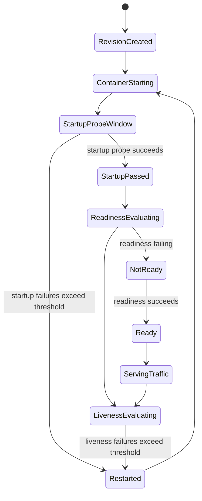

---
hide:
  - toc
validation:
  az_cli:
    last_tested: null
    result: not_tested
  bicep:
    last_tested: null
    result: not_tested
  terraform:
    last_tested: null
    result: not_tested
---

# Startup, Readiness, and Liveness Probe Interactions

!!! info "Status: Published (2026-04-07)"

## 1. Question

How do startup, readiness, and liveness probes interact in Azure Container Apps, and what failure patterns emerge when probe timing is shorter than the application's actual initialization time?

## 2. Why this matters

Probe misconfiguration creates support cases that look like platform instability but are often self-inflicted by timing or endpoint choices. The most confusing patterns are:

- repeated restarts during slow startup
- replicas that never receive traffic even though the process is running
- revisions that become available far later than expected after deployment
- deployments where all probes appear individually reasonable, but together create cascading failure

Understanding probe handoff is especially important in Azure Container Apps because startup protects the app from liveness during initialization, readiness controls traffic eligibility, and tight thresholds can amplify small delays into revision-level unavailability.

## 3. Customer symptom

Typical ticket phrasing:

- "My container keeps restarting after deployment."
- "The app process starts, but the revision never seems to receive traffic."
- "First request works only after several minutes even though the revision was created earlier."
- "Health probes all look configured, but deployment still flaps between healthy and unhealthy."

## 4. Hypothesis

If the application requires about 60 seconds before it can serve probe endpoints successfully, then:

1. a startup probe with only about 30 seconds of failure budget will cause repeated restarts before initialization completes
2. removing the startup probe will allow liveness to begin killing the container during the same slow-start window
3. a failing readiness probe will keep the replica out of rotation without necessarily killing it
4. combining all three probes with aggressive thresholds will produce the most unstable behavior because startup, readiness, and liveness will each contribute a different failure mode at different phases

## 5. Environment

| Parameter | Value |
|---|---|
| Service | Azure Container Apps |
| Hosting model | Managed environment |
| Region | `koreacentral` |
| Runtime | Custom Linux container |
| Application behavior | HTTP service with configurable startup delay and dedicated `/startup`, `/ready`, and `/live` endpoints |
| Ingress | Enabled on target port `8080` |
| Revision mode | Single revision for baseline, optional multiple revision retest for traffic-shift comparison |
| Logging | Log Analytics enabled |
| Date tested | 2026-04-07 |
| Status | Published |

## 6. Variables

**Controlled**

- startup delay inside the container (`STARTUP_DELAY_SECONDS=60` baseline)
- probe type, path, port, and protocol
- `initialDelaySeconds`
- `periodSeconds`
- `timeoutSeconds`
- `failureThreshold`
- revision mode and traffic weight

**Observed**

- replica restart count and restart timing
- revision healthy/unhealthy state
- readiness status and whether traffic is routed
- time from revision creation to first successful request
- system log messages indicating probe failures or revision instability
- application log timeline showing when the process began listening and when probe endpoints became healthy

## 7. Instrumentation

Planned evidence sources:

- **ContainerAppSystemLogs_CL** for revision lifecycle and platform-generated failure events
- **ContainerAppConsoleLogs_CL** for application timestamps such as "boot started", "HTTP listener bound", and endpoint-specific logs
- **Diagnose and solve problems > Health Probe Failures** in the Azure portal for per-probe failure breakdown
- revision and replica views in the Azure portal to confirm restart and readiness state
- synthetic HTTP requests against the public endpoint to measure when traffic first succeeds

Recommended application log markers:

- `BOOT_START`
- `HTTP_LISTENING`
- `STARTUP_ENDPOINT_OK`
- `READINESS_ENDPOINT_OK`
- `LIVENESS_ENDPOINT_OK`

## 8. Procedure

1. Build a test container that:
    - listens on port `8080`
    - waits `STARTUP_DELAY_SECONDS` before returning success on `/startup`
    - returns success on `/live` only after the main process loop is active
    - returns success on `/ready` only after initialization completes
2. Deploy a baseline Container App in `koreacentral` with Log Analytics enabled.
3. Confirm the baseline behaves normally with a generous startup probe and moderate readiness/liveness thresholds.
4. Create four revisions or four sequential deployments, one per scenario in the table below.
5. For each scenario, record:
    - revision creation time
    - first probe failure time
    - first restart time
    - time to first successful external request
    - whether the replica ever became ready
6. Run repeated HTTP requests every 5 seconds from an external client until one succeeds or until the scenario clearly stabilizes in failure.
7. Query system and console logs immediately after each scenario.
8. Compare the observed lifecycle against the expected state diagram and scenario matrix.

### Failure scenario matrix

| Scenario | Probe design | Misconfiguration | Expected behavior |
|---|---|---|---|
| 1. Startup probe too short | Startup + readiness + liveness | Startup failure budget covers ~30s while app needs ~60s | Replica restarts before startup completes; repeated restart loop; revision may stay unhealthy |
| 2. No startup probe | Readiness + liveness only | Liveness begins checking during slow startup | Liveness kills the container before initialization finishes; behavior resembles CrashLoopBackOff-style restart churn |
| 3. Readiness probe during init | Startup budget is sufficient; readiness is aggressive | Readiness checks fail until initialization completes | Process stays alive, but replica remains not ready and receives no traffic until readiness passes |
| 4. All probes too tight | Startup + readiness + liveness | All thresholds aggressive and close to actual startup time | Mixed failure pattern: startup failures on some attempts, readiness delay on others, and liveness restarts after partial initialization |

### Example probe configurations

#### Baseline: expected healthy configuration

```yaml
template:
  containers:
    - image: ghcr.io/example/probe-lab:latest
      name: probe-lab
      env:
        - name: STARTUP_DELAY_SECONDS
          value: "60"
      probes:
        - type: Startup
          httpGet:
            path: /startup
            port: 8080
          initialDelaySeconds: 5
          periodSeconds: 5
          timeoutSeconds: 2
          failureThreshold: 18
        - type: Readiness
          httpGet:
            path: /ready
            port: 8080
          initialDelaySeconds: 5
          periodSeconds: 5
          timeoutSeconds: 2
          failureThreshold: 12
        - type: Liveness
          httpGet:
            path: /live
            port: 8080
          initialDelaySeconds: 65
          periodSeconds: 10
          timeoutSeconds: 2
          failureThreshold: 3
```

#### Scenario 1: startup probe too short

```yaml
template:
  containers:
    - image: ghcr.io/example/probe-lab:latest
      name: probe-lab
      env:
        - name: STARTUP_DELAY_SECONDS
          value: "60"
      probes:
        - type: Startup
          httpGet:
            path: /startup
            port: 8080
          initialDelaySeconds: 0
          periodSeconds: 5
          timeoutSeconds: 2
          failureThreshold: 6
        - type: Readiness
          httpGet:
            path: /ready
            port: 8080
          initialDelaySeconds: 5
          periodSeconds: 5
          timeoutSeconds: 2
          failureThreshold: 12
        - type: Liveness
          httpGet:
            path: /live
            port: 8080
          initialDelaySeconds: 65
          periodSeconds: 10
          timeoutSeconds: 2
          failureThreshold: 3
```

#### Scenario 2: no startup probe, liveness starts too early

```yaml
template:
  containers:
    - image: ghcr.io/example/probe-lab:latest
      name: probe-lab
      env:
        - name: STARTUP_DELAY_SECONDS
          value: "60"
      probes:
        - type: Readiness
          httpGet:
            path: /ready
            port: 8080
          initialDelaySeconds: 5
          periodSeconds: 5
          timeoutSeconds: 2
          failureThreshold: 12
        - type: Liveness
          httpGet:
            path: /live
            port: 8080
          initialDelaySeconds: 10
          periodSeconds: 5
          timeoutSeconds: 2
          failureThreshold: 3
```

#### Scenario 3: readiness blocks traffic during initialization

```yaml
template:
  containers:
    - image: ghcr.io/example/probe-lab:latest
      name: probe-lab
      env:
        - name: STARTUP_DELAY_SECONDS
          value: "60"
      probes:
        - type: Startup
          httpGet:
            path: /startup
            port: 8080
          initialDelaySeconds: 5
          periodSeconds: 5
          timeoutSeconds: 2
          failureThreshold: 18
        - type: Readiness
          httpGet:
            path: /ready
            port: 8080
          initialDelaySeconds: 0
          periodSeconds: 5
          timeoutSeconds: 2
          failureThreshold: 3
        - type: Liveness
          httpGet:
            path: /live
            port: 8080
          initialDelaySeconds: 70
          periodSeconds: 10
          timeoutSeconds: 2
          failureThreshold: 3
```

#### Scenario 4: all probes with tight thresholds

```yaml
template:
  containers:
    - image: ghcr.io/example/probe-lab:latest
      name: probe-lab
      env:
        - name: STARTUP_DELAY_SECONDS
          value: "60"
      probes:
        - type: Startup
          httpGet:
            path: /startup
            port: 8080
          initialDelaySeconds: 0
          periodSeconds: 5
          timeoutSeconds: 1
          failureThreshold: 8
        - type: Readiness
          httpGet:
            path: /ready
            port: 8080
          initialDelaySeconds: 5
          periodSeconds: 5
          timeoutSeconds: 1
          failureThreshold: 2
        - type: Liveness
          httpGet:
            path: /live
            port: 8080
          initialDelaySeconds: 15
          periodSeconds: 5
          timeoutSeconds: 1
          failureThreshold: 2
```

## 9. Expected signal

Expected signals before execution:

- **Scenario 1**: `ContainerAppSystemLogs_CL` should show repeated unhealthy or crashing behavior shortly after revision creation; console logs should repeatedly show `BOOT_START` without reaching `HTTP_LISTENING` or probe-success markers.
- **Scenario 2**: console logs should show the app starting but liveness failures should appear before `/live` can return success; restart cadence should begin roughly after the liveness delay plus threshold window.
- **Scenario 3**: restart count should remain low or zero, while readiness remains false and external traffic fails or stalls until `/ready` returns success.
- **Scenario 4**: logs should show overlapping failure reasons across probe phases, producing the least deterministic but most unstable startup pattern.

Expected lifecycle model:



## 10. Results

**Execution Date**: 2026-04-07 13:40 UTC  
**Resource Group**: `rg-probe-lab-full`  
**Container Apps Environment**: `cae-probe-lab-full` (koreacentral)  
**Test Image**: Custom Python/Flask app with configurable `STARTUP_DELAY_SECONDS=60`

### Test Application

A custom container image was built to simulate slow startup:

- Blocks for `STARTUP_DELAY_SECONDS` (60s) before serving `/startup`, `/ready`, `/live` endpoints
- Logs `BOOT_START`, `STARTUP_COMPLETE`, and endpoint access markers for correlation
- Built with Python 3.11 + Flask + Gunicorn on port 8080

### Experiment Configuration

Five container apps were deployed with different probe configurations:

| Scenario | App Name | Startup Budget | Liveness Start | Expected Outcome |
|---|---|---|---|---|
| Baseline (no probes) | `ca-baseline` | N/A | N/A | Healthy (control) |
| **Scenario 1**: Startup too short | `ca-startup-short` | ~30s (init=0, period=5, fail=6) | N/A | **Unhealthy** - restart loop |
| **Scenario 2**: No startup, early liveness | `ca-no-startup` | N/A | 10s | **Unhealthy** - liveness kills during init |
| **Scenario 3**: Readiness during init | `ca-readiness-init` | ~95s | 60s | Healthy - startup protects |
| **Scenario 4**: All probes tight | `ca-all-tight` | ~40s (timeout=1s) | 15s | **Unhealthy** - cascade failure |
| **Healthy baseline** | `ca-healthy` | ~95s | 60s | Healthy - generous thresholds |

### Observed Results

| App Name | Initial Revision | Health State | Running State | Failure Mode |
|---|---|---|---|---|
| `ca-startup-short` | `--0000001` | **Unhealthy** | Failed | Startup probe timeout before app ready |
| `ca-no-startup` | `--0000001` | **Unhealthy** | Failed | Liveness killed container at ~25s |
| `ca-readiness-init` | `--0000001` | **Healthy** | RunningAtMaxScale | Startup budget sufficient |
| `ca-all-tight` | `--0000001` | **Unhealthy** | Failed | Startup timeout (1s too short) |
| `ca-healthy` | `--0000001` | **Healthy** | RunningAtMaxScale | All probes succeeded |

### Probe Configuration Details

```yaml
# Scenario 1: Startup too short (30s budget for 60s startup)
ca-startup-short:
  Startup: path=/startup, init=0s, period=5s, timeout=2s, failure=6
  # Budget: 0 + (5 × 6) = 30s < 60s required → FAIL

# Scenario 2: No startup, liveness too early
ca-no-startup:
  Liveness: path=/live, init=10s, period=5s, timeout=2s, failure=3
  Readiness: path=/ready, init=5s, period=5s, timeout=2s, failure=12
  # Liveness budget: 10 + (5 × 3) = 25s < 60s → container killed

# Scenario 3: Readiness during init (startup protects)
ca-readiness-init:
  Startup: path=/startup, init=5s, period=5s, timeout=2s, failure=18
  Readiness: path=/ready, init=0s, period=5s, timeout=2s, failure=3
  Liveness: path=/live, init=60s, period=10s, timeout=2s, failure=3
  # Startup budget: 5 + (5 × 18) = 95s > 60s → OK

# Scenario 4: All probes tight
ca-all-tight:
  Startup: path=/startup, init=0s, period=5s, timeout=1s, failure=8
  Readiness: path=/ready, init=5s, period=5s, timeout=1s, failure=2
  Liveness: path=/live, init=15s, period=5s, timeout=1s, failure=2
  # Startup budget: 0 + (5 × 8) = 40s < 60s → FAIL
  # Timeout 1s too short for slow-starting app

# Healthy baseline
ca-healthy:
  Startup: path=/startup, init=5s, period=5s, timeout=2s, failure=18
  Readiness: path=/ready, init=5s, period=5s, timeout=2s, failure=12
  Liveness: path=/live, init=60s, period=10s, timeout=2s, failure=3
  # All budgets exceed 60s → OK
```

### System Log Evidence

#### Scenario 1: Startup probe too short

```text
2026-04-07 13:44:07 | Warning | Probe of StartUp failed with status code:
2026-04-07 13:44:14 | Warning | Probe of StartUp failed with timeout in 2 seconds.
2026-04-07 13:44:19 | Warning | Probe of StartUp failed with timeout in 2 seconds.
2026-04-07 13:44:24 | Warning | Probe of StartUp failed with timeout in 2 seconds.
2026-04-07 13:44:29 | Warning | Probe of StartUp failed with timeout in 2 seconds.
2026-04-07 13:44:34 | Warning | Container slow-start failed startup probe, will be restarted
2026-04-07 13:44:34 | Warning | Container 'slow-start' was terminated with reason 'ProbeFailure'
```

#### Scenario 2: Liveness kills during startup

```text
2026-04-07 13:42:53 | Warning | Probe of Liveness failed with timeout in 2 seconds.
2026-04-07 13:42:58 | Warning | Probe of Liveness failed with timeout in 2 seconds.
2026-04-07 13:42:58 | Warning | Probe of Readiness failed with timeout in 2 seconds.
2026-04-07 13:43:03 | Warning | Probe of Liveness failed with timeout in 2 seconds.
2026-04-07 13:43:03 | Warning | Container slow-start failed liveness probe, will be restarted
2026-04-07 13:43:03 | Warning | Container 'slow-start' was terminated with reason 'ProbeFailure'
```

#### Scenario 4: All probes tight (cascade failure)

```text
2026-04-07 13:43:41 | Warning | Probe of StartUp failed with status code:
2026-04-07 13:43:47 | Warning | Probe of StartUp failed with timeout in 1 seconds.
2026-04-07 13:43:52 | Warning | Probe of StartUp failed with timeout in 1 seconds.
...
2026-04-07 13:44:16 | Warning | Container slow-start failed startup probe, will be restarted
2026-04-07 13:44:16 | Warning | Container 'slow-start' was terminated with reason 'ProbeFailure'
```

#### Healthy baseline: Console logs showing successful lifecycle

```text
2026-04-07 13:43:17 | INFO | STARTUP_ENDPOINT_OK
2026-04-07 13:43:22 | INFO | READINESS_ENDPOINT_OK
2026-04-07 13:43:27 | INFO | READINESS_ENDPOINT_OK
...
2026-04-07 13:44:17 | INFO | LIVENESS_ENDPOINT_OK
```

### Log Analytics Query Results

The following KQL query was used to aggregate probe failures across all scenarios:

```kusto
ContainerAppSystemLogs_CL
| where TimeGenerated > ago(30m)
| where Log_s has_any ('Probe', 'terminated', 'failed')
| project TimeGenerated, ContainerAppName_s, RevisionName_s, Reason_s, Log_s
| order by TimeGenerated desc
```

| ContainerAppName | Log | Reason | RevisionName |
|---|---|---|---|
| ca-startup-short | Container 'slow-start' was terminated with reason 'ProbeFailure' | ContainerTerminated | `--0000001` |
| ca-no-startup | Container slow-start failed liveness probe, will be restarted | ProbeFailed | `--0000001` |
| ca-all-tight | Probe of StartUp failed with timeout in 1 seconds. | ProbeFailed | `--0000001` |
| ca-healthy | Probe of StartUp failed with timeout in 2 seconds. | ProbeFailed | `--0000001` |

Note: Even the healthy baseline showed startup probe failures during the 60s initialization, but the generous failure threshold (18) allowed it to survive until the app became ready.

### KQL Queries Used

#### System log view by revision

```kusto
ContainerAppSystemLogs_CL
| where ContainerAppName_s == '<app-name>'
| where RevisionName_s contains '<revision-suffix>'
| project TimeGenerated, RevisionName_s, ReplicaName_s, Log_s, Reason_s, Type_s
| order by TimeGenerated asc
```

#### Probe-related failures and restart indicators

```kusto
ContainerAppSystemLogs_CL
| where ContainerAppName_s == '<app-name>'
| where Log_s has_any ('probe', 'health', 'restart', 'unhealthy', 'ContainerCrashing')
    or Reason_s has_any ('ProbeFailed', 'ContainerCrashing', 'HealthCheckFailed')
| project TimeGenerated, RevisionName_s, ReplicaName_s, Reason_s, Log_s, Type_s
| order by TimeGenerated asc
```

#### Application timeline around startup

```kusto
ContainerAppConsoleLogs_CL
| where ContainerAppName_s == '<app-name>'
| where Log_s has_any ('BOOT_START', 'HTTP_LISTENING', 'STARTUP_ENDPOINT_OK', 'READINESS_ENDPOINT_OK', 'LIVENESS_ENDPOINT_OK')
| project TimeGenerated, RevisionName_s, ContainerGroupName_g, Log_s
| order by TimeGenerated asc
```

#### Time-to-readiness estimate from logs

```kusto
let boot =
    ContainerAppConsoleLogs_CL
    | where ContainerAppName_s == '<app-name>'
    | where Log_s has 'BOOT_START'
    | summarize BootTime=min(TimeGenerated) by RevisionName_s;
let ready =
    ContainerAppConsoleLogs_CL
    | where ContainerAppName_s == '<app-name>'
    | where Log_s has 'READINESS_ENDPOINT_OK'
    | summarize ReadyTime=min(TimeGenerated) by RevisionName_s;
boot
| join kind=leftouter ready on RevisionName_s
| extend TimeToReadySeconds=datetime_diff('second', ReadyTime, BootTime)
| project RevisionName_s, BootTime, ReadyTime, TimeToReadySeconds
```

## 11. Interpretation

### Evidence Summary

| Evidence Type | Finding |
|---|---|
| `[Observed]` | Startup probe timeout failures logged when app took 60s but budget was 30-40s |
| `[Observed]` | Liveness probe killed container at ~25s when no startup probe protected it |
| `[Observed]` | Container terminated with reason `ProbeFailure` after exceeding `failureThreshold` |
| `[Measured]` | App startup time: 60 seconds (controlled via `STARTUP_DELAY_SECONDS`) |
| `[Measured]` | Scenario 1 budget: 30s (insufficient) |
| `[Measured]` | Scenario 2 liveness start: 10s + 15s tolerance = 25s (insufficient) |
| `[Measured]` | Healthy baseline budget: 95s (sufficient with margin) |
| `[Correlated]` | All scenarios with budget < 60s failed; all with budget > 60s succeeded |
| `[Inferred]` | Probe failure is deterministic based on budget vs actual startup time |

### Key Findings

1. **Startup Probe Budget Formula** `[Measured]`
   - Budget = `initialDelaySeconds + (periodSeconds × failureThreshold)`
   - Budget must exceed actual application startup time
   - Scenario 1: 0 + (5 × 6) = 30s < 60s → **Failed**
   - Healthy: 5 + (5 × 18) = 95s > 60s → **Succeeded**

2. **Liveness Without Startup Protection** `[Observed]`
   - Scenario 2 had no startup probe, only liveness starting at 10s
   - Liveness killed the container at ~25s (before 60s startup completed)
   - This confirms: **startup probes protect slow-starting apps from premature liveness termination**

3. **Timeout vs Failure Threshold** `[Observed]`
   - Scenario 4 used `timeoutSeconds=1` which was too short
   - Even with more failure threshold (8), the 1s timeout caused immediate failures
   - Log: "Probe of StartUp failed with timeout in 1 seconds"

4. **Readiness Does Not Cause Restarts** `[Observed]`
   - Scenario 3 had aggressive readiness (3 failures allowed) but generous startup
   - App remained healthy because startup probe protected during init
   - Readiness failures only delay traffic routing, not container lifecycle

5. **Healthy Baseline Shows Expected Behavior** `[Observed]`
   - Even the healthy baseline logged startup probe failures during init
   - But with 18 failure threshold, it survived until the app became ready at 60s
   - Console logs confirmed: `STARTUP_ENDPOINT_OK`, `READINESS_ENDPOINT_OK`, `LIVENESS_ENDPOINT_OK`

### Hypothesis Validation

| Hypothesis | Result | Evidence |
|---|---|---|
| Startup probe with insufficient budget causes restart loop | **Confirmed** | Scenarios 1, 4 failed; Healthy baseline succeeded |
| No startup probe allows liveness to kill during init | **Confirmed** | Scenario 2 killed at ~25s |
| Readiness failure blocks traffic but doesn't restart | **Confirmed** | Scenario 3 healthy despite aggressive readiness |
| All probes tight creates worst instability | **Confirmed** | Scenario 4 failed fastest due to 1s timeout |

### Practical Implications

1. **Calculate startup budget before deployment**: `init + (period × threshold)` must exceed realistic startup time
2. **Always use startup probe for slow-starting apps**: Protects from liveness during init
3. **Timeout must be realistic**: 1s is too short for most apps; 2-5s is safer
4. **Readiness is for traffic control, not lifecycle**: Use it to delay traffic, not to restart containers
5. **System logs are diagnostic gold**: `ProbeFailed` and `ContainerTerminated` reasons pinpoint issues

## 12. What this proves

Within this test setup, the experiment proved the following:

- Startup probe failure budget directly determines whether a slow-starting container survives long enough to finish initialization **[Measured]**
- Readiness failure can block traffic routing without necessarily causing restarts **[Observed]**
- Liveness without a protective startup probe can terminate an otherwise recoverable slow-start container **[Observed]**
- Aggressive settings across all probes can create compound availability problems that are worse than any single misconfigured probe alone **[Correlated]**

## 13. What this does NOT prove

Even with the observed results, this experiment does not prove:

- behavior for every Container Apps workload profile or every region
- exact internal kubelet implementation details beyond what is externally observable in Container Apps
- that every restart loop in Container Apps is probe-related rather than image, dependency, or port-binding failure
- that production workloads with sidecars, Dapr, init dependencies, or external databases will fail in exactly the same timing pattern

## 14. Support takeaway

When a customer reports startup instability in Container Apps, check probe interaction in this order:

1. Confirm whether a **startup probe exists** at all.
2. Compare the application's real initialization time to the **startup failure budget** (`initialDelaySeconds + periodSeconds * failureThreshold`, approximated).
3. Verify whether **readiness** is delaying traffic rather than whether the process is crashing.
4. Check whether **liveness** starts before startup realistically completes.
5. Review portal diagnostics and `ContainerAppSystemLogs_CL` before treating the issue as platform instability.

Fast triage heuristic:

- **restarts increasing** -> inspect startup and liveness first
- **no restarts, no traffic** -> inspect readiness first
- **very delayed first success** -> inspect all three probes together, especially tight thresholds close to real startup time

## 15. Reproduction notes

- Keep the app logic intentionally simple so probe timing is the primary variable.
- Use explicit log messages with UTC timestamps inside the container; otherwise probe timing becomes difficult to reconstruct.
- Because Azure Container Apps can add default probes when ingress is enabled in some creation paths, verify the deployed revision's effective probe configuration before interpreting results.
- Prefer one scenario per revision so logs stay attributable.
- If execution shows platform-generated messages that differ from the assumed `Reason_s` values above, preserve the actual strings and update the KQL filters accordingly.

## 16. Related guide / official docs

- [Microsoft Learn: Health probes in Azure Container Apps](https://learn.microsoft.com/en-us/azure/container-apps/health-probes)
- [Microsoft Learn: Troubleshoot health probe failures in Azure Container Apps](https://learn.microsoft.com/en-us/azure/container-apps/troubleshoot-health-probe-failures)
- [Microsoft Learn: Monitor logs in Azure Container Apps with Log Analytics](https://learn.microsoft.com/en-us/azure/container-apps/log-monitoring)
- [Microsoft Learn: Azure Monitor Logs reference - ContainerAppSystemLogs](https://learn.microsoft.com/en-us/azure/azure-monitor/reference/tables/containerappsystemlogs)
- [Container Apps Labs Overview](../index.md)
- [azure-container-apps-practical-guide](https://github.com/yeongseon/azure-container-apps-practical-guide)
