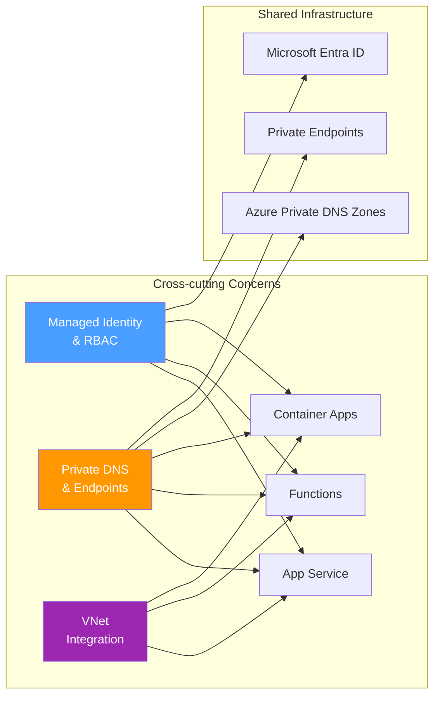

---
hide:
  - toc
---

# Cross-cutting Experiments

Experiments that span multiple Azure PaaS services and test platform-level behaviors shared across App Service, Functions, and Container Apps.

## Why Cross-cutting?

Some troubleshooting scenarios are not specific to a single compute service. Identity propagation, DNS resolution, and networking behaviors apply across App Service, Functions, and Container Apps. Testing these cross-cutting behaviors reveals whether the root cause is in the shared platform infrastructure or in service-specific implementation.

### Key Cross-cutting Patterns

| Pattern | Description | Affected Services |
|---------|-------------|-------------------|
| **RBAC Propagation Delay** | Role assignment changes take time to propagate through Entra ID and local token caches | All services using managed identity |
| **DNS Negative Caching** | Failed DNS lookups are cached, extending outages beyond the original failure window | All services with VNet integration |
| **VNet DNS Resolution** | Custom DNS servers and Azure DNS Private Zones interact differently across services | App Service, Functions (Flex), Container Apps |
| **Token Cache Behavior** | Managed identity tokens are cached at multiple layers with different TTLs | All services using managed identity |

## Experiment Status

| Experiment | Type | Status | Description |
|-----------|------|--------|-------------|
| [MI RBAC Propagation](mi-rbac-propagation/overview.md) | Hybrid | Planned | Role assignment delay and token cache interaction |
| [PE DNS Negative Cache](pe-dns-negative-cache/overview.md) | Hybrid | Planned | Extended outages from DNS negative cache during PE cutover |

## Planned Experiments

### [Managed Identity RBAC Propagation](mi-rbac-propagation/overview.md)

Role assignment delay and token cache interaction across services. Tests the end-to-end propagation time from `az role assignment create` to successful API call, and how token caching at different layers (IMDS, SDK, application) affects the observable delay.

This experiment tests the same RBAC assignment across App Service, Functions, and Container Apps to determine whether propagation delay is service-specific or platform-wide.

### [Private Endpoint DNS Negative Caching](pe-dns-negative-cache/overview.md)

Extended outages from DNS negative cache during private endpoint cutover. When a private endpoint is created or migrated, DNS records change — but negative cache entries from the transition window can persist for minutes, causing continued failures even after the DNS change is complete.

This experiment measures the negative cache TTL and its impact across services with VNet integration.

## Related Experiments

These service-specific experiments touch on cross-cutting concerns:

- **App Service** — [Custom DNS Resolution](../app-service/custom-dns-resolution/overview.md) — DNS resolution drift after VNet changes (DNS-specific)
- **App Service** — [SNAT Exhaustion](../app-service/snat-exhaustion/overview.md) (**Published**) — Networking behavior under connection pressure
- **Container Apps** — [Custom DNS Forwarding](../container-apps/custom-dns-forwarding/overview.md) — DNS forwarding failures in Container Apps environments
- **Container Apps** — [Private Endpoint FQDN vs IP](../container-apps/private-endpoint-fqdn-vs-ip/overview.md) — Private endpoint access pattern differences
