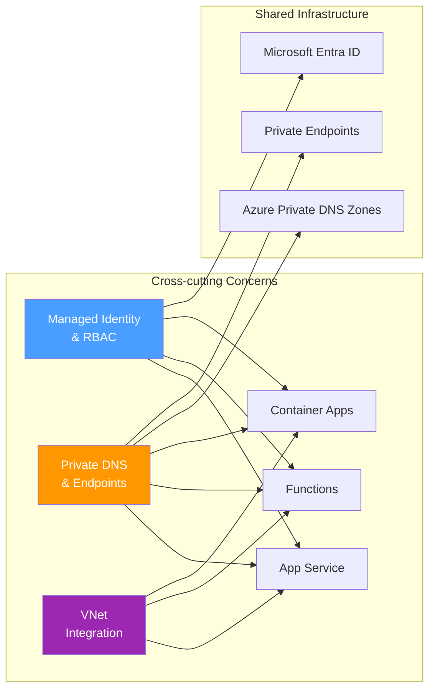

---
hide:
  - toc
---

# Cross-cutting Experiments

Experiments that span multiple Azure PaaS services and test platform-level behaviors shared across App Service, Functions, and Container Apps.

## Why Cross-cutting?

Some troubleshooting scenarios are not specific to a single compute service. Identity propagation, DNS resolution, and networking behaviors apply across App Service, Functions, and Container Apps. Testing these cross-cutting behaviors reveals whether the root cause is in the shared platform infrastructure or in service-specific implementation.

### Key Cross-cutting Patterns

| Pattern | Description | Affected Services |
|---------|-------------|-------------------|
| **RBAC Propagation Delay** | Role assignment changes take time to propagate through Entra ID and local token caches | All services using managed identity |
| **DNS Negative Caching** | Failed DNS lookups are cached, extending outages beyond the original failure window | All services with VNet integration |
| **VNet DNS Resolution** | Custom DNS servers and Azure DNS Private Zones interact differently across services | App Service, Functions (Flex), Container Apps |
| **Token Cache Behavior** | Managed identity tokens are cached at multiple layers with different TTLs | All services using managed identity |

## Experiment Status

| Experiment | Type | Status | Description |
|-----------|------|--------|-------------|
| [MI RBAC Propagation](mi-rbac-propagation/overview.md) | Hybrid | Published | Role assignment delay and token cache interaction |
| [PE DNS Negative Cache](pe-dns-negative-cache/overview.md) | Hybrid | Published | Extended outages from DNS negative cache during PE cutover |
| [Ingress Idle Timeout](ingress-idle-timeout/overview.md) | Hybrid | Draft | Ingress idle timeout vs application streaming |
| [Config Change Restart](config-change-restart/overview.md) | Hybrid | Draft | Container restart behavior on configuration changes |

## Planned Experiments

### [Managed Identity RBAC Propagation](mi-rbac-propagation/overview.md) — Published

Role assignment delay and token cache interaction across services. Tested end-to-end propagation time from `az role assignment create` to successful API call across Key Vault (~10s), Storage (~60s), and Service Bus (~5 min). Discovered that Service Bus has a server-side RBAC authorization cache that persists through application restarts — the delay is NOT Azure Identity SDK token cache.

### [Private Endpoint DNS Negative Caching](pe-dns-negative-cache/overview.md) — Published

Extended outages from DNS negative cache during private endpoint cutover. **Unexpected finding:** DNS negative caching was NOT observed in App Service Linux — transitions were immediate. The experiment refutes the original hypothesis for this platform.

## Draft Experiments

### [Ingress Idle Timeout](ingress-idle-timeout/overview.md) — **Draft**

Ingress idle timeout vs application streaming behavior. Tests what happens when long-running requests (SSE, file downloads) exceed the ingress idle timeout, and whether the timeout applies to idle connections or total request duration.

!!! info "Status: Draft - Awaiting Execution"
    Designed based on Oracle recommendations. High priority for streaming/SSE use cases.

### [Config Change Restart](config-change-restart/overview.md) — **Draft**

Container restart behavior on configuration changes. Tests which configuration changes trigger container restarts across services, and whether in-flight requests are handled gracefully.

!!! info "Status: Draft - Awaiting Execution"
    Designed based on Oracle recommendations. Awaiting execution.

### [VNet DNS Server Priority](vnet-dns-server-priority/overview.md) — **Draft**

DNS resolution priority when both custom DNS servers and Azure DNS Private Zones are configured on the same VNet. Tests resolution order, fallback behavior when the custom DNS server is unreachable, and whether Azure DNS Private Zones are queried before or after custom servers.

!!! info "Status: Draft - Awaiting Execution"
    Addresses a common misconfiguration: custom DNS server blocks Azure-internal name resolution.

### [Managed Identity Federated Credential](managed-identity-federated-credential/overview.md) — **Draft**

Federated credential token exchange behavior for workload identity federation. Tests OIDC issuer validation, subject claim mismatch failures, and token exchange latency compared to standard managed identity token acquisition.

!!! info "Status: Draft - Awaiting Execution"
    Relevant for GitHub Actions and Kubernetes workloads authenticating to Azure via federated credentials.

## Related Experiments

These service-specific experiments touch on cross-cutting concerns:

- **App Service** — [Custom DNS Resolution](../app-service/custom-dns-resolution/overview.md) — DNS resolution drift after VNet changes (DNS-specific)
- **App Service** — [SNAT Exhaustion](../app-service/snat-exhaustion/overview.md) (**Published**) — Networking behavior under connection pressure
- **Container Apps** — [Custom DNS Forwarding](../container-apps/custom-dns-forwarding/overview.md) — DNS forwarding failures in Container Apps environments
- **Container Apps** — [Private Endpoint FQDN vs IP](../container-apps/private-endpoint-fqdn-vs-ip/overview.md) — Private endpoint access pattern differences
