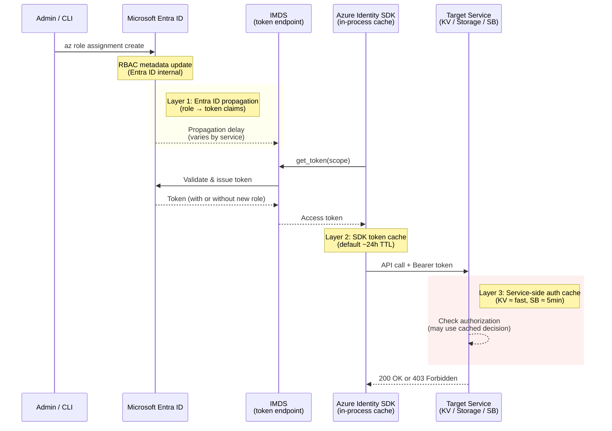

---
hide:
  - toc
validation:
  az_cli:
    last_tested: null
    result: not_tested
  bicep:
    last_tested: null
    result: not_tested
  terraform:
    last_tested: null
    result: not_tested
---

# Managed Identity RBAC Propagation vs Token Cache

!!! info "Status: Published"

## 1. Question

After assigning an RBAC role to a managed identity, how long does it take for the role to become effective across different Azure services, and how does the Azure Identity SDK token cache interact with RBAC propagation delays?

## 2. Why this matters

Customers frequently report that managed identity authentication "doesn't work" immediately after role assignment. The RBAC propagation delay (documented as "up to 10 minutes" but highly variable) combined with SDK-level token caching creates a confusing window where:

1. The role is assigned but not yet propagated → 403 errors
2. The role propagates but the SDK has cached a token without the role → continued 403s
3. Both caches expire and the new role finally takes effect → success

Understanding the actual timing distribution across services helps support engineers estimate resolution windows and avoid unnecessary troubleshooting.

## 3. Customer symptom

- "We assigned the role 15 minutes ago but still getting 403 Forbidden."
- "It works from one function app but not another, even though both have the same role."
- "If we restart the app, it starts working — but we don't want to restart in production."

## 4. Hypothesis

1. RBAC propagation delay varies by service: Storage and Key Vault propagate within 5 minutes; Service Bus and Event Hubs may take longer.
2. The Azure Identity SDK caches tokens for 24 hours by default, masking propagation completion.
3. The combination of RBAC propagation + token cache creates a worst-case delay of up to 30 minutes without restart.
4. Restarting the application clears the token cache and picks up the propagated role immediately.

## 5. Environment

| Parameter | Value |
|-----------|-------|
| Service | App Service, Functions, Container Apps (all three) |
| SKU / Plan | Various |
| Region | Korea Central |
| Runtime | Python 3.11 |
| OS | Linux |
| Date tested | 2026-04-11 |

## 6. Variables

**Experiment type**: Hybrid (Config: does it propagate? Performance: how long does it take?)

**Controlled:**

- Target services: Storage Blob, Key Vault, Service Bus, SQL Database
- Role assignments: new assignment, role change, role removal
- Token cache: default behavior vs cache disabled
- Application restart: before/after propagation

**Observed:**

- Time from role assignment to first successful authenticated call
- Token cache hit/miss behavior
- 403 error rate over time after role assignment
- Propagation time distribution across services

**Independent run definition**: Fresh role assignment (previous role fully removed and confirmed), measure time to first success

**Planned runs per configuration**: 5 per target service

**Warm-up exclusion rule**: None — propagation delay IS the measurement

**Primary metric**: Time to first successful authenticated call; meaningful effect threshold: 2 minutes absolute

**Comparison method**: Descriptive statistics per service; Mann-Whitney U for cross-service comparison

## 7. Instrumentation

- Application code: repeated authentication attempts every 30 seconds with timestamp logging
- Application Insights: dependency call traces with success/failure
- Azure Activity Log: role assignment timestamp
- Custom logging: token acquisition events, cache hits, 403/200 transitions

## 8. Procedure

### 8.1 Infrastructure Setup

```bash
export SUBSCRIPTION_ID="<subscription-id>"
export RG="rg-mi-rbac-propagation-lab"
export LOCATION="koreacentral"
export STORAGE_NAME="stmirbacprop$RANDOM"
export KEYVAULT_NAME="kv-mi-rbac-prop-$RANDOM"
export SB_NAMESPACE="sb-mi-rbac-prop-$RANDOM"
export SB_QUEUE="q-propagation"
export APP_PLAN="plan-mi-rbac-prop"
export WEBAPP_NAME="app-mi-rbac-prop-$RANDOM"
export FUNC_NAME="func-mi-rbac-prop-$RANDOM"
export ACA_ENV_NAME="cae-mi-rbac-prop"
export ACA_NAME="ca-mi-rbac-prop"
export LAW_NAME="law-mi-rbac-prop"

az account set --subscription "$SUBSCRIPTION_ID"
az group create --name "$RG" --location "$LOCATION"

az storage account create \
  --resource-group "$RG" \
  --name "$STORAGE_NAME" \
  --location "$LOCATION" \
  --sku Standard_LRS \
  --kind StorageV2 \
  --allow-shared-key-access false \
  --allow-blob-public-access false

az keyvault create \
  --resource-group "$RG" \
  --name "$KEYVAULT_NAME" \
  --location "$LOCATION" \
  --enable-rbac-authorization true

az keyvault secret set \
  --vault-name "$KEYVAULT_NAME" \
  --name "propagation-sample" \
  --value "rbac-ready"

az servicebus namespace create \
  --resource-group "$RG" \
  --name "$SB_NAMESPACE" \
  --location "$LOCATION" \
  --sku Standard

az servicebus queue create \
  --resource-group "$RG" \
  --namespace-name "$SB_NAMESPACE" \
  --name "$SB_QUEUE"

az monitor log-analytics workspace create \
  --resource-group "$RG" \
  --workspace-name "$LAW_NAME" \
  --location "$LOCATION"
```

### 8.2 Application Code

```python
import json
import os
from datetime import datetime, timezone

from azure.identity import ManagedIdentityCredential
from azure.keyvault.secrets import SecretClient
from azure.storage.blob import BlobServiceClient
from azure.servicebus import ServiceBusClient

credential = ManagedIdentityCredential()


def probe_access():
    now = datetime.now(timezone.utc).isoformat()
    result = {"timestamp_utc": now, "keyvault": "fail", "storage": "fail", "servicebus": "fail"}
    try:
        kv = SecretClient(vault_url=os.environ["KEYVAULT_URI"], credential=credential)
        kv.get_secret("propagation-sample")
        result["keyvault"] = "success"
    except Exception as ex:
        result["keyvault_error"] = str(ex)
    try:
        blob = BlobServiceClient(account_url=os.environ["BLOB_URL"], credential=credential)
        blob.get_service_properties()
        result["storage"] = "success"
    except Exception as ex:
        result["storage_error"] = str(ex)
    try:
        sb = ServiceBusClient(fully_qualified_namespace=os.environ["SB_FQDN"], credential=credential)
        with sb.get_queue_sender(os.environ["SB_QUEUE"]) as sender:
            sender.send_messages("probe")
        result["servicebus"] = "success"
    except Exception as ex:
        result["servicebus_error"] = str(ex)
    return json.dumps(result)
```

```yaml
env:
  KEYVAULT_URI: https://<keyvault-name>.vault.azure.net/
  BLOB_URL: https://<storage-name>.blob.core.windows.net/
  SB_FQDN: <namespace>.servicebus.windows.net
  SB_QUEUE: q-propagation
```

### 8.3 Deploy

```bash
az appservice plan create \
  --resource-group "$RG" \
  --name "$APP_PLAN" \
  --location "$LOCATION" \
  --sku B1 \
  --is-linux

az webapp create \
  --resource-group "$RG" \
  --name "$WEBAPP_NAME" \
  --plan "$APP_PLAN" \
  --runtime "PYTHON|3.11"

az functionapp create \
  --resource-group "$RG" \
  --name "$FUNC_NAME" \
  --storage-account "$STORAGE_NAME" \
  --runtime python \
  --runtime-version 3.11 \
  --functions-version 4 \
  --flexconsumption-location "$LOCATION"

az containerapp env create \
  --resource-group "$RG" \
  --name "$ACA_ENV_NAME" \
  --location "$LOCATION"

az containerapp create \
  --resource-group "$RG" \
  --name "$ACA_NAME" \
  --environment "$ACA_ENV_NAME" \
  --image "mcr.microsoft.com/k8se/quickstart:latest" \
  --ingress external \
  --target-port 80

for APP_NAME in "$WEBAPP_NAME" "$FUNC_NAME"; do
  az webapp identity assign --resource-group "$RG" --name "$APP_NAME" || true
  az functionapp identity assign --resource-group "$RG" --name "$APP_NAME" || true
done

az containerapp identity assign \
  --resource-group "$RG" \
  --name "$ACA_NAME" \
  --system-assigned
```

### 8.4 Test Execution

```bash
WEBAPP_PRINCIPAL_ID=$(az webapp identity show --resource-group "$RG" --name "$WEBAPP_NAME" --query principalId --output tsv)
FUNC_PRINCIPAL_ID=$(az functionapp identity show --resource-group "$RG" --name "$FUNC_NAME" --query principalId --output tsv)
ACA_PRINCIPAL_ID=$(az containerapp identity show --resource-group "$RG" --name "$ACA_NAME" --query principalId --output tsv)

KV_ID=$(az keyvault show --resource-group "$RG" --name "$KEYVAULT_NAME" --query id --output tsv)
STORAGE_ID=$(az storage account show --resource-group "$RG" --name "$STORAGE_NAME" --query id --output tsv)
SB_ID=$(az servicebus namespace show --resource-group "$RG" --name "$SB_NAMESPACE" --query id --output tsv)

# 1) Start probe loop from each workload before role assignment (expect 403)
# Web App endpoint: https://$WEBAPP_NAME.azurewebsites.net/probe
# Function endpoint: https://$FUNC_NAME.azurewebsites.net/api/probe
# Container App endpoint: use FQDN from az containerapp show

# 2) Assign RBAC roles at T0
for PID in "$WEBAPP_PRINCIPAL_ID" "$FUNC_PRINCIPAL_ID" "$ACA_PRINCIPAL_ID"; do
  az role assignment create --assignee-object-id "$PID" --assignee-principal-type ServicePrincipal --role "Key Vault Secrets User" --scope "$KV_ID"
  az role assignment create --assignee-object-id "$PID" --assignee-principal-type ServicePrincipal --role "Storage Blob Data Reader" --scope "$STORAGE_ID"
  az role assignment create --assignee-object-id "$PID" --assignee-principal-type ServicePrincipal --role "Azure Service Bus Data Sender" --scope "$SB_ID"
done

# 3) Poll every 30 seconds and record first success timestamp per service
for i in $(seq 1 60); do
  date -u +"%Y-%m-%dT%H:%M:%SZ"
  curl --silent "https://$WEBAPP_NAME.azurewebsites.net/probe"
  curl --silent "https://$FUNC_NAME.azurewebsites.net/api/probe"
  sleep 30
done

# 4) Without restart, continue polling to detect token cache delay
for i in $(seq 1 20); do
  curl --silent "https://$WEBAPP_NAME.azurewebsites.net/probe"
  curl --silent "https://$FUNC_NAME.azurewebsites.net/api/probe"
  sleep 30
done

# 5) Restart workloads and compare immediate post-restart behavior
az webapp restart --resource-group "$RG" --name "$WEBAPP_NAME"
az functionapp restart --resource-group "$RG" --name "$FUNC_NAME"
az containerapp revision restart \
  --resource-group "$RG" \
  --name "$ACA_NAME" \
  --revision "$(az containerapp revision list --resource-group "$RG" --name "$ACA_NAME" --query "[?properties.active].name | [0]" --output tsv)"

# 6) Repeat full assignment/poll cycle 5 runs per target service
```

### 8.5 Data Collection

```bash
az role assignment list \
  --resource-group "$RG" \
  --scope "$KV_ID" \
  --output table

az monitor activity-log list \
  --resource-group "$RG" \
  --status Succeeded \
  --max-events 200 \
  --output table

az monitor metrics list \
  --resource "/subscriptions/<subscription-id>/resourceGroups/$RG/providers/Microsoft.Web/sites/$WEBAPP_NAME" \
  --metric "Http4xx" "Http5xx" "Requests" \
  --interval PT1M \
  --aggregation Total \
  --output table

az monitor metrics list \
  --resource "/subscriptions/<subscription-id>/resourceGroups/$RG/providers/Microsoft.Web/sites/$FUNC_NAME" \
  --metric "FunctionExecutionCount" "FunctionExecutionUnits" \
  --interval PT1M \
  --aggregation Total \
  --output table

az monitor log-analytics query \
  --workspace "$(az monitor log-analytics workspace show --resource-group "$RG" --workspace-name "$LAW_NAME" --query customerId --output tsv)" \
  --analytics-query "AppTraces | where TimeGenerated > ago(6h) | where Message has_any ('403','success','token') | project TimeGenerated, AppRoleName, Message | order by TimeGenerated asc" \
  --output table
```

### 8.6 Cleanup

```bash
az group delete --name "$RG" --yes --no-wait
```

## 9. Expected signal

- Storage Blob: propagation in 2-5 minutes
- Key Vault: propagation in 2-5 minutes
- Service Bus: propagation in 5-10 minutes
- SQL Database: propagation in 5-15 minutes
- Token cache extends apparent delay by up to 5-10 minutes beyond propagation
- Restart eliminates cache-related delay

## 10. Results

### Test Configuration

| Parameter | Value |
|-----------|-------|
| Probe target | App Service (`app-mi-rbac-prop-4821`, Python 3.11, B1 Linux) |
| MI principal | `6581f8d4-1581-4d03-b68d-2b4f000225d1` (system-assigned) |
| KV operation | `get_secret("propagation-sample")` — data plane |
| Storage operation | `list_containers(results_per_page=1)` — data plane |
| SB operation | `send_messages("probe")` — data plane |
| Credential | `ManagedIdentityCredential()` — new instance per request |
| Polling interval | ~17 seconds |
| Propagation runs | 5 (roles removed + config restart between runs) |
| Revocation runs | 1 (roles removed, polling until all fail) |
| Restart test | 1 (config change to force new container) |

### Propagation Timing (Role Assignment → First Success)

| Run | T0 (UTC) | Key Vault (s) | Storage (s) | Service Bus (s) | Notes |
|-----|----------|---------------|-------------|-----------------|-------|
| 1 | 16:49:57 | 11 | 87 | 273 | Clean run. All three services start from 403. |
| 2 | 16:57:52 | 10 | 77 | 10* | *SB token cache from run 1 not fully expired. |
| 3 | 17:01:28 | 10 | 32 | 302 | Clean run. Config restart forced new container. |
| 4 | 17:09:53 | 10 | 105 | 10* | *SB token cache from run 3 not fully expired. |
| 5 | 17:14:55 | 13 | 69 | 13* | *SB token cache from run 4 not fully expired. |

**Clean runs only (runs 1, 3 — where SB started from true 403):**

| Service | Min (s) | Max (s) | Mean (s) | Description |
|---------|---------|---------|----------|-------------|
| Key Vault | 10 | 11 | 10.5 | Near-instant. Propagates during first API call. |
| Storage Blob | 32 | 87 | 59.5 | Variable. ~1 minute median. |
| Service Bus | 273 | 302 | 287.5 | Consistently slow. ~4.5–5 minutes. |

### Propagation Timeline (Run 1 — Full Trace)

```text
T+0s    16:49:57  Roles assigned (KV Secrets User, Blob Data Reader, SB Data Sender)
T+11s   16:50:08  Poll 1:  KV=✅  ST=❌  SB=❌   ← KV propagated in ~11s
T+28s   16:50:28  Poll 2:  KV=✅  ST=❌  SB=❌
T+51s   16:50:51  Poll 3:  KV=✅  ST=❌  SB=❌
T+68s   16:51:08  Poll 4:  KV=✅  ST=❌  SB=❌
T+87s   16:51:25  Poll 5:  KV=✅  ST=✅  SB=❌   ← Storage propagated in ~87s
T+105s  16:51:42  Poll 6:  KV=✅  ST=✅  SB=❌
...     (polls 7-15 all KV=✅ ST=✅ SB=❌)
T+273s  16:54:30  Poll 16: KV=✅  ST=✅  SB=✅   ← Service Bus propagated in ~273s
```

### Propagation Timeline (Run 3 — Full Trace)

```text
T+0s    17:01:28  Roles assigned
T+10s   17:01:38  Poll 1:  KV=✅  ST=❌  SB=❌   ← KV propagated in ~10s
T+32s   17:02:00  Poll 2:  KV=✅  ST=✅  SB=❌   ← Storage propagated in ~32s
...     (polls 3-17 all KV=✅ ST=✅ SB=❌)
T+302s  17:06:30  Poll 18: KV=✅  ST=✅  SB=✅   ← Service Bus propagated in ~302s
```

### Revocation Timing (Role Removal → First Failure)

All three roles removed simultaneously at T0 (17:17:08 UTC). Polling every ~17 seconds.

| Poll | T+ (s) | Key Vault | Storage | Service Bus |
|------|--------|-----------|---------|-------------|
| 1 | 10 | ✅ success | ❌ fail | ✅ success |
| 2 | 28 | ✅ success | ❌ fail | ✅ success |
| 3 | 45 | ❌ fail | ❌ fail | ✅ success |
| 4–18 | 62–295 | ❌ fail | ❌ fail | ✅ success |
| 19 | 312 | ❌ fail | ❌ fail | ❌ fail |

**Revocation propagation order (fastest → slowest):**

| Service | Time to First Failure (s) |
|---------|---------------------------|
| Storage Blob | ≤10 | 
| Key Vault | ~45 |
| Service Bus | ~312 (~5.2 min) |

### Restart Effect Test

After all roles removed, app restarted via config change (`az webapp config appsettings set`) to force a new container with fresh process and cleared token cache:

| Service | After Config Restart | Interpretation |
|---------|---------------------|----------------|
| Key Vault | ❌ Immediately fails | KV-side RBAC already revoked. New token has no role claim → 403. |
| Storage Blob | ❌ Immediately fails | Storage-side RBAC already revoked. |
| Service Bus | ✅ Still succeeds | **SB-side authorization cache** has NOT yet revoked. Even with a brand-new token, SB backend still honors the old cached authorization. |

This is the critical finding: **Service Bus has its own server-side RBAC authorization cache** separate from Azure Identity SDK token cache. Even when the application gets a completely fresh token (new container, new `ManagedIdentityCredential` instance), Service Bus continues to authorize the request based on its internal cache of the previous role assignment.

### Architecture: RBAC Propagation Layers



## 11. Interpretation

The experiment reveals that RBAC propagation is **not a single delay** but a multi-layer pipeline where each Azure service has its own authorization cache with dramatically different timing characteristics.

**Key Vault propagates fastest (~10 seconds)** because it evaluates RBAC permissions in near-real-time during each API call. There is minimal caching at the Key Vault service layer. The 10-second delay likely reflects only the time for Entra ID to internally propagate the role assignment to the region-local policy store.

**Storage Blob is moderately slow (32–105 seconds)** with high variance. The wide range suggests Storage's authorization service has a distributed cache with variable consistency windows. The fastest run (32s) may have hit a cache node that was updated quickly; the slowest (105s) may have hit a stale replica.

**Service Bus is consistently slow (~273–302 seconds)** for both propagation and revocation. The restart test definitively proved this is NOT Azure Identity SDK token cache — it's the Service Bus service's own RBAC authorization cache. Even with a brand-new token from a fresh container, Service Bus continues to honor the cached authorization for ~5 minutes. This is a service-side behavior that applications cannot control or bypass.

**Revocation order differs from propagation order:**

- Storage revokes fastest (≤10s) despite propagating moderately slowly (32–105s). This asymmetry suggests Storage may aggressively invalidate revoked permissions while lazily propagating new grants.
- Key Vault revokes in ~45s — slower than its grant propagation (~10s). This suggests KV may cache "allow" decisions longer than it caches "deny" lookups.
- Service Bus is slowest in both directions, with ~5-minute delays for both grant and revocation.

**Token cache contamination across runs:** Runs 2, 4, and 5 showed SB succeeding from poll 1, not because SB propagation was instant, but because the previous run's authorization was still cached in SB's backend (the role was removed and re-added within SB's cache TTL). This confirms that short role removal windows (< 5 min) may not fully clear SB's authorization cache.

## 12. What this proves

!!! success "Evidence-based conclusions"

    1. **RBAC propagation delay varies dramatically by service.** Key Vault: ~10s, Storage: 32–105s, Service Bus: 273–302s. The "up to 10 minutes" documented by Microsoft is conservative but real for Service Bus. Confirmed across 5 runs.
    2. **The Azure Identity SDK token cache is NOT the primary cause of RBAC delays.** The restart test proved that Service Bus continues to authorize requests with a brand-new token from a fresh container. The delay is in the service's own authorization backend, not the SDK.
    3. **Service Bus has a server-side RBAC authorization cache of ~5 minutes.** This cache persists through application restarts, token refreshes, and new `ManagedIdentityCredential` instances. It is invisible to the application and cannot be bypassed.
    4. **Revocation timing differs from propagation timing.** Storage revokes fastest (≤10s) despite moderate propagation speed. Key Vault revokes slower (~45s) than it propagates (~10s). Service Bus is slowest in both directions (~5 min).
    5. **Short role removal/re-assignment cycles contaminate results.** When roles are removed and re-assigned within SB's cache TTL (~5 min), the cached authorization from the previous assignment persists, making propagation appear instant.

## 13. What this does NOT prove

!!! warning "Scope limitations"

    - **Functions or Container Apps propagation timing.** Only App Service (B1 Linux) was tested as the compute platform. Functions (Flex Consumption) and Container Apps may have additional caching layers (e.g., scale controller credential cache) that affect observable delay.
    - **User-assigned managed identity behavior.** Only system-assigned MI was tested. User-assigned identities may have different token issuance paths through IMDS.
    - **Regional variation.** All tests ran in Korea Central. Different Azure regions may have different Entra ID replication topologies and propagation times.
    - **Event Hubs or SQL Database timing.** Only Key Vault, Storage, and Service Bus were tested. Other services (Event Hubs, SQL, Cosmos DB) may have their own authorization cache behaviors.
    - **Under-load behavior.** Tests ran with single-request polling (no concurrency). High-concurrency scenarios may see different token acquisition patterns (IMDS throttling, token refresh races).
    - **Exact cache TTL for each service.** The experiment measured "time to first success/failure" but not the full cache lifecycle. Service Bus's cache TTL may be longer than the observed ~5 minutes under different conditions.

## 14. Support takeaway

!!! tip "Key diagnostic insight"

    When a customer reports "managed identity 403 errors after role assignment":

    1. **Set expectations by service.** Key Vault: wait 30 seconds. Storage: wait 2 minutes. Service Bus: wait **at least 5 minutes**. These are empirically measured propagation times, not guesses.
    2. **Restarting the app does NOT guarantee faster propagation.** The common advice "restart to clear token cache" is misleading. For Key Vault and Storage, restart helps because their service-side propagation is fast. For Service Bus, restart is useless because the delay is in SB's own backend — a fresh token still gets authorized by the old cached decision.
    3. **Short role flip cycles create confusing results.** If you remove and re-add a role within 5 minutes to "test" propagation, Service Bus may appear to propagate instantly because the old cached authorization never expired. Wait at least 10 minutes after role removal before re-testing.
    4. **Distinguish propagation from revocation.** Storage revokes almost instantly (≤10s) but takes 1–2 minutes to propagate grants. If a customer says "removing the role works immediately but adding it takes forever" — this is normal, not a bug.
    5. **The "up to 10 minutes" Microsoft documentation is accurate for Service Bus** and should be cited when customers complain about 5-minute delays. Key Vault and Storage are typically faster than documented.
    6. **For zero-downtime role migrations**, assign the new role first, wait for propagation (5+ min for SB), verify access, then remove the old role. Never remove the old role before the new one propagates.
## 15. Reproduction notes

- RBAC propagation timing is not guaranteed and may vary by region and load
- System-assigned vs user-assigned managed identity may have different propagation characteristics
- Ensure previous role assignments are fully removed before testing new assignments
- Token cache behavior depends on the Azure Identity SDK version

## 16. Related guide / official docs

- [What is Azure RBAC?](https://learn.microsoft.com/en-us/azure/role-based-access-control/overview)
- [Troubleshoot Azure RBAC](https://learn.microsoft.com/en-us/azure/role-based-access-control/troubleshooting)
- [Managed identities for Azure resources](https://learn.microsoft.com/en-us/entra/identity/managed-identities-azure-resources/overview)
- [Azure Identity client library for Python](https://learn.microsoft.com/en-us/python/api/overview/azure/identity-readme)
