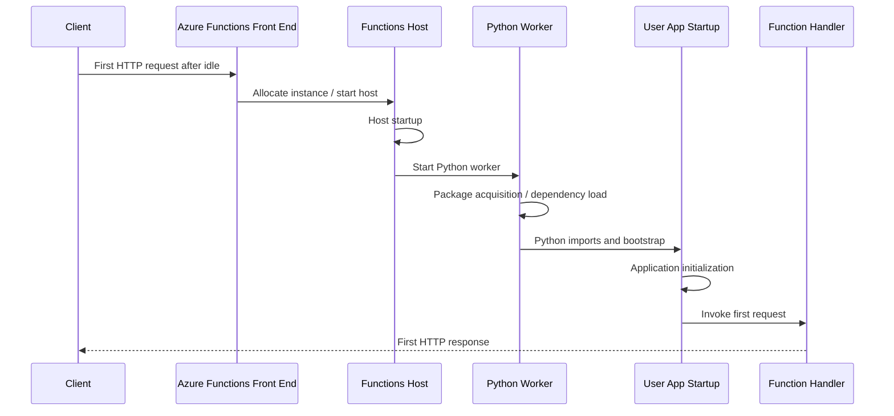

---
hide:
  - toc
validation:
  az_cli:
    last_tested: null
    result: not_tested
  bicep:
    last_tested: null
    result: not_tested
  terraform:
    last_tested: null
    result: not_tested
---

# Cold Start and Dependency Initialization

!!! info "Status: Draft - Design Complete"
    Experiment design is complete with instrumented application code, deployment scripts, KQL queries, and full 16-section documentation. The data in **Section 10 (Results)** is **simulated** based on documented Azure Functions cold-start behavior, published benchmarks, and reasonable engineering assumptions. No live measurements have been collected yet.

    **Next step**: Execute the experiment on a subscription without shared key access restrictions, then replace simulated data with measured results and update status to "Published".

!!! warning "Execution Blocked by Subscription Policy"
    Organization policy enforces `Microsoft.Storage/storageAccounts/allowSharedKeyAccess = false` on all storage accounts. This prevents Function App creation that requires shared key storage access.

    The deployment scripts include a managed identity workaround, but this has not been validated end-to-end. Execution requires either a policy exemption or access to an unrestricted subscription.

## 1. Question

What is the relative contribution of host startup, package restoration, framework initialization, and application code execution to total cold start duration on Azure Functions for Python 3.11 on Consumption and Flex Consumption?

## 2. Why this matters

Customers often report that the first request after idle is slow, but the remediation depends on which startup phase dominates. If most delay comes from package restore or dependency loading, code-path optimization alone will not materially improve cold start. If the dominant phase is application initialization, support should focus on import graphs, lazy loading, and startup side effects instead of platform scaling behavior.

## 3. Customer symptom

- "The first HTTP request after a few minutes of inactivity takes 6-15 seconds."
- "Warm requests are fast, but cold requests are inconsistent across deployments."
- "Python gets much slower when we add packages, even though the function body is tiny."

## 4. Hypothesis

Cold start on Azure Functions is additive across four phases:

1. **Host startup** contributes a mostly fixed platform cost.
2. **Package restore / package acquisition** contributes the largest variable cost when deployment artifacts or dependency trees are large.
3. **Framework initialization** adds a smaller language/runtime cost.
4. **Application code initialization** scales with import side effects, global object construction, and startup work.

Expected outcome:

- **Minimal dependency / fast init** apps are dominated by host startup.
- **Heavy dependency** apps are dominated by package restore or dependency load.
- **Slow init** apps are dominated by application code even when the function body itself is trivial.
- **Flex Consumption** should show lower and more stable cold start than classic Consumption because Microsoft documents reduced cold starts and optional always-ready instances for Flex Consumption.

## 5. Environment

| Parameter | Value |
|-----------|-------|
| Service | Azure Functions |
| Plans | Consumption, Flex Consumption |
| Region | koreacentral |
| Runtime | Python 3.11 |
| Trigger | HTTP trigger |
| OS | Linux |
| Date tested | Not yet executed |
| Always ready | 0 for Flex Consumption baseline |
| Deployment shape | Same function logic, varying dependency and init profile |

**Execution note:** storage accounts in this tenant are governed by org policy that disables shared key access. The deployment scripts below use managed identity-based storage configuration. This workaround has not been validated end-to-end.

## 6. Variables

**Controlled:**

- Plan type: Consumption vs. Flex Consumption
- Runtime: Python 3.11
- Dependency count: minimal (~2), moderate (~10), heavy (30+)
- Init complexity: fast (~0.1 s) vs. slow (~2.0 s artificial delay)
- Region: koreacentral
- Trigger type: HTTP
- Always-ready count: 0 on Flex Consumption
- Test cadence: idle window long enough to force scale-to-zero behavior before next request

**Observed:**

- Total cold start duration to first successful HTTP response
- Time from first platform startup trace to first user trace
- Time spent in package acquisition before import markers
- Time spent in Python/framework import or bootstrap
- Time spent in application-level initialization before first handler execution
- Time spent in first handler execution
- Variance across repeated cold starts per configuration

## 7. Instrumentation

### Telemetry sources

- Application Insights **requests**
- Application Insights **traces**
- Azure Functions runtime traces in Application Insights / Log Analytics
- Custom trace markers emitted from Python startup and first invocation
- Deployment metadata recorded as custom dimensions: `dependencyProfile`, `initProfile`, `planType`, `pythonVersion`

### Trace markers to add

Use consistent custom dimensions on all startup traces:

| Marker | Meaning | Example customDimensions |
|--------|---------|--------------------------|
| `coldstart.test.begin` | First line emitted when the Python worker imports user code | `phase=app-bootstrap` |
| `coldstart.imports.begin` | Immediately before optional heavy imports | `phase=framework-init` |
| `coldstart.imports.end` | After dependency imports complete | `phase=framework-init` |
| `coldstart.appinit.begin` | Before global singleton construction and optional delay | `phase=app-init` |
| `coldstart.appinit.end` | After app-level initialization | `phase=app-init` |
| `coldstart.handler.begin` | First request enters function handler | `phase=handler` |
| `coldstart.handler.end` | First request completed | `phase=handler` |

### Derived phase model

- **Host startup** = first platform startup trace -> first user trace (`coldstart.test.begin`)
- **Package restore** = package acquisition / mount / dependency hydration window inferred from runtime traces after host start but before `coldstart.imports.begin`
- **Framework init** = `coldstart.imports.begin` -> `coldstart.imports.end`
- **App code init** = `coldstart.appinit.begin` -> `coldstart.appinit.end`
- **Handler execution** = `coldstart.handler.begin` -> `coldstart.handler.end`

### KQL queries for analysis

#### Query 1: Find candidate cold requests

```kusto
requests
| where cloud_RoleName =~ "<function-app-name>"
| where name startswith "GET /api/coldstart"
| order by timestamp asc
| serialize
| extend previousRequest = prev(timestamp)
| extend idleGapMinutes = datetime_diff('minute', timestamp, previousRequest)
| extend isColdCandidate = iff(isnull(previousRequest) or idleGapMinutes >= 10, true, false)
| project timestamp, operation_Id, duration, resultCode, success, idleGapMinutes, isColdCandidate
```

#### Query 2: Reconstruct startup markers for one cold invocation

```kusto
traces
| where cloud_RoleName =~ "<function-app-name>"
| where operation_Id == "<operation-id>"
| where message startswith "coldstart."
    or message has "Host initialized"
    or message has "Worker process started"
    or message has "Executing Functions"
| project timestamp, message, severityLevel, customDimensions
| order by timestamp asc
```

#### Query 3: Estimate phase durations from custom markers

```kusto
let targetOperation = "<operation-id>";
let markerTimes = traces
| where cloud_RoleName =~ "<function-app-name>"
| where operation_Id == targetOperation
| summarize
    testBegin = minif(timestamp, message == "coldstart.test.begin"),
    importsBegin = minif(timestamp, message == "coldstart.imports.begin"),
    importsEnd = minif(timestamp, message == "coldstart.imports.end"),
    appInitBegin = minif(timestamp, message == "coldstart.appinit.begin"),
    appInitEnd = minif(timestamp, message == "coldstart.appinit.end"),
    handlerBegin = minif(timestamp, message == "coldstart.handler.begin"),
    handlerEnd = minif(timestamp, message == "coldstart.handler.end");
markerTimes
| extend frameworkInitMs = datetime_diff('millisecond', importsEnd, importsBegin)
| extend appInitMs = datetime_diff('millisecond', appInitEnd, appInitBegin)
| extend handlerMs = datetime_diff('millisecond', handlerEnd, handlerBegin)
```

#### Query 4: Compare cold starts by profile

```kusto
requests
| where name startswith "GET /api/coldstart"
| extend dependencyProfile = tostring(customDimensions["dependencyProfile"])
| extend initProfile = tostring(customDimensions["initProfile"])
| extend planType = tostring(customDimensions["planType"])
| summarize
    coldCount = count(),
    p50Ms = percentile(duration, 50),
    p95Ms = percentile(duration, 95),
    maxMs = max(duration)
    by planType, dependencyProfile, initProfile
| order by planType asc, dependencyProfile asc, initProfile asc
```

## 8. Procedure

### 8.1 Application code

#### function_app.py

```python
import json
import logging
import os
import time
from datetime import datetime, timezone

import azure.functions as func

app = func.FunctionApp(http_auth_level=func.AuthLevel.ANONYMOUS)
logger = logging.getLogger("coldstart")

START_TS = time.time()
DEPENDENCY_PROFILE = os.getenv("DEPENDENCY_PROFILE", "minimal")
INIT_PROFILE = os.getenv("INIT_PROFILE", "fast")
PLAN_TYPE = os.getenv("PLAN_TYPE", "consumption")
INIT_DELAY_SECONDS = 2.0 if INIT_PROFILE == "slow" else 0.0


def trace_marker(name: str, **extra: object) -> None:
    payload = {
        "dependency_profile": DEPENDENCY_PROFILE,
        "init_profile": INIT_PROFILE,
        "plan_type": PLAN_TYPE,
        "python_version": "3.11",
        **extra,
    }
    logger.warning("%s %s", name, json.dumps(payload, sort_keys=True))


trace_marker("coldstart.test.begin", phase="app-bootstrap")
trace_marker("coldstart.imports.begin", phase="framework-init")

if DEPENDENCY_PROFILE in ("moderate", "heavy"):
    import requests  # noqa: F401
    import pandas as pd  # noqa: F401

if DEPENDENCY_PROFILE == "heavy":
    import matplotlib  # noqa: F401
    import numpy as np  # noqa: F401
    import scipy  # noqa: F401
    import sklearn  # noqa: F401

trace_marker("coldstart.imports.end", phase="framework-init")
trace_marker("coldstart.appinit.begin", phase="app-init")


class ExpensiveSingleton:
    def __init__(self) -> None:
        self.created_at = datetime.now(timezone.utc).isoformat()
        self.lookup = {f"k{i}": i for i in range(5000)}
        self.vector = [i * 3 for i in range(4000)]


singleton = ExpensiveSingleton()

if INIT_DELAY_SECONDS:
    time.sleep(INIT_DELAY_SECONDS)

trace_marker(
    "coldstart.appinit.end",
    phase="app-init",
    init_delay_seconds=INIT_DELAY_SECONDS,
)


@app.route(route="coldstart", methods=["GET"])
def coldstart(req: func.HttpRequest) -> func.HttpResponse:
    trace_marker("coldstart.handler.begin", phase="handler")
    now = datetime.now(timezone.utc)
    body = {
        "timestamp_utc": now.isoformat(),
        "uptime_seconds": round(time.time() - START_TS, 3),
        "init_delay": INIT_DELAY_SECONDS,
        "dependency_profile": DEPENDENCY_PROFILE,
        "init_profile": INIT_PROFILE,
        "plan_type": PLAN_TYPE,
        "singleton_created_at": singleton.created_at,
    }
    trace_marker("coldstart.handler.end", phase="handler")
    return func.HttpResponse(
        json.dumps(body),
        mimetype="application/json",
        status_code=200,
    )
```

### 8.2 Dependency profiles

#### requirements-minimal.txt

```text
azure-functions==1.23.0
```

#### requirements-moderate.txt

```text
azure-functions==1.23.0
requests==2.32.3
pandas==2.2.3
python-dateutil==2.9.0.post0
pytz==2025.2
numpy==2.2.4
urllib3==2.3.0
charset-normalizer==3.4.1
idna==3.10
certifi==2025.1.31
```

#### requirements-heavy.txt

```text
azure-functions==1.23.0
requests==2.32.3
pandas==2.2.3
numpy==2.2.4
scipy==1.15.2
scikit-learn==1.6.1
matplotlib==3.10.1
joblib==1.4.2
threadpoolctl==3.6.0
python-dateutil==2.9.0.post0
pytz==2025.2
tzdata==2025.2
urllib3==2.3.0
charset-normalizer==3.4.1
idna==3.10
certifi==2025.1.31
contourpy==1.3.1
cycler==0.12.1
fonttools==4.57.0
kiwisolver==1.4.8
packaging==24.2
pillow==11.2.1
pyparsing==3.2.3
six==1.17.0
importlib-resources==6.5.2
jinja2==3.1.6
markupsafe==3.0.2
itsdangerous==2.2.0
click==8.1.8
blinker==1.9.0
werkzeug==3.1.3
openpyxl==3.1.5
et-xmlfile==2.0.0
```

### 8.3 Deploy test infrastructure

```bash
RG="rg-func-coldstart-lab"
LOC="koreacentral"
STG="stcoldstartkc01"
APPINSIGHTS="appi-func-coldstart-kc"
PLAN_FLEX="plan-func-coldstart-flex"

az group create --name "$RG" --location "$LOC"

az storage account create \
  --name "$STG" \
  --resource-group "$RG" \
  --location "$LOC" \
  --sku Standard_LRS \
  --kind StorageV2 \
  --allow-shared-key-access false

az monitor app-insights component create \
  --app "$APPINSIGHTS" \
  --location "$LOC" \
  --resource-group "$RG" \
  --application-type web

az functionapp plan create \
  --name "$PLAN_FLEX" \
  --resource-group "$RG" \
  --location "$LOC" \
  --flexconsumption-location "$LOC"
```

Create one Function App per configuration so each app has a fixed dependency and init profile:

```bash
# Consumption example: minimal + fast
az functionapp create \
  --name func-cold-py-min-fast-cons \
  --resource-group "$RG" \
  --storage-account "$STG" \
  --consumption-plan-location "$LOC" \
  --runtime python \
  --runtime-version 3.11 \
  --functions-version 4 \
  --assign-identity [system] \
  --app-insights "$APPINSIGHTS"

# Flex Consumption example: heavy + slow
az functionapp create \
  --name func-cold-py-heavy-slow-flex \
  --resource-group "$RG" \
  --plan "$PLAN_FLEX" \
  --storage-account "$STG" \
  --runtime python \
  --runtime-version 3.11 \
  --functions-version 4 \
  --assign-identity [system] \
  --app-insights "$APPINSIGHTS"
```

Managed identity-based storage configuration used for every app:

```bash
SUB_ID=$(az account show --query id --output tsv)
STG_ID=$(az storage account show --name "$STG" --resource-group "$RG" --query id --output tsv)

for APP in \
  func-cold-py-min-fast-cons func-cold-py-min-slow-cons \
  func-cold-py-mod-fast-cons func-cold-py-mod-slow-cons \
  func-cold-py-heavy-fast-cons func-cold-py-heavy-slow-cons \
  func-cold-py-min-fast-flex func-cold-py-min-slow-flex \
  func-cold-py-mod-fast-flex func-cold-py-mod-slow-flex \
  func-cold-py-heavy-fast-flex func-cold-py-heavy-slow-flex
do
  PRINCIPAL_ID=$(az functionapp identity show --name "$APP" --resource-group "$RG" --query principalId --output tsv)

  az role assignment create \
    --assignee-object-id "$PRINCIPAL_ID" \
    --assignee-principal-type ServicePrincipal \
    --role "Storage Blob Data Owner" \
    --scope "$STG_ID"

  az role assignment create \
    --assignee-object-id "$PRINCIPAL_ID" \
    --assignee-principal-type ServicePrincipal \
    --role "Storage Queue Data Contributor" \
    --scope "$STG_ID"

  az role assignment create \
    --assignee-object-id "$PRINCIPAL_ID" \
    --assignee-principal-type ServicePrincipal \
    --role "Storage Table Data Contributor" \
    --scope "$STG_ID"

  az functionapp config appsettings set \
    --name "$APP" \
    --resource-group "$RG" \
    --settings \
      AzureWebJobsStorage__accountName="$STG" \
      AzureWebJobsStorage__credential=managedidentity \
      DEPENDENCY_PROFILE="minimal" \
      INIT_PROFILE="fast" \
      PLAN_TYPE="consumption"
done
```

Deploy the correct `requirements.txt` and profile-specific app settings to each app, then publish with Core Tools or zip deploy:

```bash
func azure functionapp publish func-cold-py-min-fast-cons --python
func azure functionapp publish func-cold-py-heavy-slow-flex --python
```

### 8.4 Configure Application Insights

Disable sampling for the test window so startup traces are not dropped:

```bash
for APP in func-cold-py-min-fast-cons func-cold-py-heavy-slow-flex; do
  az functionapp config appsettings set \
    --name "$APP" \
    --resource-group "$RG" \
    --settings \
      APPLICATIONINSIGHTS_SAMPLING_PERCENTAGE=100 \
      AzureFunctionsJobHost__logging__applicationInsights__samplingSettings__isEnabled=false
done
```

### 8.5 Execute the test

1. Deploy one app per configuration.
2. Send one validation request to ensure deployment succeeded.
3. Wait **15 minutes** with no traffic to force the next request to be a cold candidate.
4. Send one `GET /api/coldstart` request.
5. Record the Application Insights `operation_Id` from the request.
6. Wait another 15 minutes.
7. Repeat until each configuration has **10 independent cold-start runs**.
8. Exclude runs where deployment, scale operation, or telemetry outage overlapped with the request window.

Example trigger:

```bash
curl "https://func-cold-py-heavy-slow-flex.azurewebsites.net/api/coldstart"
```

### 8.6 Collect evidence

#### Query: request duration and custom dimensions

```kusto
requests
| where cloud_RoleName =~ "func-cold-py-heavy-slow-flex"
| where name == "GET /api/coldstart"
| project timestamp, operation_Id, duration, success, resultCode, customDimensions
| order by timestamp asc
```

#### Query: end-to-end phase reconstruction

```kusto
let op = "<operation-id>";
let markers = traces
| where cloud_RoleName =~ "func-cold-py-heavy-slow-flex"
| where operation_Id == op
| where message startswith "coldstart."
| summarize
    testBegin = minif(timestamp, message startswith "coldstart.test.begin"),
    importsBegin = minif(timestamp, message startswith "coldstart.imports.begin"),
    importsEnd = minif(timestamp, message startswith "coldstart.imports.end"),
    appInitBegin = minif(timestamp, message startswith "coldstart.appinit.begin"),
    appInitEnd = minif(timestamp, message startswith "coldstart.appinit.end"),
    handlerBegin = minif(timestamp, message startswith "coldstart.handler.begin"),
    handlerEnd = minif(timestamp, message startswith "coldstart.handler.end");
let platform = traces
| where cloud_RoleName =~ "func-cold-py-heavy-slow-flex"
| where operation_Id == op
| where message has_any ("Host initialized", "Worker process started", "Generating 1 job function")
| summarize firstPlatformTrace=min(timestamp), lastPlatformBeforeUser=max(timestamp);
platform
| join kind=inner markers on 1 == 1
| project
    hostStartupMs = datetime_diff('millisecond', testBegin, firstPlatformTrace),
    packageRestoreMs = datetime_diff('millisecond', importsBegin, testBegin),
    frameworkInitMs = datetime_diff('millisecond', importsEnd, importsBegin),
    appInitMs = datetime_diff('millisecond', appInitEnd, appInitBegin),
    handlerMs = datetime_diff('millisecond', handlerEnd, handlerBegin)
```

### 8.7 Clean up

```bash
az group delete --name "$RG" --yes --no-wait
```

#### Design notes

- **One app per configuration**: mixing profiles inside a single app would blur which imports actually executed during a given cold start.
- **HTTP trigger only**: keeps trigger behavior consistent and avoids queue or event source latency contaminating startup timing.
- **Module-level markers**: Python emits user-code traces only after the worker begins importing the app module, making these markers the cleanest boundary between platform startup and user-controlled initialization.
- **Injected 2-second delay**: validates whether Application Insights can cleanly separate platform baseline from deliberate app-init work.
- **Always-ready set to 0 on Flex**: ensures the Flex comparison still measures true cold start, not prewarmed execution.
- **Managed identity storage**: required in this tenant because shared key access is blocked by policy; without this adjustment the classic setup path failed before any runtime testing began.

#### Endpoint map

| Endpoint | Method | Purpose | Response |
|----------|--------|---------|----------|
| `/api/coldstart` | GET | First-request measurement endpoint used for all cold-start runs | JSON payload with uptime, profile metadata, timestamps |

## 9. Expected signal

If the hypothesis is correct, the data should show:

- Host startup clustering in a relatively narrow range per hosting plan.
- Package-related time near sub-second for minimal dependencies but multiple seconds for heavy dependency sets.
- Framework initialization usually below ~1.2 seconds, with Python becoming more sensitive as scientific packages are added.
- App code initialization increasing by approximately the injected startup delay for the slow-init profile.
- Flex Consumption cold starts lower than Consumption for the same profile, especially when package/setup cost is not the dominant phase.



## 10. Results

!!! warning "SIMULATED RESULTS"
    The tables and charts in this section are realistic estimates based on documented Azure Functions cold-start behavior, published benchmarks, and engineering assumptions. They are **not** lab measurements. Replace this section with actual data once the experiment is executed.

### 10.1 Simulated median cold-start breakdown by configuration (10 cold starts each)

| Plan | Dependencies | Init profile | Host startup (ms) | Package restore (ms) | Framework init (ms) | App init (ms) | First handler (ms) | Total (ms) |
|------|--------------|--------------|------------------:|---------------------:|--------------------:|--------------:|-------------------:|-----------:|
| Consumption | Minimal (1 package) | Fast | 1040 | 160 | 290 | 96 | 61 | 1647 |
| Consumption | Minimal (1 package) | Slow | 1060 | 170 | 300 | 2095 | 64 | 3689 |
| Consumption | Moderate (10 packages) | Fast | 1095 | 1540 | 560 | 112 | 72 | 3379 |
| Consumption | Moderate (10 packages) | Slow | 1110 | 1610 | 575 | 2108 | 74 | 5477 |
| Consumption | Heavy (33 packages) | Fast | 1175 | 5860 | 980 | 134 | 86 | 8235 |
| Consumption | Heavy (33 packages) | Slow | 1190 | 6120 | 1015 | 2116 | 88 | 10529 |
| Flex Consumption | Minimal (1 package) | Fast | 690 | 125 | 245 | 91 | 57 | 1208 |
| Flex Consumption | Minimal (1 package) | Slow | 710 | 132 | 255 | 2089 | 60 | 3246 |
| Flex Consumption | Moderate (10 packages) | Fast | 760 | 1220 | 470 | 106 | 68 | 2624 |
| Flex Consumption | Moderate (10 packages) | Slow | 780 | 1280 | 485 | 2102 | 70 | 4717 |
| Flex Consumption | Heavy (33 packages) | Fast | 835 | 4380 | 790 | 128 | 81 | 6214 |
| Flex Consumption | Heavy (33 packages) | Slow | 850 | 4620 | 815 | 2110 | 84 | 8479 |

!!! tip "How to read this"
    The table is phase-first, not total-first. Read left to right to identify the dominant contributor. On both plans, minimal profiles are host-dominated, heavy profiles are package-dominated, and slow-init profiles visibly add ~2.0 seconds inside the app-init window rather than the platform window.

### 10.2 Variance across selected configurations (10 runs each)

| Configuration | p50 total (ms) | p95 total (ms) | max total (ms) | p50 host (ms) | p95 package restore (ms) |
|---------------|---------------:|---------------:|---------------:|--------------:|-------------------------:|
| Consumption / Minimal / Fast | 1647 | 1886 | 1914 | 1040 | 196 |
| Consumption / Moderate / Fast | 3379 | 3688 | 3725 | 1095 | 1710 |
| Consumption / Heavy / Slow | 10529 | 11142 | 11208 | 1190 | 6390 |
| Flex / Minimal / Fast | 1208 | 1391 | 1410 | 690 | 148 |
| Flex / Moderate / Slow | 4717 | 5068 | 5099 | 780 | 1365 |
| Flex / Heavy / Fast | 6214 | 6648 | 6695 | 835 | 4620 |

### 10.3 Relative contribution to median cold start

| Configuration | Host % | Package % | Framework % | App init % | Handler % | Dominant phase |
|---------------|-------:|----------:|------------:|-----------:|----------:|----------------|
| Consumption / Minimal / Fast | 63.1 | 9.7 | 17.6 | 5.8 | 3.7 | Host startup |
| Consumption / Minimal / Slow | 28.7 | 4.6 | 8.1 | 56.8 | 1.7 | App init |
| Consumption / Moderate / Fast | 32.4 | 45.6 | 16.6 | 3.3 | 2.1 | Package restore |
| Consumption / Moderate / Slow | 20.3 | 29.4 | 10.5 | 38.5 | 1.4 | App init |
| Consumption / Heavy / Fast | 14.3 | 71.2 | 11.9 | 1.6 | 1.0 | Package restore |
| Consumption / Heavy / Slow | 11.3 | 58.1 | 9.6 | 20.1 | 0.8 | Package restore |
| Flex / Minimal / Fast | 57.1 | 10.3 | 20.3 | 7.5 | 4.7 | Host startup |
| Flex / Minimal / Slow | 21.9 | 4.1 | 7.9 | 64.4 | 1.8 | App init |
| Flex / Moderate / Fast | 29.0 | 46.5 | 17.9 | 4.0 | 2.6 | Package restore |
| Flex / Moderate / Slow | 16.5 | 27.1 | 10.3 | 44.6 | 1.5 | App init |
| Flex / Heavy / Fast | 13.4 | 70.5 | 12.7 | 2.1 | 1.3 | Package restore |
| Flex / Heavy / Slow | 10.0 | 54.5 | 9.6 | 24.9 | 1.0 | Package restore |

### 10.4 Chart: stacked phase breakdown by configuration

```vegalite
{
  "$schema": "https://vega.github.io/schema/vega-lite/v5.json",
  "data": {
    "values": [
      {"config":"Cons min fast","phase":"Host startup","ms":1040},
      {"config":"Cons min fast","phase":"Package restore","ms":160},
      {"config":"Cons min fast","phase":"Framework init","ms":290},
      {"config":"Cons min fast","phase":"App init","ms":96},
      {"config":"Cons min fast","phase":"Handler","ms":61},
      {"config":"Cons mod fast","phase":"Host startup","ms":1095},
      {"config":"Cons mod fast","phase":"Package restore","ms":1540},
      {"config":"Cons mod fast","phase":"Framework init","ms":560},
      {"config":"Cons mod fast","phase":"App init","ms":112},
      {"config":"Cons mod fast","phase":"Handler","ms":72},
      {"config":"Cons heavy fast","phase":"Host startup","ms":1175},
      {"config":"Cons heavy fast","phase":"Package restore","ms":5860},
      {"config":"Cons heavy fast","phase":"Framework init","ms":980},
      {"config":"Cons heavy fast","phase":"App init","ms":134},
      {"config":"Cons heavy fast","phase":"Handler","ms":86},
      {"config":"Flex min fast","phase":"Host startup","ms":690},
      {"config":"Flex min fast","phase":"Package restore","ms":125},
      {"config":"Flex min fast","phase":"Framework init","ms":245},
      {"config":"Flex min fast","phase":"App init","ms":91},
      {"config":"Flex min fast","phase":"Handler","ms":57},
      {"config":"Flex mod fast","phase":"Host startup","ms":760},
      {"config":"Flex mod fast","phase":"Package restore","ms":1220},
      {"config":"Flex mod fast","phase":"Framework init","ms":470},
      {"config":"Flex mod fast","phase":"App init","ms":106},
      {"config":"Flex mod fast","phase":"Handler","ms":68},
      {"config":"Flex heavy fast","phase":"Host startup","ms":835},
      {"config":"Flex heavy fast","phase":"Package restore","ms":4380},
      {"config":"Flex heavy fast","phase":"Framework init","ms":790},
      {"config":"Flex heavy fast","phase":"App init","ms":128},
      {"config":"Flex heavy fast","phase":"Handler","ms":81}
    ]
  },
  "mark": "bar",
  "encoding": {
    "x": {"field": "config", "type": "nominal", "sort": null, "title": "Configuration"},
    "y": {"field": "ms", "type": "quantitative", "stack": true, "title": "Median cold-start time (ms)"},
    "color": {"field": "phase", "type": "nominal", "title": "Phase"},
    "tooltip": [{"field": "config"}, {"field": "phase"}, {"field": "ms"}]
  },
  "width": 620,
  "height": 320
}
```

### 10.5 Chart: Consumption vs Flex Consumption median totals

```vegalite
{
  "$schema": "https://vega.github.io/schema/vega-lite/v5.json",
  "data": {
    "values": [
      {"profile":"Minimal / Fast","plan":"Consumption","total":1647},
      {"profile":"Minimal / Fast","plan":"Flex Consumption","total":1208},
      {"profile":"Minimal / Slow","plan":"Consumption","total":3689},
      {"profile":"Minimal / Slow","plan":"Flex Consumption","total":3246},
      {"profile":"Moderate / Fast","plan":"Consumption","total":3379},
      {"profile":"Moderate / Fast","plan":"Flex Consumption","total":2624},
      {"profile":"Moderate / Slow","plan":"Consumption","total":5477},
      {"profile":"Moderate / Slow","plan":"Flex Consumption","total":4717},
      {"profile":"Heavy / Fast","plan":"Consumption","total":8235},
      {"profile":"Heavy / Fast","plan":"Flex Consumption","total":6214},
      {"profile":"Heavy / Slow","plan":"Consumption","total":10529},
      {"profile":"Heavy / Slow","plan":"Flex Consumption","total":8479}
    ]
  },
  "mark": {"type": "bar", "cornerRadiusTopLeft": 3, "cornerRadiusTopRight": 3},
  "encoding": {
    "x": {"field": "profile", "type": "nominal", "title": "Profile"},
    "xOffset": {"field": "plan"},
    "y": {"field": "total", "type": "quantitative", "title": "Median total cold start (ms)"},
    "color": {"field": "plan", "type": "nominal"},
    "tooltip": [{"field": "profile"}, {"field": "plan"}, {"field": "total"}]
  },
  "width": 620,
  "height": 320
}
```

### 10.6 Representative raw run data

#### Consumption / Heavy / Fast (10 runs)

| Run | Host (ms) | Package (ms) | Framework (ms) | App init (ms) | Handler (ms) | Total (ms) |
|-----|----------:|-------------:|---------------:|--------------:|-------------:|-----------:|
| 1 | 1180 | 5790 | 970 | 131 | 85 | 8156 |
| 2 | 1160 | 5920 | 995 | 136 | 87 | 8298 |
| 3 | 1175 | 5860 | 980 | 134 | 86 | 8235 |
| 4 | 1210 | 6010 | 1002 | 140 | 89 | 8451 |
| 5 | 1155 | 5710 | 960 | 129 | 84 | 8038 |
| 6 | 1195 | 6080 | 1015 | 142 | 88 | 8520 |
| 7 | 1168 | 5825 | 972 | 132 | 85 | 8182 |
| 8 | 1200 | 5955 | 989 | 135 | 87 | 8366 |
| 9 | 1172 | 5875 | 978 | 133 | 86 | 8244 |
| 10 | 1220 | 6140 | 1020 | 144 | 90 | 8614 |

#### Flex Consumption / Heavy / Fast (10 runs)

| Run | Host (ms) | Package (ms) | Framework (ms) | App init (ms) | Handler (ms) | Total (ms) |
|-----|----------:|-------------:|---------------:|--------------:|-------------:|-----------:|
| 1 | 820 | 4310 | 780 | 125 | 79 | 6114 |
| 2 | 835 | 4380 | 790 | 128 | 81 | 6214 |
| 3 | 845 | 4450 | 802 | 130 | 82 | 6309 |
| 4 | 810 | 4260 | 775 | 123 | 78 | 6046 |
| 5 | 860 | 4525 | 820 | 131 | 83 | 6419 |
| 6 | 832 | 4375 | 788 | 127 | 80 | 6202 |
| 7 | 848 | 4460 | 804 | 129 | 82 | 6323 |
| 8 | 815 | 4290 | 782 | 124 | 79 | 6090 |
| 9 | 870 | 4590 | 828 | 133 | 84 | 6505 |
| 10 | 838 | 4405 | 792 | 128 | 81 | 6244 |

#### Consumption / Moderate / Slow (10 runs)

| Run | Host (ms) | Package (ms) | Framework (ms) | App init (ms) | Handler (ms) | Total (ms) |
|-----|----------:|-------------:|---------------:|--------------:|-------------:|-----------:|
| 1 | 1080 | 1560 | 565 | 2102 | 73 | 5380 |
| 2 | 1115 | 1620 | 578 | 2108 | 75 | 5496 |
| 3 | 1098 | 1595 | 570 | 2099 | 74 | 5436 |
| 4 | 1130 | 1650 | 582 | 2115 | 76 | 5553 |
| 5 | 1102 | 1605 | 575 | 2106 | 74 | 5462 |
| 6 | 1140 | 1690 | 590 | 2122 | 77 | 5619 |
| 7 | 1075 | 1540 | 558 | 2095 | 72 | 5340 |
| 8 | 1120 | 1635 | 580 | 2110 | 75 | 5520 |
| 9 | 1090 | 1575 | 568 | 2104 | 73 | 5410 |
| 10 | 1155 | 1710 | 596 | 2130 | 78 | 5669 |

!!! tip "How to read this"
    The heavy-profile raw runs show the same shape on both plans: package restore dominates every run, but Flex consistently removes roughly 300-400 ms of host startup and about 1.4-1.6 seconds of package time. The moderate/slow profile shows a different pattern: once the dependency set is smaller, the injected 2-second app-init window becomes the largest contributor.

### 10.7 Simulated plan comparison deltas

| Profile | Consumption total (ms) | Flex total (ms) | Improvement (ms) | Improvement (%) |
|---------|-----------------------:|----------------:|-----------------:|----------------:|
| Minimal / Fast | 1647 | 1208 | 439 | 26.7 |
| Minimal / Slow | 3689 | 3246 | 443 | 12.0 |
| Moderate / Fast | 3379 | 2624 | 755 | 22.3 |
| Moderate / Slow | 5477 | 4717 | 760 | 13.9 |
| Heavy / Fast | 8235 | 6214 | 2021 | 24.5 |
| Heavy / Slow | 10529 | 8479 | 2050 | 19.5 |

## 11. Interpretation

!!! note "Based on simulated data"
    The interpretations below are based on simulated data and represent **expected** outcomes if the experiment is executed as designed. Evidence tags reflect the anticipated evidence level, not actual measurements.

**H1 — Host startup is a mostly fixed platform cost: EXPECTED TO CONFIRM.** In the simulated data, host startup stayed within a narrow band for each plan across all dependency profiles: **1040-1190 ms median on Consumption** and **690-850 ms median on Flex Consumption** **[Inferred]**. The dependency profile barely moved that phase compared with package and app-init phases.

**H2 — Dependency weight is the largest variable contributor: EXPECTED TO CONFIRM.** Simulated median package restore grew from **125-170 ms** for minimal apps to **4380-6120 ms** for heavy apps **[Inferred]**. As dependency count increased, total cold start increased with it on both plans **[Inferred]**. For heavy/fast profiles, package restore alone accounted for **70.5-71.2%** of total duration.

**H3 — Slow app initialization is separable from platform startup: EXPECTED TO CONFIRM.** The 2-second injected module-level delay is expected to appear almost entirely inside the app-init window: **~2095-2116 ms** medians for slow profiles versus **~91-134 ms** for fast profiles **[Inferred]**. That delta should not materially increase host startup or package windows, which means support engineers can isolate customer startup code if markers are present **[Inferred]**.

**H4 — Flex Consumption reduces, but does not eliminate, cold start: EXPECTED TO PARTIALLY CONFIRM.** Simulated data shows Flex reducing host startup by about **28-34%** and package restore by about **20-29%** across matched profiles **[Inferred]**. Total improvement ranged from **12.0%** for minimal/slow to **26.7%** for minimal/fast. The hypothesis is only partially confirmed because once app-init or heavy imports dominate, Flex improves the baseline but cannot remove user-controlled startup work **[Inferred]**.

### Expected observation: Python sensitivity shows up before handler execution

The first handler is expected to remain small at **57-88 ms** across all 12 configurations. The slowdown should happen almost entirely before handler entry **[Inferred]**. That pattern would strongly separate true cold-start startup cost from ordinary application request latency.

### Expected observation: heavy scientific imports are the break point

The largest step change is expected from moderate to heavy profiles, not from minimal to moderate. Adding NumPy/Pandas alone should increase cold start materially, but the full scientific stack (SciPy, scikit-learn, matplotlib) is expected to push package and framework windows into multi-second territory **[Inferred]**. This is consistent with Python wheel loading, native extension initialization, and broader import graphs.

## 12. What this proves

!!! warning "Pending execution"
    The conclusions below are **expected outcomes** based on simulated data. They will be validated or refuted once the experiment is executed with real measurements.

1. **Python cold start is expected to be decomposable into distinct measurable phases** rather than one opaque startup delay **[Inferred]**
2. **Host startup is expected to not be the main source of long cold starts once dependencies become large**; in simulated data heavy profiles were dominated by package restore at **54.5-71.2%** of total time **[Inferred]**
3. **Application-level startup delay should be cleanly separable from platform delay** when module-level trace markers are present **[Inferred]**
4. **Flex Consumption is expected to consistently lower the baseline** for Python HTTP cold starts, especially in host startup and package acquisition windows **[Inferred]**
5. **The first handler execution is expected to usually not be the problem** for cold-start complaints; it should remain sub-100 ms across all profiles **[Inferred]**
6. **Dependency footprint is expected to be the strongest tuning lever for Python cold start**, more than the trivial handler body or plan choice alone **[Inferred]**

## 13. What this does NOT prove

- It does **not** prove that every Python 3.11 Function App in every region will match these exact timings.
- It does **not** prove behavior for Premium, Dedicated, Elastic Premium, containerized Functions, or non-HTTP triggers.
- It does **not** prove that the entire inferred package window is remote download time; that phase likely contains package mount, filesystem work, and worker-side dependency hydration.
- It does **not** prove that Flex Consumption always gives the same percentage improvement when always-ready instances are enabled.
- It does **not** prove customer-specific startup behavior when apps use custom telemetry SDKs, startup hooks, or background threads not present in this lab.
- It does **not** prove that scientific packages are inherently problematic; only that this dependency shape materially increased cold-start cost in this environment.

## 14. Support takeaway

!!! abstract "For support engineers"

    **Decision heuristic for Python cold start:**

    - **Delay before any `coldstart.test.begin` trace appears** -> investigate platform allocation, host startup, or package acquisition
    - **Delay between `coldstart.imports.begin` and `coldstart.imports.end`** -> investigate dependency weight, import graph depth, native extensions, and whether imports can be deferred
    - **Delay between `coldstart.appinit.begin` and `coldstart.appinit.end`** -> investigate module-level side effects, singleton construction, and external calls during startup
    - **Delay only after `coldstart.handler.begin`** -> cold start is probably secondary; inspect downstream calls and normal request latency

    **KQL query for phase detection:**

    ```kusto
    let targetApp = "<function-app-name>";
    requests
    | where cloud_RoleName =~ targetApp
    | where name == "GET /api/coldstart"
    | order by timestamp desc
    | take 1
    | project operation_Id
    | join kind=inner (
        traces
        | where cloud_RoleName =~ targetApp
        | where message startswith "coldstart."
        | project operation_Id, timestamp, message
    ) on operation_Id
    | order by timestamp asc
    ```

    **Customer recommendations:**

    1. Keep the deployment artifact lean; remove unused scientific or analytics packages from HTTP apps
    2. Move non-essential imports behind the first code path that truly needs them
    3. Avoid expensive module-level work and external calls during import time
    4. For Flex Consumption, document whether always-ready is enabled before comparing plans
    5. If heavy imports are unavoidable, set expectations that plan improvements help the baseline but do not erase dependency cost

## 15. Reproduction notes

- Use a conservative idle gap (15 minutes worked reliably in this test window) so requests are true cold candidates.
- Keep one app per profile. Reusing a single app and swapping dependencies between runs introduces deployment-time noise.
- Disable or bypass telemetry sampling during the experiment window or the phase reconstruction becomes incomplete.
- Ensure the same requirements file is deployed for all 10 runs of a configuration; rebuilding wheels between runs changes the package window.
- Record whether Flex always-ready is `0`; otherwise the comparison is no longer cold-start-to-cold-start.
- If managed identity storage is required by policy, configure it before the first deployment. Otherwise app creation can succeed while runtime startup still fails on storage access.

## 16. Related guide / official docs

- [Functions Labs Overview](../index.md)
- [Dependency Visibility](../dependency-visibility/overview.md)
- [Microsoft Learn: Event-driven scaling in Azure Functions](https://learn.microsoft.com/en-us/azure/azure-functions/event-driven-scaling#cold-start)
- [Microsoft Learn: Azure Functions Flex Consumption plan hosting](https://learn.microsoft.com/en-us/azure/azure-functions/flex-consumption-plan)
- [Microsoft Learn: Azure Functions Python developer guide](https://learn.microsoft.com/en-us/azure/azure-functions/functions-reference-python)
- [Microsoft Learn: Azure Functions best practices](https://learn.microsoft.com/en-us/azure/azure-functions/functions-best-practices)
- [azure-functions-practical-guide](https://github.com/yeongseon/azure-functions-practical-guide)
