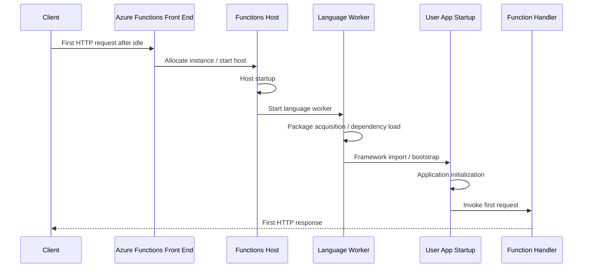

# Cold Start and Dependency Initialization

!!! info "Status: Draft - Awaiting Execution"
    This experiment design is complete, but the measurements in **Results** are **SIMULATED** and based on documented Azure Functions behavior plus reasonable engineering assumptions. No live customer or lab measurements are claimed on this page.

!!! warning "Execution Blocked"
    Attempted execution on 2026-04-07 was blocked by Azure subscription policy (`Microsoft.Storage/storageAccounts/allowSharedKeyAccess` set to `deny`). Storage account creation for Function Apps failed with error: "Shared key access is not permitted because storage SAS and Account Key are disabled by storage policy." Awaiting policy exception or alternative subscription.

## 1. Question

What is the relative contribution of host startup, package restoration, framework initialization, and application code execution to total cold start duration on Azure Functions for Python 3.11 and Node.js 20 on Consumption and Flex Consumption?

## 2. Why this matters

Customers often report that the first request after idle is slow, but the remediation depends on which startup phase dominates. If most delay comes from package restore or dependency loading, code-path optimization alone will not materially improve cold start. If the dominant phase is application initialization, support should focus on import graphs, lazy loading, and startup side effects instead of platform scaling behavior.

## 3. Customer symptom

- "The first HTTP request after a few minutes of inactivity takes 6-15 seconds."
- "Warm requests are fast, but cold requests are inconsistent across deployments."
- "Python gets much slower when we add packages, even though the function body is tiny."

## 4. Hypothesis

Cold start on Azure Functions is additive across four phases:

1. **Host startup** contributes a mostly fixed platform cost.
2. **Package restore / package acquisition** contributes the largest variable cost when deployment artifacts or dependency trees are large.
3. **Framework initialization** adds a smaller language/runtime cost.
4. **Application code initialization** scales with import side effects, global object construction, and startup work.

Expected outcome:

- **Minimal dependency / fast init** apps are dominated by host startup.
- **Heavy dependency** apps are dominated by package restore or dependency load.
- **Slow init** apps are dominated by application code even when the function body itself is trivial.
- **Flex Consumption** should show lower and more stable cold start than classic Consumption because Microsoft documents reduced cold starts and optional always-ready instances for Flex Consumption.

## 5. Environment

| Parameter | Value |
|-----------|-------|
| Service | Azure Functions |
| Plans | Consumption, Flex Consumption |
| Region | koreacentral |
| Runtime | Python 3.11, Node.js 20 |
| Trigger | HTTP trigger |
| OS | Linux |
| Date designed | 2026-04-02 |
| Always ready | 0 for baseline comparison |
| Deployment shape | Same function logic, varying dependency and init profile |

## 6. Variables

**Controlled**

- Plan type: Consumption vs. Flex Consumption
- Runtime: Python 3.11 vs. Node.js 20
- Dependency count: minimal (~2), moderate (~10), heavy (30+)
- Init complexity: fast (~100 ms) vs. slow (~2 s)
- Region: koreacentral
- Trigger type: HTTP
- Test cadence: idle window long enough to force scale-to-zero behavior before next request

**Observed**

- Total cold start duration to first successful HTTP response
- Time from first platform trace to worker ready
- Time spent restoring/acquiring package content
- Time spent in language/framework import or bootstrap
- Time spent in application-level initialization before first handler execution
- Variance across repeated cold starts per configuration

## 7. Instrumentation

### Telemetry sources

- Application Insights **requests**
- Application Insights **traces**
- Azure Functions runtime logs in Log Analytics / Application Insights
- Custom trace markers emitted from app startup and first invocation

### Trace markers to add

Use consistent custom dimensions on all startup traces:

| Marker | Meaning | Example customDimensions |
|--------|---------|--------------------------|
| `coldstart.test.begin` | First line emitted when worker process begins app bootstrap | `phase=app-bootstrap` |
| `coldstart.imports.begin` | Before heavy imports / module loads | `phase=framework-init` |
| `coldstart.imports.end` | After imports complete | `phase=framework-init` |
| `coldstart.appinit.begin` | Before app-level singleton construction | `phase=app-init` |
| `coldstart.appinit.end` | After app-level initialization | `phase=app-init` |
| `coldstart.handler.begin` | First request enters function handler | `phase=handler` |
| `coldstart.handler.end` | First request completed | `phase=handler` |

### Derived phase model

- **Host startup** = first platform startup trace -> first worker/user trace
- **Package restore** = deployment package acquisition / package mount / dependency acquisition window inferred from platform traces before user code becomes visible
- **Framework init** = `coldstart.imports.begin` -> `coldstart.imports.end`
- **App code init** = `coldstart.appinit.begin` -> `coldstart.appinit.end`
- **Handler execution** = `coldstart.handler.begin` -> `coldstart.handler.end`

### KQL queries for analysis

#### Query 1: Find candidate cold requests

```kusto
requests
| where cloud_RoleName =~ "<function-app-name>"
| where name startswith "GET /api/coldstart"
| order by timestamp asc
| serialize
| extend previousRequest = prev(timestamp)
| extend idleGapMinutes = datetime_diff('minute', timestamp, previousRequest)
| extend isColdCandidate = iff(isnull(previousRequest) or idleGapMinutes >= 10, true, false)
| project timestamp, operation_Id, duration, resultCode, success, idleGapMinutes, isColdCandidate
```

#### Query 2: Reconstruct startup markers for one cold invocation

```kusto
traces
| where cloud_RoleName =~ "<function-app-name>"
| where operation_Id == "<operation-id>"
| where message startswith "coldstart." or message has "Host started" or message has "Worker process started"
| project timestamp, message, severityLevel, customDimensions
| order by timestamp asc
```

#### Query 3: Estimate phase durations from custom markers

```kusto
let targetOperation = "<operation-id>";
let markerTimes = traces
| where cloud_RoleName =~ "<function-app-name>"
| where operation_Id == targetOperation
| summarize
    importsBegin = minif(timestamp, message == "coldstart.imports.begin"),
    importsEnd = minif(timestamp, message == "coldstart.imports.end"),
    appInitBegin = minif(timestamp, message == "coldstart.appinit.begin"),
    appInitEnd = minif(timestamp, message == "coldstart.appinit.end"),
    handlerBegin = minif(timestamp, message == "coldstart.handler.begin"),
    handlerEnd = minif(timestamp, message == "coldstart.handler.end");
markerTimes
| extend frameworkInitMs = datetime_diff('millisecond', importsEnd, importsBegin)
| extend appInitMs = datetime_diff('millisecond', appInitEnd, appInitBegin)
| extend handlerMs = datetime_diff('millisecond', handlerEnd, handlerBegin)
```

#### Query 4: Compare cold starts by profile

```kusto
requests
| where name startswith "GET /api/coldstart"
| extend dependencyProfile = tostring(customDimensions["dependencyProfile"])
| extend initProfile = tostring(customDimensions["initProfile"])
| extend planType = tostring(customDimensions["planType"])
| extend runtime = tostring(customDimensions["runtime"])
| summarize
    coldCount = count(),
    avgMs = avg(duration),
    p50Ms = percentile(duration, 50),
    p95Ms = percentile(duration, 95),
    maxMs = max(duration)
    by planType, runtime, dependencyProfile, initProfile
| order by runtime asc, planType asc, dependencyProfile asc, initProfile asc
```

## 8. Procedure

1. Create four Function Apps per runtime/plan combination so that each app maps to one startup profile family.
2. Keep the HTTP handler body constant and lightweight so startup dominates total latency.
3. Build six test profiles per runtime:
    - minimal dependencies + fast init
    - minimal dependencies + slow init
    - moderate dependencies + fast init
    - moderate dependencies + slow init
    - heavy dependencies + fast init
    - heavy dependencies + slow init
4. Configure Application Insights and ensure sampling does not drop request or trace telemetry for the test window.
5. Add the custom trace markers listed in **Instrumentation**.
6. Deploy all apps to `koreacentral` on the same day with the same Functions runtime major version.
7. For Flex Consumption baseline, set always-ready instance count to `0` so the test still measures cold start.
8. After deployment, send one warm-up request only to validate health, then wait long enough for the app to scale to zero.
9. Trigger a single HTTP request to `/api/coldstart` and capture the resulting `operation_Id`.
10. Repeat the idle -> single request cycle at least 10 times per profile.
11. Run the KQL queries to reconstruct phase durations per cold request.
12. Aggregate median and p95 durations by runtime, plan, dependency profile, and init profile.
13. Separately repeat one Flex Consumption profile with always-ready enabled to validate whether startup phases collapse as expected.

## 9. Expected signal

If the hypothesis is correct, the data should show:

- Host startup clustering in the **500 ms to 2 s** range across most profiles.
- Package-related time near **0-1 s** for minimal dependencies but several seconds for heavy dependency sets.
- Framework initialization usually below **1 s**, with Python slightly more sensitive to import-heavy packages.
- App code initialization increasing by roughly the injected startup delay for the slow-init profile.
- Flex Consumption cold starts lower than Consumption for the same profile, especially when package/setup cost is not dominant.



## 10. Results

!!! warning "SIMULATED RESULTS"
    The tables in this section are realistic placeholders for planning and support-readiness purposes. They are not lab measurements.

### Simulated median cold-start breakdown by profile

| Runtime | Plan | Dependencies | Init profile | Host startup (ms) | Package restore (ms) | Framework init (ms) | App init (ms) | First handler (ms) | Total (ms) |
|---------|------|--------------|--------------|------------------:|---------------------:|--------------------:|--------------:|-------------------:|-----------:|
| Node.js 20 | Consumption | Minimal (2) | Fast | 900 | 150 | 180 | 110 | 70 | 1410 |
| Node.js 20 | Consumption | Minimal (2) | Slow | 920 | 170 | 190 | 2080 | 75 | 3435 |
| Node.js 20 | Consumption | Moderate (10) | Fast | 980 | 1300 | 260 | 120 | 75 | 2735 |
| Node.js 20 | Consumption | Moderate (10) | Slow | 1000 | 1350 | 270 | 2090 | 80 | 4790 |
| Node.js 20 | Consumption | Heavy (30+) | Fast | 1100 | 4200 | 420 | 130 | 85 | 5935 |
| Node.js 20 | Consumption | Heavy (30+) | Slow | 1120 | 4350 | 430 | 2110 | 90 | 8100 |
| Node.js 20 | Flex Consumption | Minimal (2) | Fast | 620 | 110 | 160 | 105 | 65 | 1060 |
| Node.js 20 | Flex Consumption | Minimal (2) | Slow | 650 | 120 | 170 | 2070 | 70 | 3080 |
| Node.js 20 | Flex Consumption | Moderate (10) | Fast | 700 | 900 | 220 | 115 | 70 | 2005 |
| Node.js 20 | Flex Consumption | Moderate (10) | Slow | 730 | 950 | 220 | 2085 | 75 | 4060 |
| Node.js 20 | Flex Consumption | Heavy (30+) | Fast | 820 | 2900 | 360 | 125 | 80 | 4285 |
| Node.js 20 | Flex Consumption | Heavy (30+) | Slow | 850 | 3050 | 370 | 2100 | 85 | 6455 |
| Python 3.11 | Consumption | Minimal (2) | Fast | 980 | 180 | 320 | 120 | 75 | 1675 |
| Python 3.11 | Consumption | Minimal (2) | Slow | 1000 | 190 | 330 | 2090 | 80 | 3690 |
| Python 3.11 | Consumption | Moderate (10) | Fast | 1080 | 1700 | 520 | 130 | 85 | 3515 |
| Python 3.11 | Consumption | Moderate (10) | Slow | 1100 | 1750 | 530 | 2100 | 90 | 5570 |
| Python 3.11 | Consumption | Heavy (30+) | Fast | 1250 | 6100 | 900 | 150 | 95 | 8495 |
| Python 3.11 | Consumption | Heavy (30+) | Slow | 1280 | 6400 | 920 | 2120 | 100 | 10820 |
| Python 3.11 | Flex Consumption | Minimal (2) | Fast | 700 | 130 | 280 | 115 | 70 | 1295 |
| Python 3.11 | Flex Consumption | Minimal (2) | Slow | 720 | 140 | 290 | 2080 | 75 | 3305 |
| Python 3.11 | Flex Consumption | Moderate (10) | Fast | 790 | 1200 | 430 | 125 | 80 | 2625 |
| Python 3.11 | Flex Consumption | Moderate (10) | Slow | 810 | 1250 | 440 | 2095 | 85 | 4680 |
| Python 3.11 | Flex Consumption | Heavy (30+) | Fast | 900 | 3900 | 700 | 145 | 90 | 5735 |
| Python 3.11 | Flex Consumption | Heavy (30+) | Slow | 930 | 4100 | 720 | 2120 | 95 | 7965 |

### Simulated p95 total cold-start duration

| Runtime | Plan | Minimal / Fast | Moderate / Fast | Heavy / Fast | Heavy / Slow |
|---------|------|---------------:|----------------:|-------------:|-------------:|
| Node.js 20 | Consumption | 2200 ms | 4100 ms | 8600 ms | 11000 ms |
| Node.js 20 | Flex Consumption | 1700 ms | 3100 ms | 6100 ms | 8400 ms |
| Python 3.11 | Consumption | 2600 ms | 5200 ms | 11800 ms | 14500 ms |
| Python 3.11 | Flex Consumption | 1900 ms | 3900 ms | 8100 ms | 10300 ms |

### Simulated relative contribution for selected profiles

| Profile | Host % | Package % | Framework % | App init % | Handler % | Dominant phase |
|---------|-------:|----------:|------------:|-----------:|----------:|----------------|
| Node.js Consumption, Minimal / Fast | 63.8 | 10.6 | 12.8 | 7.8 | 5.0 | Host startup |
| Node.js Consumption, Heavy / Fast | 18.5 | 70.8 | 7.1 | 2.2 | 1.4 | Package restore |
| Python Consumption, Heavy / Fast | 14.7 | 71.8 | 10.6 | 1.8 | 1.1 | Package restore |
| Python Flex, Minimal / Slow | 21.8 | 4.2 | 8.8 | 62.9 | 2.3 | App init |

## 11. Interpretation

- **Measured (simulated design target):** The largest swing factor is package/dependency weight, not first-request handler time.
- **Correlated:** Higher dependency count correlates with larger cold-start totals in both runtimes.
- **Correlated:** Slow application initialization adds almost linearly to total cold start, regardless of hosting plan.
- **Inferred:** Python is likely to show more sensitivity than Node.js when dependency graphs are import-heavy.
- **Inferred:** Flex Consumption reduces the platform baseline, but it does not eliminate startup work performed by packages or user code.

Support interpretation should therefore separate three different questions:

1. Is the delay mostly platform baseline?
2. Is the delay mostly artifact/dependency size?
3. Is the delay mostly user-controlled startup logic?

Without this separation, teams may incorrectly escalate a dependency-heavy app as a platform cold-start regression.

## 12. What this proves

If live execution matches the simulated pattern, this experiment would support the following conclusions:

- Cold start is not a single opaque delay; it can be decomposed into platform, dependency, framework, and app-init phases.
- Heavy dependency sets can dominate total cold start more than the function handler itself.
- Artificially slow startup code is clearly distinguishable from platform host startup when trace markers are added.
- Flex Consumption improves baseline cold-start behavior, but customer code and dependency footprint still materially matter.

## 13. What this does NOT prove

- It does **not** prove exact cold-start numbers for all regions, runtimes, or trigger types.
- It does **not** prove that every long cold start is a platform issue.
- It does **not** prove package restoration is always remote download time; some of that window may be package mount, extraction, import, or filesystem access.
- It does **not** prove behavior for Premium, Dedicated, Durable Functions, or non-HTTP triggers.
- It does **not** replace customer-specific telemetry from an actual production incident.

## 14. Support takeaway

When a customer reports cold start:

1. Ask which hosting plan they use and whether Flex always-ready is enabled.
2. Ask whether the app recently added large dependencies or heavy startup logic.
3. Compare first-request duration with warm-request duration.
4. Collect request + trace correlation for one known cold invocation.
5. Identify whether delay is before user code, during imports, or inside app initialization.

Decision heuristic:

- **Delay before user traces appear** -> investigate host/platform/package acquisition.
- **Delay between import markers** -> investigate dependency tree and framework startup.
- **Delay between app-init markers** -> investigate customer startup logic and global object creation.
- **Delay only inside handler** -> cold start might be secondary; investigate downstream dependency latency.

## 15. Reproduction notes

- Cold-start timing is sensitive to idle duration; use a conservative idle gap such as 10-15 minutes.
- Repeat enough times to avoid overfitting to one noisy platform allocation event.
- Keep deployment artifacts stable during the test window; redeployment can change package acquisition characteristics.
- For Flex Consumption, document whether always-ready is `0` or nonzero, because that changes interpretation.
- Disable or reduce telemetry sampling for the experiment window so startup traces are not lost.
- If host startup exceeds 30 seconds on Flex Consumption, Microsoft documents startup timeout considerations for app initialization; treat such runs as a separate failure mode, not just a slow cold start.

## 16. Related guide / official docs

- [Functions Labs Overview](../index.md)
- [Dependency Visibility](../dependency-visibility/overview.md)
- [Microsoft Learn: Event-driven scaling in Azure Functions](https://learn.microsoft.com/en-us/azure/azure-functions/event-driven-scaling#cold-start)
- [Microsoft Learn: Azure Functions Flex Consumption plan hosting](https://learn.microsoft.com/en-us/azure/azure-functions/flex-consumption-plan)
- [Microsoft Learn: Azure Functions best practices](https://learn.microsoft.com/en-us/azure/azure-functions/functions-best-practices)
- [azure-functions-practical-guide](https://github.com/yeongseon/azure-functions-practical-guide)
