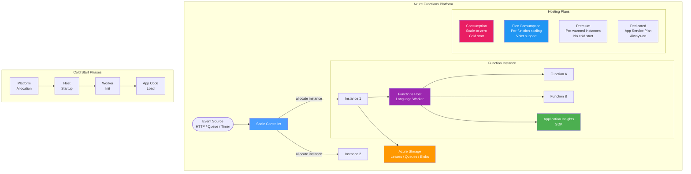

---
hide:
  - toc
---

# Functions Labs

Azure Functions troubleshooting experiments focused on cold start behavior, scaling edge cases, hosting plan differences, dependency visibility, and telemetry reliability.

## Architecture Overview

Azure Functions is a serverless compute platform that executes event-driven code. The architecture varies significantly across hosting plans, making plan selection a critical factor in troubleshooting.

### Key Components for Troubleshooting

| Component | Role | Why It Matters |
|-----------|------|---------------|
| **Scale Controller** | Monitors event sources and allocates/deallocates instances | Scaling decisions are opaque; unexpected scaling behavior is a common support issue |
| **Functions Host** | Runtime that manages function execution and language workers | Host startup failures, worker crashes, and initialization errors originate here |
| **Language Worker** | Process that executes function code (Python, Node.js, etc.) | Worker initialization time is a major component of cold start duration |
| **Azure Storage** | Backend for leases, triggers, and deployment packages | Storage misconfiguration or identity issues can silently prevent function execution |
| **Application Insights** | Telemetry pipeline for traces, metrics, and dependencies | Auth misconfiguration can create a "blackhole" — telemetry silently drops |
| **Hosting Plan** | Resource allocation model (Consumption, Flex, Premium, Dedicated) | Plan choice determines cold start behavior, scaling limits, VNet support, and cost |

!!! note
    Experiments cover both Consumption and Flex Consumption plans where applicable. Dedicated (App Service Plan) and Premium plan behavior may differ.

## Experiment Status

| Experiment | Status | Description |
|-----------|--------|-------------|
| [Flex Router Queueing](flex-router-queueing/overview.md) | Planned | Hidden latency between request arrival and function invocation |
| [HTTP Concurrency Cliffs](http-concurrency-cliffs/overview.md) | Planned | Per-instance degradation thresholds on Flex Consumption |
| [Telemetry Auth Blackhole](telemetry-auth-blackhole/overview.md) | Planned | Monitoring misconfiguration preventing host startup |
| [Flex Site Update Strategy](flex-site-update-strategy/overview.md) | Planned | In-flight request behavior during deployment |
| [Flex Consumption Storage](flex-consumption-storage/overview.md) | Planned | Storage identity misconfiguration edge cases |
| [Cold Start](cold-start/overview.md) | Draft | Dependency initialization and cold start duration breakdown |
| [Dependency Visibility](dependency-visibility/overview.md) | Planned | Outbound dependency observability limits |

!!! info "No experiments executed yet"
    Functions experiments are designed but have not yet been executed against real Azure environments. Execution is planned after completing the current App Service and Container Apps experiment backlog.

## Planned Experiments

### [Flex Router Queueing](flex-router-queueing/overview.md)

Hidden latency between HTTP request arrival at the Flex Consumption router and actual function invocation. Investigates whether the router introduces queuing delays that are invisible in Application Insights timing.

### [HTTP Concurrency Cliffs](http-concurrency-cliffs/overview.md)

Per-instance performance degradation thresholds on Flex Consumption. Tests at what concurrency level a single instance's response time degrades non-linearly, and whether the scale controller reacts before degradation becomes visible to users.

### [Telemetry Auth Blackhole](telemetry-auth-blackhole/overview.md)

Monitoring misconfiguration that silently prevents the Functions host from starting or drops all telemetry. Investigates what happens when Application Insights connection string or authentication is misconfigured.

### [Flex Site Update Strategy](flex-site-update-strategy/overview.md)

In-flight request behavior during Flex Consumption deployment. Tests whether active requests are drained gracefully or terminated, and how the platform transitions between old and new code versions.

### [Flex Consumption Storage](flex-consumption-storage/overview.md)

Storage identity and misconfiguration edge cases in the Flex Consumption hosting plan. Investigates what happens when storage identity is changed, revoked, or misconfigured, and how the failure manifests to the developer.

### [Cold Start](cold-start/overview.md) — *Draft*

Dependency initialization impact on cold start duration. Breaks down the relative contribution of host startup, package restoration, framework initialization, and application code to total cold start time.

### [Dependency Visibility](dependency-visibility/overview.md)

Limitations of observing outbound dependency calls through Application Insights and platform telemetry. Tests what is visible, what is missing, and where correlation breaks down in distributed tracing scenarios.

## Related Experiments in Other Services

- **App Service** — [Memory Pressure](../app-service/memory-pressure/overview.md) (**Published**) investigates plan-level resource contention, a pattern also relevant to understanding Functions scaling behavior on Dedicated plans.
- **Container Apps** — [Scale-to-Zero 503](../container-apps/scale-to-zero-502/overview.md) (**Published**) explores cold start failure modes, conceptually parallel to Functions Consumption plan cold start behavior.
- **Cross-cutting** — [MI RBAC Propagation](../cross-cutting/mi-rbac-propagation/overview.md) tests identity propagation delays, critical for Functions using managed identity for storage or downstream services.
